# Range Weighted Branch Length Difference (RWiBaLD) Calculations &
Figure Generation
Nunzio Knerr
2025-10-24

- [<span class="toc-section-number">1</span>
  Introduction](#introduction)
- [<span class="toc-section-number">2</span> Load
  packages](#load-packages)
- [<span class="toc-section-number">3</span> The RWiBaLD
  metric](#the-rwibald-metric)
- [<span class="toc-section-number">4</span> Specify biodiverse results
  data](#specify-biodiverse-results-data)
- [<span class="toc-section-number">5</span> Load data & calculate
  RWiBaLD](#load-data--calculate-rwibald)
- [<span class="toc-section-number">6</span> Elbow point calculation
  function](#elbow-point-calculation-function)
- [<span class="toc-section-number">7</span> Calculate branches of
  interest](#calculate-branches-of-interest)
- [<span class="toc-section-number">8</span> Generate figure 2A -
  RWiBaLD branches of
  interest](#generate-figure-2a---rwibald-branches-of-interest)
- [<span class="toc-section-number">9</span> Calculate RWiBaLD branch
  categories (neo-endemic, meso-endemic,
  paleo-endemic)](#calculate-rwibald-branch-categories-neo-endemic-meso-endemic-paleo-endemic)
- [<span class="toc-section-number">10</span> Load RWiBaLD results &
  tree data by cells](#load-rwibald-results--tree-data-by-cells)
- [<span class="toc-section-number">11</span> Generate figure 2B -
  ranked RWiBaLD score by RWiBaLD
  score](#generate-figure-2b---ranked-rwibald-score-by-rwibald-score)
- [<span class="toc-section-number">12</span> Generate figure 2C -
  ranked BaLD by BaLD (non range
  weighted)](#generate-figure-2c---ranked-bald-by-bald-non-range-weighted)
- [<span class="toc-section-number">13</span> Generate multi-panel
  figure 2ABC](#generate-multi-panel-figure-2abc)
- [<span class="toc-section-number">14</span> Generate Figure
  3A](#generate-figure-3a)
- [<span class="toc-section-number">15</span> Generate Figure
  3B](#generate-figure-3b)
- [<span class="toc-section-number">16</span> Generate multi-panel
  figure 3AB](#generate-multi-panel-figure-3ab)
- [<span class="toc-section-number">17</span> Read tree file & generate
  supplementary figure
  1](#read-tree-file--generate-supplementary-figure-1)
- [<span class="toc-section-number">18</span> Generate tree in 2 halves
  supplementary figure 1A and
  1B](#generate-tree-in-2-halves-supplementary-figure-1a-and-1b)
- [<span class="toc-section-number">19</span> Load data & generate
  histograms for all
  cells](#load-data--generate-histograms-for-all-cells)
- [<span class="toc-section-number">20</span> Load data & generate 12
  histograms for figure
  4A-L](#load-data--generate-12-histograms-for-figure-4a-l)
- [<span class="toc-section-number">21</span> Generate multi-panel
  histogram figure 4A-L](#generate-multi-panel-histogram-figure-4a-l)
- [<span class="toc-section-number">22</span> Load results data &
  generate data files for biome
  maps](#load-results-data--generate-data-files-for-biome-maps)
- [<span class="toc-section-number">23</span> Two tailed relative
  phylogenetic diversity (RPD) & CANAPE
  functions](#two-tailed-relative-phylogenetic-diversity-rpd--canape-functions)
- [<span class="toc-section-number">24</span> Load CANAPE &
  randomisation results](#load-canape--randomisation-results)
- [<span class="toc-section-number">25</span> Generate CANAPE map figure
  5A](#generate-canape-map-figure-5a)
- [<span class="toc-section-number">26</span> Generate biome map with
  neo-endemics figure
  5B](#generate-biome-map-with-neo-endemics-figure-5b)
- [<span class="toc-section-number">27</span> Generate biome map with
  meso-endemics figure
  5C](#generate-biome-map-with-meso-endemics-figure-5c)
- [<span class="toc-section-number">28</span> Generate biome map with
  paleo-endemics figure
  5D](#generate-biome-map-with-paleo-endemics-figure-5d)
- [<span class="toc-section-number">29</span> Generate 4 up map figure
  5ABCD](#generate-4-up-map-figure-5abcd)
- [<span class="toc-section-number">30</span> Table of RWiBaLD
  results supplementary table
  1](#table-of-rwibald-results-supplementary-table-1)

------------------------------------------------------------------------

## Introduction

This document contains code for calculating and plotting Range Weighted
Branch Length Difference (RWiBaLD). It uses input from
[Biodiverse](https://github.com/shawnlaffan/biodiverse) analyses of
phylogenetic data. The method is related to the [Categorical Analysis of
Neo And Paleo-Endemisim
(CANAPE)](https://www.nature.com/articles/ncomms5473) published in 2014
and follows up on that paper. Consequently, the [acacia dataset from the
CANAPE paper](https://doi.org/10.5061/dryad.dv4qk) is used to illustrate
the method.

## Load packages

Here we load the packages for use in subsequent code.

<details class="code-fold">
<summary>Show the code</summary>

``` r
library(sf)
library(ggplot2)
library(Cairo)
library(extrafont)
library(dplyr)
library(ggrepel)
library(stringr)
library(patchwork)
library(forcats)
library(ggtree)
library(ape)
library(knitr)
library(gt)
```

</details>

## The RWiBaLD metric

The steps for calculating RWiBaLD are as follows:

1.  For each branch on the phylogeny (terminal or internal), calculate
    its *range weighted branch length difference* (RWiBaLD) score as the
    difference between its length on the RWoT and the RWcT. These scores
    can be used directly as a continuous measure of neo- and
    paleo-endemism (negative and positive values, respectively).
    Classification into neo-endemic, paleo-endemic, and meso-endemic
    requires further processing using steps 2-4:  

2.  Identify the “highly endemic branches,” i.e., those with range sizes
    below a threshold. We calculate this threshold by identifying the
    “elbow” of the distribution, using the *maximum Euclidean distance*
    method described by [Ramer
    (1972)](https://doi.org/10.1016/S0146-664X(72)80017-0). This is done
    by ranking all branches according to the inverse of their range size
    (functionally the same as their lengths on the RWcT), plotting a
    straight line from the first to last points on that curve, then
    identifying the point on the curve that produces the longest
    perpendicular line drawn to it from the straight line (Fig 2A).
    Branches greater than or equal to the threshold are considered the
    highly endemic branches of interest.

3.  The same elbow statistic is then applied to the RWiBaLD scores from
    step 1. The positive and negative differences are processed
    separately (divided at the RWiBaLD = 0 value), resulting in two
    thresholds (Fig 2B).

4.  The highly endemic branches identified in step 2 are then classified
    using the thresholds from step 3. Highly endemic branches with
    negative differences less than or equal to the threshold are
    classified as neo-endemic, those with positive differences greater
    than or equal to the threshold are classified as paleo-endemic, and
    those between these two categories are classified as meso-endemic
    (Fig 2B). 

## Specify biodiverse results data

Specify the tabular data files exported from a biodiverse analysis. Both
the observed data & the equal branch length data from a range weighted
tree.

<details class="code-fold">
<summary>Show the code</summary>

``` r
# Set the data locations etc.
data_dir <- "Acacia_biodiverse_exports/"
observed_data_csv <- paste0(data_dir, "Acacia_RWT_tabular_export.csv")
equal_branch_length_data_csv  <- paste0(data_dir, "Acacia_RWT_EQBL_tabular_export.csv")
```

</details>

## Load data & calculate RWiBaLD

Load the data in, merge the tables and calculate the RWiBaLD score for
each branch, then write out the results to a file.

<details class="code-fold">
<summary>Show the code</summary>

``` r
# Load data
observed_data <- read.table(observed_data_csv, header=T,sep=",")
equal_branch_length_data <- read.table(equal_branch_length_data_csv, header=T,sep=",")

# Calculate RWiBaLD Statistic etc.
rwibald_results <- observed_data |>
  left_join(equal_branch_length_data, by = 'NAME') |>
  rename(branch_length_observed_tree = LENGTH.x, branch_length_comparison_tree = LENGTH.y) |> 
  mutate(rank_comparison_tree = rank(desc(branch_length_comparison_tree), ties.method = "min")) |>
  mutate(sorted_asc_bl_comparison_tree = rank(branch_length_comparison_tree, ties.method = "first")) |>
  mutate(rwibald_score = (branch_length_observed_tree - branch_length_comparison_tree)) |>
  mutate(rwibald_score_rank = rank(rwibald_score, ties.method = "first"))

# View(rwibald_results)
output_dir <- "quarto_outputs/"

# Write data to file
write.csv(rwibald_results, paste0(output_dir, "Acacia_RWiBaLD_results.csv"), row.names=FALSE)
```

</details>

## Elbow point calculation function

We propose a function to calculate the elbow point of a curve in order
to determine branches of interest and identify the different categories
of RWiBaLD (e.g., neo, meso, paleo).

It takes a numerical vector `data` as input and calculates the point
where the rate of decrease in a measure of fit (e.g., sum of squared
distances) starts to slow down. The function first orders the values of
the data and calculates vectors from the first point to all other
points, normalizing the vector from the first to the last point. It then
computes the Euclidean distance of each point to this line and returns
the y-coordinate (value) of the point with the maximum distance from the
line, considered the “elbow” point threshold.

The procedure is described step by step below:

1.  **Function Definition and Input:**

    - The function `get_elbow` takes one argument, `data`, which is a
      numerical vector.

2.  **Initial Setup:**

    - `n_pts` is assigned the length of `data`.

    - `x_coords` is a sequence from 1 to `n_pts`.

    - `y_coords` is the values of `data`, sorted in ascending order.

3.  **First Point Coordinates:**

    - `x1` and `y1` are the coordinates of the first point in the
      sequence.

4.  **Normalize the Line Vector:**

    - `x_vec` and `y_vec` are vectors from the first point to all other
      points.

    - `x_vec_max` and `y_vec_max` are the vectors from the first point
      to the last point.

    - `normaliser` is the length of the line vector.

    - Normalize `x_vec_max` and `y_vec_max` by dividing by `normaliser`.

5.  **Vectors from First Point:**

    - `v_x` and `v_y` are vectors from the first point to all other
      points.

    - `scalar_prod` calculates the scalar projection of `v_x` and `v_y`
      onto the normalized line vector.

6.  **Calculate Distance to Line:**

    - `vec_to_line_x` and `vec_to_line_y` are the components of the
      vectors from each point to the line.

    - `dist_to_line` is the Euclidean distance of each point to the
      line.

    - `i_max` is the index of the maximum distance (the elbow)

7.  **Return the Elbow Point Threshold:**

    - The function returns the coordinates (x,y) of the point with the
      maximum distance from the line, considered the “elbow” point
      threshold.

In summary, the function identifies the point in the data set that is
farthest away from a line drawn between the first and last data points,
which often corresponds to a significant change. In case of ties we take
the point closest to the minimum.

see: Ramer, U. (1972). *An iterative procedure for the polygonal
approximation of plane curves.* **Computer Graphics and Image
Processing**, 1, 244–256.
<https://doi.org/10.1016/S0146-664X(72)80017-0>

<details class="code-fold">
<summary>Show the code</summary>

``` r
get_elbow <- function(data){
    
   n_pts = length(data)

   x_coords = 1:n_pts
   y_coords = data[order(data)]

   # First points
   x1 = x_coords[1]
   y1 = y_coords[1]

   # Normalize the line vector
   x_vec = x_coords - x1
   y_vec = y_coords - y1
   x_vec_max = x_vec[n_pts]
   y_vec_max = y_vec[n_pts]

   normaliser = sqrt(x_vec_max^2 + y_vec_max^2)

   x_vec_max = x_vec_max / normaliser
   y_vec_max = y_vec_max / normaliser

   # Vectors from first point
   v_x = x_coords - x1
   v_y = y_coords - y1

   scalar_prod = v_x * x_vec_max + v_y * y_vec_max

   vec_to_line_x = v_x - scalar_prod * x_vec_max
   vec_to_line_y = v_y - scalar_prod * y_vec_max

   # Distance to line is the norm
   dist_to_line = sqrt(vec_to_line_x^2 + vec_to_line_y^2)
   
   # y value at the point of maximum distance from the hypotenuse
   #return(y_coords[which(dist_to_line==max(dist_to_line))])
   
   # Find index of the maximum distance (the elbow)
   i_max <- which.max(dist_to_line)
  
   # Return both coordinates
   return(list(x = x_coords[i_max], y = y_coords[i_max]))
}
```

</details>

## Calculate branches of interest

Now we take the data and determine the key branches of interest using
the elbow point statistic defined in the function above.

<details class="code-fold">
<summary>Show the code</summary>

``` r
# For range weighted tree
df <- rwibald_results[,c("NAME", "rwibald_score", "rwibald_score_rank",
                         "sorted_asc_bl_comparison_tree",
                         "branch_length_comparison_tree",
                         "branch_length_observed_tree")] %>%
      arrange(., branch_length_comparison_tree)

# Call the get_elbow function to find the threshold
elbow_thresh <- get_elbow(df$branch_length_comparison_tree)

# Define key branches
key_branches <- df$branch_length_comparison_tree >= elbow_thresh$y

# Count them
number_of_key_branches <- sum(key_branches)

# Add a column to the results marking the branches of interest as 'sig' 
rwibald_results_key <- rwibald_results %>%
  arrange(., branch_length_comparison_tree) %>%
  mutate(bl_comparison_tree_rwibald_elbow_key = ifelse(key_branches, 'key', 'not_key'))

# Merge data
rwibald_results_all <- merge(rwibald_results, rwibald_results_key[, c("NAME","bl_comparison_tree_rwibald_elbow_key")], by=c('NAME','NAME'),all.x=T)

#View(rwibald_results_all)

# Print number of key branches
print(paste0("Number of key branches: ", number_of_key_branches))
```

</details>

    [1] "Number of key branches: 135"

## Generate figure 2A - RWiBaLD branches of interest

Now we plot the ranked branch lengths on the comparison tree showing the
cut-off line for the key RWiBaLD branches of interest.

<details class="code-fold">
<summary>Show the code</summary>

``` r
# Check the total number of branches
#length(df$branch_length_comparison_tree)

# Add x_marks every 100 
x_marks <- c(0, 100, 200, 300, 400, 500, 600, 700, 800, 900, length(df$branch_length_comparison_tree))

branch_length_by_rank <- ggplot(
  df,
  aes(x = as.numeric(rownames(df)), y = sort(branch_length_comparison_tree))
) +
  geom_point() +
  geom_vline(
    xintercept = (length(df$branch_length_comparison_tree) - number_of_key_branches + 1),
    color = "red", linetype = "dashed"
  ) +
  geom_segment(x = 0, y = 0, xend = 1015, yend = 0.0090413023,
    color = "orange", linewidth = 0.5, inherit.aes = FALSE) +
  geom_segment(x = 881, y = 0.001004589, xend = 755.55, yend = 0.00675, color = "orange", linewidth = 0.5, inherit.aes = FALSE) +  
  annotate("text", x = 724, y = 0.0052, label = "longest\nperpendicular\nline",
           color = "orange") +
  xlab("Branch Length Rank (shortest-longest)") +
  ylab("Branch Length\nComparison Tree (RWcT)") +
  theme_classic() +
  theme(plot.title = element_text(hjust = 0.5)) +
  scale_x_continuous(breaks = x_marks, labels = x_marks) +
  annotate("text", x = 945, y = 0.0072,
           label = paste0(number_of_key_branches, " key\n branches\n of interest"),
           vjust = 1, hjust = 0.5)


print(branch_length_by_rank)
```

</details>

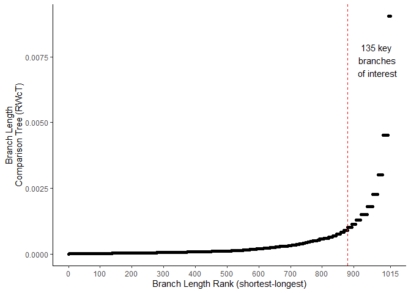

<details class="code-fold">
<summary>Show the code</summary>

``` r
output_dir <- "quarto_outputs/"

ggsave(paste0(output_dir, "figures/Figure2_A.png"), plot = branch_length_by_rank,  scale = 1,
        width = 3000,
        height = 1354,
        units = "px",
        dpi = 300)
```

</details>

## Calculate RWiBaLD branch categories (neo-endemic, meso-endemic, paleo-endemic)

Next we take the key branches of interest and define which of them are
neo-endemic, meso-endemic or paleo-endemic. We use the same elbow
statistic defined above but only consider the branches of key interest
calculated above as valid. We split the data at 0 with those equal or
below the elbow point threshold in the negative data being neo-endemics.
Those in the positive dataset equal or above the elbow point threshold
being classified as paleo-endemic, and rest are classified as
meso-endemic. We have described three categories, but of course one
could break the continuous distribution into further categories if
required.

<details class="code-fold">
<summary>Show the code</summary>

``` r
# Load the data
data <- rwibald_results_all[,c("NAME", "bl_comparison_tree_rwibald_elbow_key", "rwibald_score", "rwibald_score_rank")] %>%
  arrange(., rwibald_score_rank)

# Subset the left and right dataframes
subset_left_df <- data[data$rwibald_score <= 0, ]
subset_right_df <- data[data$rwibald_score >= 0, ]

# Create a list to store the results for the table
results <- list()

# Records in negative data
negative_records <- nrow(subset_left_df)
results$Negative_Records <- negative_records

# Neo cutoff
left_point_x <- get_elbow(subset_left_df$rwibald_score)
rwibald_score_rank_at_left_point <- subset_left_df[subset_left_df$rwibald_score == left_point_x$y, "rwibald_score_rank"]
results$Neo_Cutoff <- rwibald_score_rank_at_left_point

# Plot for left half of curve
l <- ggplot(subset_left_df, aes(x = rwibald_score_rank, y = rwibald_score)) +
  geom_point() +
  geom_vline(xintercept = rwibald_score_rank_at_left_point, color = "red", linetype = "dashed") +
  ggtitle(label= "Neo cutoff") +
  theme_classic() +
  theme(plot.title = element_text(hjust = 0.5))
print(l)
```

</details>

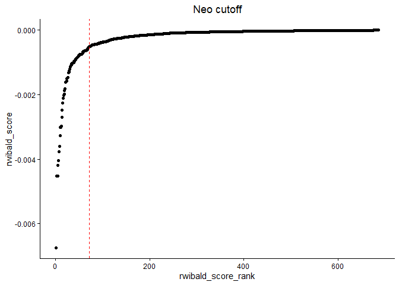

<details class="code-fold">
<summary>Show the code</summary>

``` r
ggsave(paste0(output_dir, "figures/Figure2B_L.png"), plot = l,  scale = 1,
        width = 2048,
        height = 1024,
        units = "px",
        dpi = 300)

# Records in positive data
positive_records <- nrow(subset_right_df)
results$Positive_Records <- positive_records

# Paleo cutoff
right_point_x <- get_elbow(subset_right_df$rwibald_score)
rwibald_score_rank_at_right_point <- subset_right_df[subset_right_df$rwibald_score == right_point_x$y, "rwibald_score_rank"]
results$Paleo_Cutoff <- rwibald_score_rank_at_right_point

# Plot for right half of curve
r <- ggplot(subset_right_df, aes(x = rwibald_score_rank, y = rwibald_score)) +
  geom_point() +
  geom_vline(xintercept = rwibald_score_rank_at_right_point, color = "red", linetype = "dashed") +
  ggtitle(label= "Paleo cutoff") +
  theme_classic() +
  theme(plot.title = element_text(hjust = 0.5))
print(r)
```

</details>

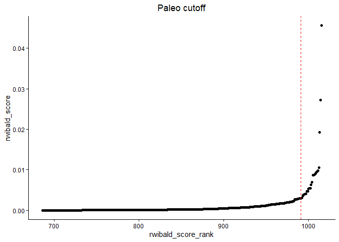

<details class="code-fold">
<summary>Show the code</summary>

``` r
ggsave(paste0(output_dir, "figures/Figure2B_R.png"), plot = r,  scale = 1,
        width = 2048,
        height = 1024,
        units = "px",
        dpi = 300)

# Create a column with the results
rwibald_results_key_type <- rwibald_results_all %>%
  filter(bl_comparison_tree_rwibald_elbow_key == "key") %>%
  mutate(rwibald_type = case_when(rwibald_score_rank <= rwibald_score_rank_at_left_point ~ "neo-endemic", 
                                  rwibald_score_rank >= rwibald_score_rank_at_right_point ~ "paleo-endemic",
                                  TRUE ~ "meso-endemic")) %>%
  select(NAME, rwibald_type)

# Convert the results list to a dataframe for gt
summary_results_df <- as.data.frame(t(sapply(results, c)))
results_gt <- gt(data = summary_results_df)

# Display the table
results_gt %>%
  tab_header(title = "Summary of Records and Cutoffs") %>%
  fmt_number(columns = everything(), decimals = 0) %>%
  tab_style(style = cell_text(align = "center"),
            locations = cells_body()
            )
# View(rwibald_results_key_type)

# Merge the data
rwibald_results_all <- merge(rwibald_results_all, rwibald_results_key_type[, c("NAME","rwibald_type")], by=c('NAME','NAME'),all.x=T)

# View(rwibald_results_all)
output_dir <- "quarto_outputs/"

# Write data to file
write.csv(rwibald_results_all,paste0(output_dir, "Acacia_RWiBaLD_results_all.csv") ,row.names=FALSE)
```

</details>

<div id="ryrqhlfbxc" style="padding-left:0px;padding-right:0px;padding-top:10px;padding-bottom:10px;overflow-x:auto;overflow-y:auto;width:auto;height:auto;">
<style>#ryrqhlfbxc table {
  font-family: system-ui, 'Segoe UI', Roboto, Helvetica, Arial, sans-serif, 'Apple Color Emoji', 'Segoe UI Emoji', 'Segoe UI Symbol', 'Noto Color Emoji';
  -webkit-font-smoothing: antialiased;
  -moz-osx-font-smoothing: grayscale;
}
&#10;#ryrqhlfbxc thead, #ryrqhlfbxc tbody, #ryrqhlfbxc tfoot, #ryrqhlfbxc tr, #ryrqhlfbxc td, #ryrqhlfbxc th {
  border-style: none;
}
&#10;#ryrqhlfbxc p {
  margin: 0;
  padding: 0;
}
&#10;#ryrqhlfbxc .gt_table {
  display: table;
  border-collapse: collapse;
  line-height: normal;
  margin-left: auto;
  margin-right: auto;
  color: #333333;
  font-size: 16px;
  font-weight: normal;
  font-style: normal;
  background-color: #FFFFFF;
  width: auto;
  border-top-style: solid;
  border-top-width: 2px;
  border-top-color: #A8A8A8;
  border-right-style: none;
  border-right-width: 2px;
  border-right-color: #D3D3D3;
  border-bottom-style: solid;
  border-bottom-width: 2px;
  border-bottom-color: #A8A8A8;
  border-left-style: none;
  border-left-width: 2px;
  border-left-color: #D3D3D3;
}
&#10;#ryrqhlfbxc .gt_caption {
  padding-top: 4px;
  padding-bottom: 4px;
}
&#10;#ryrqhlfbxc .gt_title {
  color: #333333;
  font-size: 125%;
  font-weight: initial;
  padding-top: 4px;
  padding-bottom: 4px;
  padding-left: 5px;
  padding-right: 5px;
  border-bottom-color: #FFFFFF;
  border-bottom-width: 0;
}
&#10;#ryrqhlfbxc .gt_subtitle {
  color: #333333;
  font-size: 85%;
  font-weight: initial;
  padding-top: 3px;
  padding-bottom: 5px;
  padding-left: 5px;
  padding-right: 5px;
  border-top-color: #FFFFFF;
  border-top-width: 0;
}
&#10;#ryrqhlfbxc .gt_heading {
  background-color: #FFFFFF;
  text-align: center;
  border-bottom-color: #FFFFFF;
  border-left-style: none;
  border-left-width: 1px;
  border-left-color: #D3D3D3;
  border-right-style: none;
  border-right-width: 1px;
  border-right-color: #D3D3D3;
}
&#10;#ryrqhlfbxc .gt_bottom_border {
  border-bottom-style: solid;
  border-bottom-width: 2px;
  border-bottom-color: #D3D3D3;
}
&#10;#ryrqhlfbxc .gt_col_headings {
  border-top-style: solid;
  border-top-width: 2px;
  border-top-color: #D3D3D3;
  border-bottom-style: solid;
  border-bottom-width: 2px;
  border-bottom-color: #D3D3D3;
  border-left-style: none;
  border-left-width: 1px;
  border-left-color: #D3D3D3;
  border-right-style: none;
  border-right-width: 1px;
  border-right-color: #D3D3D3;
}
&#10;#ryrqhlfbxc .gt_col_heading {
  color: #333333;
  background-color: #FFFFFF;
  font-size: 100%;
  font-weight: normal;
  text-transform: inherit;
  border-left-style: none;
  border-left-width: 1px;
  border-left-color: #D3D3D3;
  border-right-style: none;
  border-right-width: 1px;
  border-right-color: #D3D3D3;
  vertical-align: bottom;
  padding-top: 5px;
  padding-bottom: 6px;
  padding-left: 5px;
  padding-right: 5px;
  overflow-x: hidden;
}
&#10;#ryrqhlfbxc .gt_column_spanner_outer {
  color: #333333;
  background-color: #FFFFFF;
  font-size: 100%;
  font-weight: normal;
  text-transform: inherit;
  padding-top: 0;
  padding-bottom: 0;
  padding-left: 4px;
  padding-right: 4px;
}
&#10;#ryrqhlfbxc .gt_column_spanner_outer:first-child {
  padding-left: 0;
}
&#10;#ryrqhlfbxc .gt_column_spanner_outer:last-child {
  padding-right: 0;
}
&#10;#ryrqhlfbxc .gt_column_spanner {
  border-bottom-style: solid;
  border-bottom-width: 2px;
  border-bottom-color: #D3D3D3;
  vertical-align: bottom;
  padding-top: 5px;
  padding-bottom: 5px;
  overflow-x: hidden;
  display: inline-block;
  width: 100%;
}
&#10;#ryrqhlfbxc .gt_spanner_row {
  border-bottom-style: hidden;
}
&#10;#ryrqhlfbxc .gt_group_heading {
  padding-top: 8px;
  padding-bottom: 8px;
  padding-left: 5px;
  padding-right: 5px;
  color: #333333;
  background-color: #FFFFFF;
  font-size: 100%;
  font-weight: initial;
  text-transform: inherit;
  border-top-style: solid;
  border-top-width: 2px;
  border-top-color: #D3D3D3;
  border-bottom-style: solid;
  border-bottom-width: 2px;
  border-bottom-color: #D3D3D3;
  border-left-style: none;
  border-left-width: 1px;
  border-left-color: #D3D3D3;
  border-right-style: none;
  border-right-width: 1px;
  border-right-color: #D3D3D3;
  vertical-align: middle;
  text-align: left;
}
&#10;#ryrqhlfbxc .gt_empty_group_heading {
  padding: 0.5px;
  color: #333333;
  background-color: #FFFFFF;
  font-size: 100%;
  font-weight: initial;
  border-top-style: solid;
  border-top-width: 2px;
  border-top-color: #D3D3D3;
  border-bottom-style: solid;
  border-bottom-width: 2px;
  border-bottom-color: #D3D3D3;
  vertical-align: middle;
}
&#10;#ryrqhlfbxc .gt_from_md > :first-child {
  margin-top: 0;
}
&#10;#ryrqhlfbxc .gt_from_md > :last-child {
  margin-bottom: 0;
}
&#10;#ryrqhlfbxc .gt_row {
  padding-top: 8px;
  padding-bottom: 8px;
  padding-left: 5px;
  padding-right: 5px;
  margin: 10px;
  border-top-style: solid;
  border-top-width: 1px;
  border-top-color: #D3D3D3;
  border-left-style: none;
  border-left-width: 1px;
  border-left-color: #D3D3D3;
  border-right-style: none;
  border-right-width: 1px;
  border-right-color: #D3D3D3;
  vertical-align: middle;
  overflow-x: hidden;
}
&#10;#ryrqhlfbxc .gt_stub {
  color: #333333;
  background-color: #FFFFFF;
  font-size: 100%;
  font-weight: initial;
  text-transform: inherit;
  border-right-style: solid;
  border-right-width: 2px;
  border-right-color: #D3D3D3;
  padding-left: 5px;
  padding-right: 5px;
}
&#10;#ryrqhlfbxc .gt_stub_row_group {
  color: #333333;
  background-color: #FFFFFF;
  font-size: 100%;
  font-weight: initial;
  text-transform: inherit;
  border-right-style: solid;
  border-right-width: 2px;
  border-right-color: #D3D3D3;
  padding-left: 5px;
  padding-right: 5px;
  vertical-align: top;
}
&#10;#ryrqhlfbxc .gt_row_group_first td {
  border-top-width: 2px;
}
&#10;#ryrqhlfbxc .gt_row_group_first th {
  border-top-width: 2px;
}
&#10;#ryrqhlfbxc .gt_summary_row {
  color: #333333;
  background-color: #FFFFFF;
  text-transform: inherit;
  padding-top: 8px;
  padding-bottom: 8px;
  padding-left: 5px;
  padding-right: 5px;
}
&#10;#ryrqhlfbxc .gt_first_summary_row {
  border-top-style: solid;
  border-top-color: #D3D3D3;
}
&#10;#ryrqhlfbxc .gt_first_summary_row.thick {
  border-top-width: 2px;
}
&#10;#ryrqhlfbxc .gt_last_summary_row {
  padding-top: 8px;
  padding-bottom: 8px;
  padding-left: 5px;
  padding-right: 5px;
  border-bottom-style: solid;
  border-bottom-width: 2px;
  border-bottom-color: #D3D3D3;
}
&#10;#ryrqhlfbxc .gt_grand_summary_row {
  color: #333333;
  background-color: #FFFFFF;
  text-transform: inherit;
  padding-top: 8px;
  padding-bottom: 8px;
  padding-left: 5px;
  padding-right: 5px;
}
&#10;#ryrqhlfbxc .gt_first_grand_summary_row {
  padding-top: 8px;
  padding-bottom: 8px;
  padding-left: 5px;
  padding-right: 5px;
  border-top-style: double;
  border-top-width: 6px;
  border-top-color: #D3D3D3;
}
&#10;#ryrqhlfbxc .gt_last_grand_summary_row_top {
  padding-top: 8px;
  padding-bottom: 8px;
  padding-left: 5px;
  padding-right: 5px;
  border-bottom-style: double;
  border-bottom-width: 6px;
  border-bottom-color: #D3D3D3;
}
&#10;#ryrqhlfbxc .gt_striped {
  background-color: rgba(128, 128, 128, 0.05);
}
&#10;#ryrqhlfbxc .gt_table_body {
  border-top-style: solid;
  border-top-width: 2px;
  border-top-color: #D3D3D3;
  border-bottom-style: solid;
  border-bottom-width: 2px;
  border-bottom-color: #D3D3D3;
}
&#10;#ryrqhlfbxc .gt_footnotes {
  color: #333333;
  background-color: #FFFFFF;
  border-bottom-style: none;
  border-bottom-width: 2px;
  border-bottom-color: #D3D3D3;
  border-left-style: none;
  border-left-width: 2px;
  border-left-color: #D3D3D3;
  border-right-style: none;
  border-right-width: 2px;
  border-right-color: #D3D3D3;
}
&#10;#ryrqhlfbxc .gt_footnote {
  margin: 0px;
  font-size: 90%;
  padding-top: 4px;
  padding-bottom: 4px;
  padding-left: 5px;
  padding-right: 5px;
}
&#10;#ryrqhlfbxc .gt_sourcenotes {
  color: #333333;
  background-color: #FFFFFF;
  border-bottom-style: none;
  border-bottom-width: 2px;
  border-bottom-color: #D3D3D3;
  border-left-style: none;
  border-left-width: 2px;
  border-left-color: #D3D3D3;
  border-right-style: none;
  border-right-width: 2px;
  border-right-color: #D3D3D3;
}
&#10;#ryrqhlfbxc .gt_sourcenote {
  font-size: 90%;
  padding-top: 4px;
  padding-bottom: 4px;
  padding-left: 5px;
  padding-right: 5px;
}
&#10;#ryrqhlfbxc .gt_left {
  text-align: left;
}
&#10;#ryrqhlfbxc .gt_center {
  text-align: center;
}
&#10;#ryrqhlfbxc .gt_right {
  text-align: right;
  font-variant-numeric: tabular-nums;
}
&#10;#ryrqhlfbxc .gt_font_normal {
  font-weight: normal;
}
&#10;#ryrqhlfbxc .gt_font_bold {
  font-weight: bold;
}
&#10;#ryrqhlfbxc .gt_font_italic {
  font-style: italic;
}
&#10;#ryrqhlfbxc .gt_super {
  font-size: 65%;
}
&#10;#ryrqhlfbxc .gt_footnote_marks {
  font-size: 75%;
  vertical-align: 0.4em;
  position: initial;
}
&#10;#ryrqhlfbxc .gt_asterisk {
  font-size: 100%;
  vertical-align: 0;
}
&#10;#ryrqhlfbxc .gt_indent_1 {
  text-indent: 5px;
}
&#10;#ryrqhlfbxc .gt_indent_2 {
  text-indent: 10px;
}
&#10;#ryrqhlfbxc .gt_indent_3 {
  text-indent: 15px;
}
&#10;#ryrqhlfbxc .gt_indent_4 {
  text-indent: 20px;
}
&#10;#ryrqhlfbxc .gt_indent_5 {
  text-indent: 25px;
}
&#10;#ryrqhlfbxc .katex-display {
  display: inline-flex !important;
  margin-bottom: 0.75em !important;
}
&#10;#ryrqhlfbxc div.Reactable > div.rt-table > div.rt-thead > div.rt-tr.rt-tr-group-header > div.rt-th-group:after {
  height: 0px !important;
}
</style>

| Summary of Records and Cutoffs |            |                  |              |
|:------------------------------:|:----------:|:----------------:|:------------:|
|        Negative_Records        | Neo_Cutoff | Positive_Records | Paleo_Cutoff |
|              686               |     71     |       330        |     991      |

</div>

## Load RWiBaLD results & tree data by cells

Now we load the data for the RWiBaLD results and the range weighted tree
data in tabular format and then replace the counts in the matrix with
the branch lengths for that group so we can generate the histograms for
each grid cell location. We also add the CANAPE scores to the data table
for comparison and calculate the ranges of each branch.

<details class="code-fold">
<summary>Show the code</summary>

``` r
data_dir <- "Acacia_biodiverse_exports/"
output_dir <- "quarto_outputs/"

# Data with internal branches (spatial anaylsis from BD) x grid cells
all_tree_data_csv <- paste0(data_dir, "Acacia_PD_Included_Node_List.csv")
RWiBaLD_results_csv  <- paste0(output_dir, "Acacia_RWiBaLD_results_all.csv")

all_tree_data <- read.table(all_tree_data_csv, header=T, sep=",", check.names = FALSE )
RWiBaLD_results <- read.table(RWiBaLD_results_csv, header=T, sep=",")

#View(all_tree_data)
#View(RWiBaLD_results)
valueToUse <- "rwibald_score"

# Iterate over the columns in Table 1
for (col in colnames(all_tree_data)[-c(1:3)]) {
  # get the corresponding "valueToUse" column specified above from Table 2
  branch_length <- RWiBaLD_results[RWiBaLD_results$NAME == col, paste0(valueToUse)]
  # replace the numbers in Table 1 with the "valueToUse" value
  all_tree_data[, col] <- ifelse(is.na(all_tree_data[, col]), NA, as.numeric(branch_length))
}

# View(all_tree_data)

# Write data to file
write.csv(all_tree_data, paste0(output_dir, "Acacia_PD_Included_Node_List_", valueToUse, ".csv"), row.names=FALSE)

# Get CANAPE data from biodiverse as well
canape_csv <- paste0(data_dir, "Acacia_Rand1_CANAPE_Export.csv")
canape_results <- read.table(canape_csv, header=T,sep=",")

# View(canape_results)

canape_group_data <- canape_results %>%
                     left_join(all_tree_data %>%
                               select(-c(Axis_0, Axis_1)), by = "ELEMENT"
                               )

# Transpose the dataframe
data <- t(canape_group_data)

# View(data)

# Set the first row as column names
transposed_df <- setNames(data.frame(data[-1,]), data[1,])

# View(transposed_df)

# Merge CANAPE and RWiBaLD data
canape_group_data_rwibald <- transposed_df %>%
  mutate(range_cell_count = rowSums(!is.na(.))) %>%
  tibble::rownames_to_column(var = "NAME") %>%
  left_join(select(rwibald_results_all, NAME, rwibald_type), by = 'NAME') %>%
  mutate(rwibald_type = ifelse(is.na(rwibald_type), "other", rwibald_type)) 

# Set row names
rownames(canape_group_data_rwibald) <- canape_group_data_rwibald$NAME 

# View(canape_group_data_rwibald)

# Add range data to results and create three new columns
rwibald_results_all_with_range <- rwibald_results_all %>%
  left_join(select(canape_group_data_rwibald, NAME, range_cell_count), by = "NAME") %>%
  mutate(rwibald_type = replace(rwibald_type, is.na(rwibald_type), "other"),
         non_range_weighted_branch_length_observed_tree = branch_length_observed_tree * range_cell_count,
         non_range_weighted_branch_length_comparison_tree = branch_length_comparison_tree * range_cell_count,
         diff_non_range_weighted_observed_to_comparison_bl = non_range_weighted_branch_length_observed_tree - non_range_weighted_branch_length_comparison_tree
        ) %>%
  mutate(rank_BaLD = rank(diff_non_range_weighted_observed_to_comparison_bl, ties.method = "first"))


# Write data to file
write.csv(rwibald_results_all_with_range, paste0(output_dir, "Acacia_RWiBaLD_results_all_with_range.csv"), row.names=FALSE)

# View(rwibald_results_all_with_range)
# View(rwibald_results_all)
```

</details>

## Generate figure 2B - ranked RWiBaLD score by RWiBaLD score

Here we plot the ranked RWiBaLD score (x) by the RWiBaLD score (y)
(Figure 2B), colouring the different RWiBaLD Categories: neo-endemic
(red), meso-endemic (darkolivegreen4) and paleo-endemic (royalblue1).

<details class="code-fold">
<summary>Show the code</summary>

``` r
# Find the neo_cutoff
neo_cutoff <- rwibald_results_all_with_range %>%
  filter(rwibald_type == "neo-endemic") %>%
  summarize(highest_rank = max(rwibald_score_rank, na.rm = TRUE)) %>%
  pull(highest_rank)

# Find the paleo_cutoff
paleo_cutoff <- rwibald_results_all_with_range %>%
  filter(rwibald_type == "paleo-endemic") %>%
  summarize(lowest_rank = min(rwibald_score_rank, na.rm = TRUE)) %>%
  pull(lowest_rank)

# Get only the rwibald branches of key interest
rwibald_results_all_key_only <- rwibald_results_all_with_range %>% 
                                filter(bl_comparison_tree_rwibald_elbow_key == "key")

# View(rwibald_results_all_key_only)
# View(rwibald_results_all_with_range)

# Plot rwibald rank X rwibald score
rwibald_key_plot <- ggplot() +
    geom_point(data=rwibald_results_all_with_range, aes(x = rwibald_score_rank, y = rwibald_score), fill="transparent", size = 3, colour= "grey77", alpha = 0.4, pch = 21) +
  geom_point(data = rwibald_results_all_key_only, aes(x = rwibald_score_rank, y = rwibald_score, fill = rwibald_type, color = rwibald_type), size = 3, alpha = 0.9, pch = 21) +
  scale_fill_manual(name = "RWiBaLD Category", values = c("paleo-endemic" = "royalblue1", "neo-endemic" = "red", "meso-endemic" = "darkolivegreen4"), labels = c("neo-endemic","meso-endemic", "paleo-endemic"), limits = c("neo-endemic","meso-endemic", "paleo-endemic"),  na.value = "transparent") +
  scale_color_manual(name = "RWiBaLD Category", values = c("paleo-endemic" = "royalblue4", "neo-endemic" = "red4", "meso-endemic" = "darkolivegreen"), labels = c("neo-endemic", "meso-endemic", "paleo-endemic"), limits = c("neo-endemic", "meso-endemic", "paleo-endemic"), na.value = "transparent") +
  geom_vline(xintercept = neo_cutoff, color = "red", linetype = "dashed") +
  geom_vline(xintercept = paleo_cutoff, color = "red", linetype = "dashed") +
  xlab("RWiBaLD Score Rank (shortest-longest)") +
  ylab("Range Weighted Branch\nLength Difference (RWiBaLD) Score") +
 #annotate("segment", x = results$Negative_Records, xend = results$Negative_Records, 
  #          y = max(rwibald_results_all_with_range$rwibald_score) * 1.1, yend = 0, 
  #          arrow = arrow(length = unit(0.2, "cm")), color = "grey74") +
  geom_vline(xintercept = results$Negative_Records, color = "grey74", linetype = "solid") +
  theme_classic() +
  theme(plot.title = element_text(hjust = 0.5), legend.position="bottom", legend.text = element_text(size = 12))

print(rwibald_key_plot)
```

</details>


<details class="code-fold">
<summary>Show the code</summary>

``` r
ggsave("quarto_outputs/figures/Figure2_B.png", plot = rwibald_key_plot,  scale = 1,
        width = 3000,
        height = 1354,
        units = "px",
        dpi = 300)
```

</details>

## Generate figure 2C - ranked BaLD by BaLD (non range weighted)

Illustrating the distribution of branch lengths on the observed tree
with no range-weighting; the Y-axis is the difference between length on
the observed tree and length on the comparison tree for each branch; the
X-axis is ranked branch length difference (shortest - longest).  The
branches of interest are colored by RWiBaLD category as in 2B

<details class="code-fold">
<summary>Show the code</summary>

``` r
#View(rwibald_results_all_with_range)

#View(rwibald_results_all_key_only)

# Plot non_range_weighted score
rwibald_key_plot_non_range_weighted <- ggplot() +
    #geom_point(data=rwibald_results_all_with_range, aes(x = reorder(non_range_weighted_branch_length_observed_tree, non_range_weighted_branch_length_observed_tree), y = diff_non_range_weighted_observed_to_comparison_bl), fill="transparent", size = 3, colour= "grey77", alpha = 0.4, pch = 21) +
  geom_point(data=rwibald_results_all_with_range, aes(x = rank_BaLD, y = diff_non_range_weighted_observed_to_comparison_bl), fill="transparent", size = 3, colour= "grey77", alpha = 0.4, pch = 21) +
  geom_point(data = rwibald_results_all_key_only, aes(x =  rank_BaLD, y = diff_non_range_weighted_observed_to_comparison_bl, fill = rwibald_type, color = rwibald_type), size = 3, alpha = 0.9, pch = 21) +
  scale_fill_manual(name = "RWiBaLD Category", values = c("paleo-endemic" = "royalblue1", "neo-endemic" = "red", "meso-endemic" = "darkolivegreen4"), labels = c("neo-endemic","meso-endemic", "paleo-endemic"), limits = c("neo-endemic","meso-endemic", "paleo-endemic"),  na.value = "transparent") +
  scale_color_manual(name = "RWiBaLD Category", values = c("paleo-endemic" = "royalblue4", "neo-endemic" = "red4", "meso-endemic" = "darkolivegreen"), labels = c("neo-endemic", "meso-endemic", "paleo-endemic"), limits = c("neo-endemic", "meso-endemic", "paleo-endemic"), na.value = "transparent") +
  #geom_vline(xintercept = neo_cutoff, color = "red", linetype = "dashed") +
  #geom_vline(xintercept = paleo_cutoff, color = "red", linetype = "dashed") +
  xlab("Unweighted Branch Length Difference (BaLD) Score Rank (shortest−longest)") +
  ylab("Branch Length\nDifference (BaLD) Score") +
  geom_vline(xintercept = results$Negative_Records, color = "grey74", linetype = "solid") +
  theme_classic() +
  theme(plot.title = element_text(hjust = 0.5), legend.position="none", legend.text = element_text(size = 12), axis.title.x = element_text(size = 12), axis.text.x = element_text(size = 8))

print(rwibald_key_plot_non_range_weighted)
```

</details>

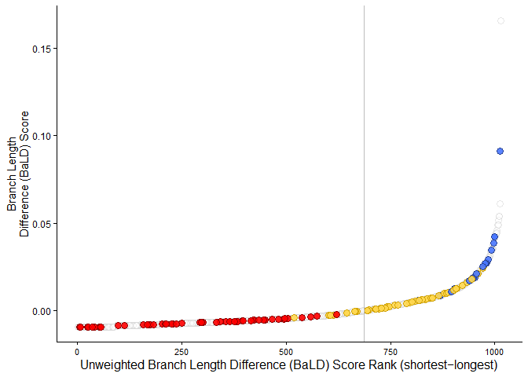

<details class="code-fold">
<summary>Show the code</summary>

``` r
ggsave("quarto_outputs/figures/Figure2_C.png", plot = rwibald_key_plot_non_range_weighted,  scale = 1,
        width = 3000,
        height = 1354,
        units = "px",
        dpi = 300)
```

</details>

## Generate multi-panel figure 2ABC

Here we generate a 2 up figure using patchwork

<details class="code-fold">
<summary>Show the code</summary>

``` r
patchwork <- branch_length_by_rank / rwibald_key_plot / rwibald_key_plot_non_range_weighted + plot_annotation(
  #title = 'Branches of Interest for Range Weighted Branch Length Difference (RWiBaLD)\n&\nRWiBaLD Scores With Categories Calculated Using Elbow Statistic',
  theme = theme(plot.title = element_text(hjust = 0.5)),
  subtitle = '',
  caption = '',
tag_levels = 'A') + 
  theme(plot.tag.position = c(0, 1),
        plot.tag = element_text(size = 12, hjust = 0, vjust = 0)) 

#print(patchwork)
#4062
ggsave("quarto_outputs/figures/Figure2_ABC.png", patchwork, width = 3000, height = 4062, units = "px")
```

</details>

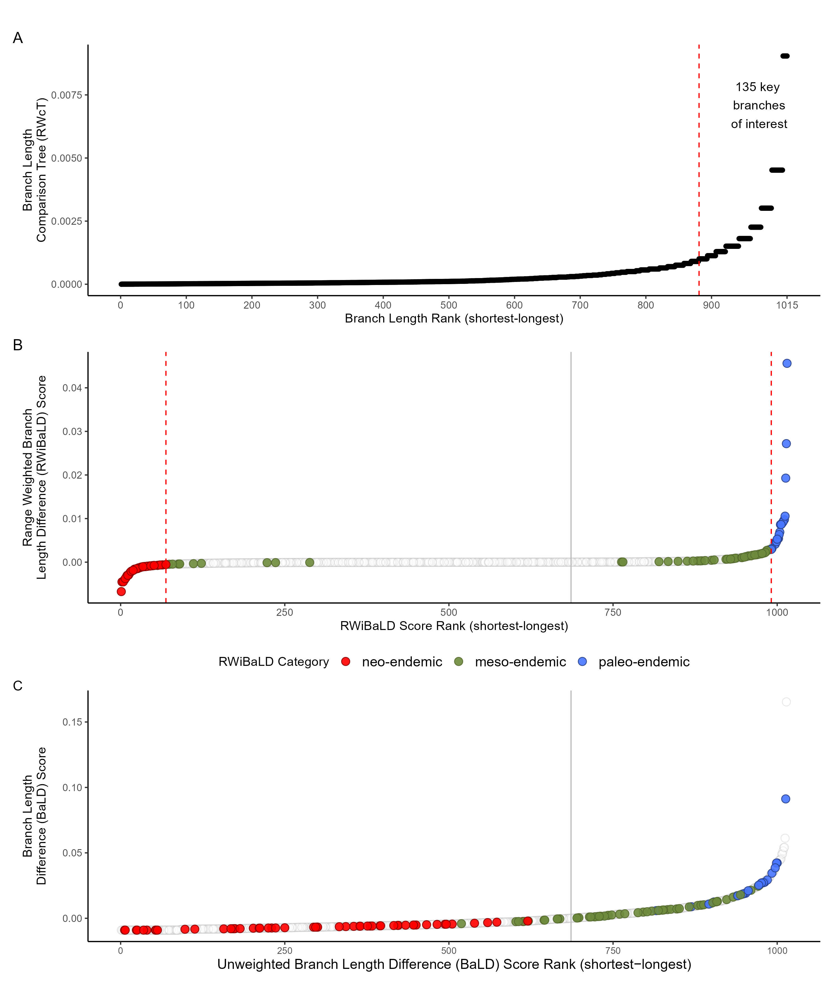

## Generate Figure 3A

Here we create a plot of RWiBaLD score (x) by branch range (cells)
(Figure 3A), coloured by RWiBaLD Categories: neo-endemic (red),
meso-endemic (green) and paleo-endemic (blue).

<details class="code-fold">
<summary>Show the code</summary>

``` r
# Plot RWiBaLD rank X branch range
rwibald_key_plot_range <- ggplot() +
    geom_point(data=rwibald_results_all_with_range, aes(x = rwibald_score_rank, y = range_cell_count), fill="transparent", size = 2, colour= "grey77", alpha = 0.4, pch = 21) +
  geom_point(data = rwibald_results_all_key_only, aes(x = rwibald_score_rank, y = range_cell_count, fill = rwibald_type, color = rwibald_type), size = 2, alpha = 0.9, pch = 21) +
  scale_fill_manual(name = "RWiBaLD Category", values = c("paleo-endemic" = "royalblue1","neo-endemic" = "red", "meso-endemic" = "darkolivegreen4"), labels = c("neo-endemic","meso-endemic", "paleo-endemic"), limits = c("neo-endemic","meso-endemic", "paleo-endemic"),  na.value = "transparent") +
  scale_color_manual(name = "RWiBaLD Category", values = c("paleo-endemic" = "royalblue4", "neo-endemic" = "red4", "meso-endemic" = "darkolivegreen"), labels = c("neo-endemic", "meso-endemic", "paleo-endemic"), limits = c("neo-endemic", "meso-endemic", "paleo-endemic"), na.value = "transparent") +
  geom_vline(xintercept = neo_cutoff, color = "red", linetype = "dashed") +
  geom_vline(xintercept = paleo_cutoff, color = "red", linetype = "dashed") +
  geom_vline(xintercept = results$Negative_Records, color = "grey74", linetype = "solid") +
  xlab("RWiBaLD Score Rank (shortest-longest)") +
  ylab("Branch Range (cells)") +
  theme_classic() +
  theme(plot.title = element_text(hjust =1),
        legend.position="none", 
        legend.text = element_text(size = rel(1)),
        legend.title = element_text(size = rel(1)), 
        axis.title.x = element_text(size = rel(1)),
        axis.title.y = element_text(size = rel(1)),
        axis.text.x = element_text(size = rel(1)),
        axis.text.y = element_text(size = rel(1)))

print(rwibald_key_plot_range)
```

</details>

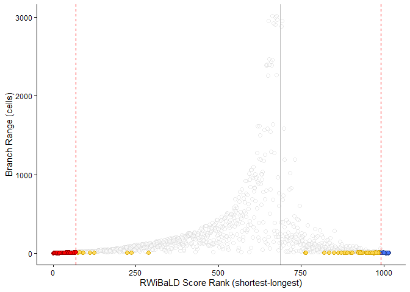

<details class="code-fold">
<summary>Show the code</summary>

``` r
ggsave("quarto_outputs/figures/Figure3_A.png", plot = rwibald_key_plot_range,  scale = 1,
        width = 2048,
        height = 1024,
        units = "px",
        dpi = 300)
```

</details>

## Generate Figure 3B

Now the same data as figure 3A but first removing all internal branches
before plotting the data. Note: the neo / meso /paleo cuttofs are
calculated on the whole dataset and the filtering to terminals done
after that.

<details class="code-fold">
<summary>Show the code</summary>

``` r
# For plotting purposes get only the rwibald branches of key interest and terminals only
rwibald_results_all_key_only_terminals <- rwibald_results_all_with_range %>%
  filter(!grepl("^[0-9]", NAME)) %>%
  mutate(rwibald_score_rank_terminals = rank(rwibald_score, ties.method = "first")) %>% 
    filter(bl_comparison_tree_rwibald_elbow_key == "key") 

rwibald_results_all_with_range_terminals <- rwibald_results_all_with_range %>% 
    filter(!grepl("^[0-9]", NAME)) %>%
  mutate(rwibald_score_rank_terminals = rank(rwibald_score, ties.method = "first"))

# Find the neo_cutoff
neo_cutoff_terms <- rwibald_results_all_with_range_terminals %>%
  filter(rwibald_type == "neo-endemic") %>%
  summarize(highest_rank = max(rwibald_score_rank_terminals, na.rm = TRUE)) %>%
  pull(highest_rank)

# Find the paleo_cutoff
paleo_cutoff_terms <- rwibald_results_all_with_range_terminals %>%
  filter(rwibald_type == "paleo-endemic") %>%
  summarize(lowest_rank = min(rwibald_score_rank_terminals, na.rm = TRUE)) %>%
  pull(lowest_rank)

# Subset the left and right dataframes
subset_left_df_terms <- rwibald_results_all_with_range_terminals[rwibald_results_all_with_range_terminals$rwibald_score <= 0, ]

# Records in negative data
negative_records_terms <- nrow(subset_left_df_terms)

# View(rwibald_results_all_key_only_terminals)
# View(rwibald_results_all_with_range_terminals)

# View(rwibald_results_all_with_range)

# Plot rwibald rank x rwibald score
# rwibald_key_plot_terminals <- ggplot() +
#     geom_point(data=rwibald_results_all_with_range_terminals, aes(x = rwibald_score_rank_terminals, y = rwibald_score), fill="transparent", size =3, colour= "grey77", alpha = 0.4, pch=21) +
#   geom_point(data = rwibald_results_all_key_only_terminals, aes(x = rwibald_score_rank_terminals, y = rwibald_score, fill = rwibald_type, color = rwibald_type), size =3, alpha = 0.9, pch=21) +
#   scale_fill_manual(name = "RWiBaLD Category", values = c("paleo-endemic" = "royalblue1", "neo-endemic" = "red", "meso-endemic" = "darkolivegreen4"), labels = c("neo-endemic","meso-endemic", "paleo-endemic"), limits = c("neo-endemic","meso-endemic", "paleo-endemic"),  na.value = "transparent") +
#   scale_color_manual(name = "RWiBaLD Category", values = c("paleo-endemic" = "royalblue4", "neo-endemic" = "red4", "meso-endemic" = "darkolivegreen"), labels = c("neo-endemic", "meso-endemic", "paleo-endemic"), limits = c("neo-endemic", "meso-endemic", "paleo-endemic"), na.value = "transparent") +
#   geom_vline(xintercept = neo_cutoff, color = "red", linetype = "dashed") +
#   geom_vline(xintercept = paleo_cutoff, color = "red", linetype = "dashed") +
#   xlab("RWiBaLD Score Rank Terminals Only (shortest-longest)") +
#   ylab("Range Weighted Branch\nLength Difference (RWiBaLD) Score") +
#   theme_classic() +
#   theme(plot.title = element_text(hjust = 0.5), legend.position="bottom", legend.text = element_text(size = 12))
# 
# print(rwibald_key_plot_terminals)
# 
# ggsave("quarto_outputs/figures/Figure3_B_terminals_only.png", plot = rwibald_key_plot_terminals,  scale = 1,
#         width = 2048,
#         height = 1024,
#         units = "px",
#         dpi = 300)

# Plot rwibald rank x branch range
rwibald_key_plot_range_terminals <- ggplot() +
    geom_point(data=rwibald_results_all_with_range_terminals, aes(x = rwibald_score_rank_terminals, y = range_cell_count), fill="transparent", size =3, colour= "grey77", alpha = 0.4, pch=21) +
  geom_point(data = rwibald_results_all_key_only_terminals, aes(x = rwibald_score_rank_terminals, y = range_cell_count, fill = rwibald_type, color = rwibald_type), size =3, alpha = 0.9, pch=21) +
  scale_fill_manual(name = "RWiBaLD Category", values = c("paleo-endemic" = "royalblue1","neo-endemic" = "red", "meso-endemic" = "darkolivegreen4"), labels = c("neo-endemic","meso-endemic", "paleo-endemic"), limits = c("neo-endemic","meso-endemic", "paleo-endemic"),  na.value = "transparent") +
  scale_color_manual(name = "RWiBaLD Category", values = c("paleo-endemic" = "royalblue4", "neo-endemic" = "red4", "meso-endemic" = "darkolivegreen"), labels = c("neo-endemic", "meso-endemic", "paleo-endemic"), limits = c("neo-endemic", "meso-endemic", "paleo-endemic"), na.value = "transparent") +
  geom_vline(xintercept = neo_cutoff_terms, color = "red", linetype = "dashed") +
  geom_vline(xintercept = paleo_cutoff_terms, color = "red", linetype = "dashed") +
    geom_vline(xintercept = negative_records_terms, color = "grey74", linetype = "solid") +
  xlab("RWiBaLD Score Rank Terminals Only (shortest-longest)") +
  ylab("Branch Range (cells)") +
  theme_classic() +
  theme(plot.title = element_text(hjust = 0.5), legend.position="bottom", legend.text = element_text(size=rel(1)))

print(rwibald_key_plot_range_terminals)
```

</details>

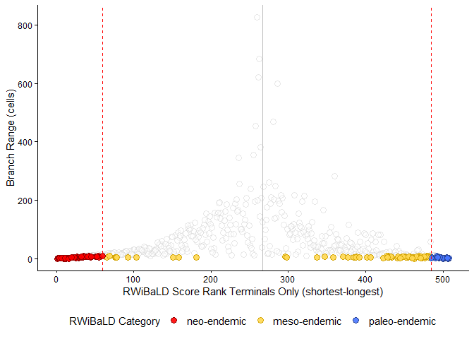

<details class="code-fold">
<summary>Show the code</summary>

``` r
ggsave("quarto_outputs/figures/Figure3_B.png", plot = rwibald_key_plot_range_terminals,  scale = 1,
        width = 2048,
        height = 1024,
        units = "px",
        dpi = 300)
```

</details>

## Generate multi-panel figure 3AB

<details class="code-fold">
<summary>Show the code</summary>

``` r
patchwork <- rwibald_key_plot_range / rwibald_key_plot_range_terminals + plot_annotation(
  theme = theme(plot.title = element_text(hjust = 0.5)),
  subtitle = '',
  caption = '',
tag_levels = 'A') + 
   theme(plot.tag.position = c(0, 1),
        plot.tag = element_text(size = 12, hjust = 0, vjust = 0)) 

#print(patchwork)

ggsave("quarto_outputs/figures/Figure3_AB.png", patchwork, width = 3000, height = 3600, units = "px")
```

</details>

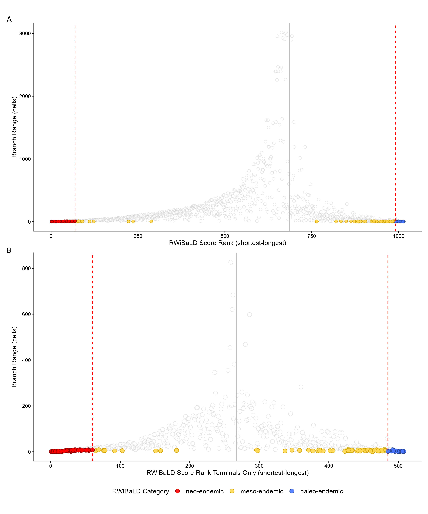

## Read tree file & generate supplementary figure 1

Now we load the range weighted tree file exported from biodiverse and
colour code it by the RWiBaLD categories.

<details class="code-fold">
<summary>Show the code</summary>

``` r
# if need be check and install ggtree using this code
# if (!require("BiocManager", quietly = TRUE))
#     install.packages("BiocManager")
#  
# BiocManager::install("ggtree")

data_dir <- "Acacia_biodiverse_exports/"

all_tree_data_nwk <- paste0(data_dir, "acacia_tree_TRIMMED1_EQ1_RW1.nwk")

myTree <- read.tree(file=all_tree_data_nwk)

rwibald_results_all <- rwibald_results_all %>% 
  mutate(rwibald_type = replace(rwibald_type,is.na(rwibald_type),"other"))

# View(rwibald_results_all)

rwibald_results_all$tree_cols <- as.factor(rwibald_results_all$rwibald_type)

# Remove quotes from labels so they match dataframe
myTree$tip.label <- gsub("'","",myTree$tip.label)
myTree$node.label <- gsub("'","",myTree$node.label)

# Create ggtree object
g <- ggtree(myTree) %<+% rwibald_results_all +
      aes(color=tree_cols) +
      scale_color_manual(values = c("paleo-endemic" = "royalblue1",
                                 "neo-endemic" = "red",
                                 "meso-endemic" = "darkolivegreen")) +
     # geom_text2(aes(label = node), 
     #         hjust =0,    # adjust horizontal position
     #         vjust = 0,     # adjust vertical position
     #         size = 1,        # adjust text size
     #         color = "blue")  + # adjust text color
      theme(legend.position="none") +
       geom_tiplab(as_ylab=FALSE, size=1)

# Display the plot
#print(g)

ggsave("quarto_outputs/figures/SupFigure1_full_tree.png", g, width = 2048,
        height = 4024, units = "px")
```

</details>

## Generate tree in 2 halves supplementary figure 1A and 1B

<details class="code-fold">
<summary>Show the code</summary>

``` r
data_dir <- "Acacia_biodiverse_exports/"
all_tree_data_nwk <- paste0(data_dir, "acacia_tree_TRIMMED1_EQ1_RW1.nwk")

myTree <- read.tree(file=all_tree_data_nwk)

rwibald_results_all <- rwibald_results_all %>% 
  mutate(rwibald_type = replace(rwibald_type, is.na(rwibald_type), "other"))

rwibald_results_all$tree_cols <- as.factor(rwibald_results_all$rwibald_type)

# Remove quotes from labels so they match the dataframe
myTree$tip.label <- gsub("'", "", myTree$tip.label)
myTree$node.label <- gsub("'", "", myTree$node.label)

# Calculate the halfway point
half <- length(myTree$tip.label) / 2

# Sort the tip labels for consistency
tip_labels <- myTree$tip.label
first_half_tips <- tip_labels[1:half]
second_half_tips <- tip_labels[(half + 1):length(tip_labels)]

# Identify MRCA nodes for each half
node_first_half <- getMRCA(myTree, first_half_tips)
node_second_half <- getMRCA(myTree, second_half_tips)


# Create the base ggtree object
g <- ggtree(myTree) %<+% rwibald_results_all +
      aes(color = tree_cols) +
      scale_color_manual(values = c("paleo-endemic" = "royalblue1",
                                    "neo-endemic" = "red",
                                    "meso-endemic" = "darkolivegreen",
                                    "other" = "gray66")) +
      theme(legend.position = "none") +
      geom_tiplab(as_ylab = FALSE, size=1)

#plot(g)

# Identify MRCA node
mrca_node <- MRCA(g, second_half_tips)

second_half_tree <- viewClade(tree_view = g, mrca_node) +
    geom_point2(
      aes(subset = (node == mrca_node)),
    shape = 21,
    size = 2,
    fill = 'gray26',
    nudge_x = 20,
    position = position_nudge(y = -88)) 


# +
#   theme(panel.ontop = FALSE,
#          panel.spacing.x = unit(c(1, 1, 1, 1), "cm"),
#          panel.background = element_rect(color = "green", fill="transparent", linewidth = 10),
#          plot.margin = unit(c(1, 1, 1, 1), "cm"))


#plot(second_half_tree)
 
# Save the figure showing the second half expanded and the first half collapsed
ggsave("quarto_outputs/figures/SupFigure_1A.png", 
        second_half_tree, width = 2048, height = 4024, units = "px")

#plot(g)
# Collapse the second half of the tree
g_half_collapsed <- collapse(g, node = node_second_half) +
  # Add a point to indicate the collapsed node for reference
  geom_point2(aes(subset=(node == node_second_half)), shape=21, size=2, fill='gray26')

#plot(g_half_collapsed)

# Save the figure showing the first half expanded and the second half collapsed
ggsave("quarto_outputs/figures/SupFigure_1B.png", 
       g_half_collapsed, width = 2048, height = 4024, units = "px")
```

</details>

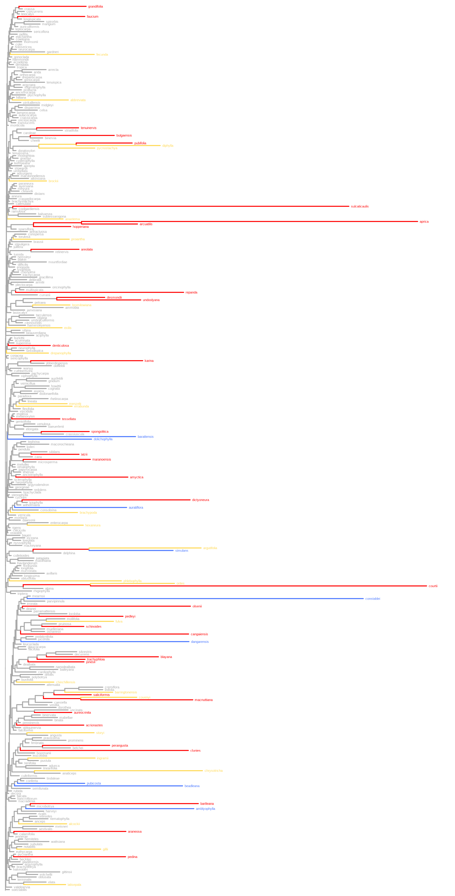

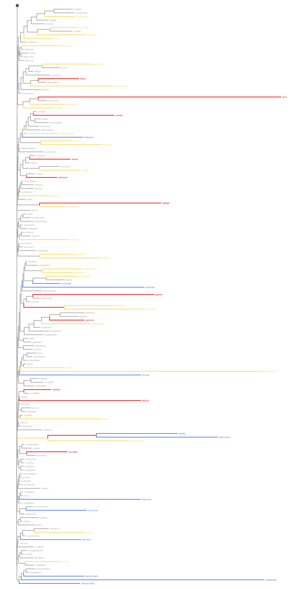

## Load data & generate histograms for all cells

Next we load the data and generate histograms. This code generates a
histogram for every cell in the dataset. For convenience the file names
contain the CANAPE code and whether the histogram contains branches of
key interest.

<details class="code-fold">
<summary>Show the code</summary>

``` r
#function to change decimal places displayed on plot
scaleFUN <- function(x) sprintf("%.8g", x)

# Function to replace '-' with 'm' and ':' with '_'
clean_column_names <- function(df) {
  new_names <- colnames(df) %>%
    gsub("-", "neg", .) %>%
    gsub(":", "_", .)
  colnames(df) <- new_names
  return(df)
}

# Clean column names using the function
canape_group_data_rwibald <- clean_column_names(canape_group_data_rwibald)

#View(canape_group_data_rwibald)

col_scheme <- c("paleo-endemic" = "royalblue1","neo-endemic" = "red", "meso-endemic" = "darkolivegreen", "other" = "lightgoldenrodyellow")
#legend_labels <- c("neo-endemic"="Neo Endemic","paleo-endemic"="paleo Endemic", "other" = "other", "meso-endemic" = "Meso Endemic")

#data <- transposed_df
#View(canape_key_group_data_rwibald)

#Generate all histograms
for (i in 2:(ncol(canape_group_data_rwibald)-2)) {# skip first column and last 2 as they are NAME,cell_count,rwibald_type
#for (i in 74:74) {
  #i <- 74
  data <- canape_group_data_rwibald[-(1:6),] # remove the rows not needed
  col_name <- colnames(data)[i] # get the column name to generate the histogram of
  colourByCol <- "rwibald_type"  # set the column to use for colouring the histogram
  numberOfBins <- 41 # set number of bins to use 
  hist_data <- na.omit(as.numeric(data[[col_name]])) # extract that column data for ploting
  hist_range <- range(hist_data,na.rm=TRUE) # calculate the range of all values in the column ie. min/max value

#calculate the total range of the whole data set to get a consistent x scale on all histograms.    
dataForRange <- data %>%
  select(-first(colnames(.)), -last(colnames(.))) %>%
  mutate(across(everything(), as.numeric)) 
totalRange <- range(dataForRange, na.rm=TRUE)#lowest and highedt values in the dataset
totalRangeGap <- max(dataForRange, na.rm = TRUE) - min(dataForRange, na.rm = TRUE) # distance between range above

  range <- max(hist_data) - min(hist_data)
  binSize <- range/numberOfBins
  farthest_number <- max(abs(hist_range)) # calculate the number farthest from 0
  x_min <- -(farthest_number)-2*(binSize) # set xmin so zero is centred
  x_max <- (farthest_number)+2*(binSize) # set xmax so zero is centred
 
  #check to see if any of the branches in the histogram are RWIBALD significant to add to the file names
  result <- data %>%
  select(!!sym(col_name), !!sym(colourByCol)) %>%  
  filter(!is.na(!!sym(col_name))) %>%
  summarise(result = ifelse(any(!!sym(colourByCol) %in% c("paleo-endemic", "neo-endemic", "meso-endemic")), "key", "zero-key")) %>%
  pull(result)
  
  #View(result)
  # setup the file names 
  CANAPE_CODE <- canape_group_data_rwibald["CANAPE_CODE", col_name]
  cell <- str_replace_all(col_name, "[:]", "_")
  filename <- paste0("quarto_outputs/histograms/", cell, "_CC_", CANAPE_CODE,"_", result, "_", numberOfBins,"bins.png")
  
  #print(filename)
  # get a subset of dataframe for the histogram
  plot_data <- data %>%
  select(!!sym(col_name), !!sym(colourByCol)) %>%  
  filter(!is.na(!!sym(col_name))) %>%
  arrange(!!sym(colourByCol))
  
  #View(plot_data)

 plot <- ggplot(plot_data, aes(x = as.numeric(.data[[col_name]]), fill = forcats::fct_rev(rwibald_type))) +
  geom_histogram(color = "black", linewidth= 0.2, bins = numberOfBins) +
  scale_fill_manual(values = col_scheme) +
  xlim(x_min, x_max) +
  coord_cartesian(ylim = c(0, 15)) +
  labs(x = "RWiBaLD Score", y = "Frequency", fill = "Branch Category") +
  theme_bw()
 
 plot <- plot +
  stat_bin(
    aes(label = after_stat(if_else (condition = count>15, as.character(count), ""))),
    bins= as.numeric(numberOfBins),
    position=position_stack(vjust=0.1),
    pad=TRUE,
    geom = "text",
    color = "black",
    size = 2,
    y = 14
  )
 
 CairoPNG(width = 1024, height = 600, file = filename, canvas="white", bg = "white", units="px", dpi=96, title = "") 
  print(plot)
 dev.off()
}
```

</details>

## Load data & generate 12 histograms for figure 4A-L

This code filters out only the 12 histograms included in Figure 4 and
generates the ggplot2 objects of them.

<details class="code-fold">
<summary>Show the code</summary>

``` r
data <- t(canape_group_data)
#View(data)

#Transpose the dataframe and set the first row as column names
transposed_df <- setNames(data.frame(data[-1,]), data[1,])

#View(transposed_df)

#cells to keep
cols_to_keep <- c("NAME", "-1825000:-2975000", "75000:-2525000", "625000:-3475000","-1425000:-3225000","1775000:-3725000", "-1425000:-3475000", "-1225000:-3775000", "-1425000:-3275000", "1225000:-1275000", "-1175000:-3275000", "-1075000:-2825000", "-1075000:-2375000")

#Calculate RWiBaLD significants and Statistics etc.
canape_group_data_rwibald <- transposed_df %>%
  tibble::rownames_to_column(var = "NAME") %>%
  select(all_of(cols_to_keep)) %>%
  left_join(select(rwibald_results_all, NAME, rwibald_type), by = 'NAME') %>%
  mutate(rwibald_type = ifelse(is.na(rwibald_type), "other", rwibald_type))   

# Check if the column is already a factor
 if (!is.factor(canape_group_data_rwibald$rwibald_type)) {
   # If not a factor, convert and specify levels
   canape_group_data_rwibald$rwibald_type <- factor(canape_group_data_rwibald$rwibald_type, levels = c("neo-endemic", "meso-endemic", "paleo-endemic", "other"))
 }

#View(canape_group_data_rwibald)

# Function to replace '-' with 'm' and ':' with '_'
clean_column_names <- function(df) {
  new_names <- colnames(df) %>%
    gsub("-", "neg", .) %>%
    gsub(":", "_", .)
  colnames(df) <- new_names
  return(df)
}

# Clean column names using the function
canape_group_data_rwibald <- clean_column_names(canape_group_data_rwibald)

rownames(canape_group_data_rwibald) <- canape_group_data_rwibald$NAME 

#View(canape_group_data_rwibald)

# Write data to file
write.csv(canape_group_data_rwibald, paste0("quarto_outputs/transposed_df_figure_only.csv"), row.names=FALSE)

#function to change decimal places displayed on plot
scaleFUN <- function(x) sprintf("%.8g", x)

#View(canape_group_data_rwibald)

col_scheme <- c("paleo-endemic" = "royalblue1",
                "neo-endemic" = "red",
                "meso-endemic" = "darkolivegreen",
                "other" = "lightgoldenrodyellow"
                )

legend_labels <- c("neo-endemic" = "neo-endemic",
                   "paleo-endemic" = "paleo-endemic",
                   "meso-endemic" = "meso-endemic",
                   "other" = "other"
                   )

legend_order <- c("neo-endemic", "meso-endemic", "paleo-endemic", "other")

#data <- transposed_df
#View(canape_group_data_rwibald)

# Create an empty list to store plots
plot_list <- list()

#Generate histograms
for (i in 2:(ncol(canape_group_data_rwibald)-1)) {# skip first column and last 2 as they are NAME,rwibald_type
  #i <- 2
  local({ # have to make this local to allow multiple plots in patchwork
    i <- i
  data <- canape_group_data_rwibald[-(1:6),] # remove the rows not needed
  col_name <- colnames(data)[i] # get the column name to generate the histogram of
  colourByCol <- "rwibald_type"  # set the column to use for colouring the histogram
  numberOfBins <- 41 # set number of bins to use 
  
  # have to show only one legend as the 'collect' feature in patchwork does not collect the legends as desired
  if(i == 3){
  showLegend <- TRUE
  } else {
  showLegend <- FALSE
  }
 
  hist_data <- na.omit(as.numeric(data[[col_name]])) # extract that column data for ploting
  hist_range <- range(hist_data,na.rm=TRUE) # calculate the range of all values in the column ie. min/max value

  #calculate the total range of the whole data set to get a consistent x scale on all histograms.    
  dataForRange <- data %>%
  select(-first(colnames(.)), -last(colnames(.))) %>%
  mutate(across(everything(), as.numeric)) 
  totalRange <- range(dataForRange, na.rm=TRUE)#lowest and highest values in the dataset
  totalRangeGap <- max(dataForRange, na.rm = TRUE) - min(dataForRange, na.rm = TRUE) # distance between range above

  range <- max(hist_data) - min(hist_data)
  binSize <- range/numberOfBins
  farthest_number <- max(abs(hist_range)) # calculate the number farthest from 0
  x_min <- -(farthest_number)-2*(binSize) # set xmin so zero is centred
  x_max <- (farthest_number)+2*(binSize) # set xmax so zero is centred
 
  # get a subset of dataframe for the histogram
  plot_data <- data %>%
  mutate(!!sym(col_name) := as.numeric(!!sym(col_name))) %>% 
  select(!!sym(col_name), !!sym(colourByCol)) %>%  
  filter(!is.na(!!sym(col_name))) %>%
  arrange(!!sym(colourByCol))
  
  #View(plot_data)
  #str(plot_data)
 
  plot <- ggplot(plot_data, aes(x = .data[[col_name]], fill = forcats::fct_rev(rwibald_type))) +
  geom_histogram(color = "black", linewidth = 0.2, bins = numberOfBins,  show.legend = showLegend) +
  scale_fill_manual(values = col_scheme, labels = legend_labels, breaks = legend_order, drop = FALSE, na.value = "transparent") +
  #xlim(x_min, x_max) +
  xlim(-0.011, 0.011) +  
  coord_cartesian(ylim = c(0, 13)) +
  scale_y_continuous(labels = scales::label_number(accuracy = 1)) +
  labs(x = "RWiBaLD Score", y = "Frequency", fill = "RWiBaLD Category") +
  theme_bw() 

 plot <- plot +
  geom_rect(
    aes(xmin = -0.0005, xmax = 0.0005, ymin = 12.2, ymax = 12.8),
    color = "white",
    fill = "white"
  ) + 
   stat_bin(
    aes(label = after_stat(if_else (condition = count>12, as.character(count), ""))),
    bins= as.numeric(numberOfBins),
    position=position_stack(vjust=0.1),
    pad=TRUE,
    geom = "text",
    color = "black",
    size = 2.5,
    y = 12.5
  ) 

  #print(plot)
 
  # Dynamic variable name for the plot
  plot_name <- paste0("plot_", i - 1)  # Subtracting 1 to start numbering from 1
  assign(plot_name, plot)

  # Add the plot to the list
  plot_list[[i - 1]] <<- get(plot_name)
  #rm(plot)
  })
 
}

 #print(plot_list[[1]])

#save the plotlist for later on
saveRDS(plot_list, "quarto_outputs/plotlist.rds")
```

</details>

## Generate multi-panel histogram figure 4A-L

This code compiles all 12 histograms generated above into one figure.

<details class="code-fold">
<summary>Show the code</summary>

``` r
plot_list <- readRDS("quarto_outputs/plotlist.rds")

patchwork <-  plot_list[[1]] + xlab(NULL) + 
              guides(x = "none") + 
              plot_list[[2]] + xlab(NULL) + ylab(NULL) + 
              guides(x = "none", y = "none") + 
              plot_list[[3]] + xlab(NULL) + ylab(NULL) + 
              guides(x = "none", y = "none") +   
              plot_list[[4]] + xlab(NULL) + ylab(NULL) + 
              guides(x = "none", y = "none") + 
              plot_list[[5]] + xlab(NULL) + guides(x = "none") + 
              plot_list[[6]] + xlab(NULL) + ylab(NULL) + 
              guides(x = "none", y = "none") + 
              plot_list[[7]] + xlab(NULL) + ylab(NULL) + 
              guides(x = "none", y = "none") + 
              plot_list[[8]] + xlab(NULL) + ylab(NULL) + 
              guides(x = "none", y = "none") + 
              plot_list[[9]] +  
              plot_list[[10]] + ylab(NULL) + guides(y = "none") +
              plot_list[[11]] + ylab(NULL) + guides(y = "none") +
              plot_list[[12]] + ylab(NULL) + guides(y = "none") +
              plot_annotation(
              subtitle = '                     CANAPE-Neo                                CANAPE-paleo                                                       CANAPE-Mixed', 
              caption = '',
              tag_levels = 'A') +
              plot_layout(ncol = 4, guides = 'collect') &
              theme(legend.position = "bottom", plot.tag.position = c(0.9, 0.9),
                    plot.tag = element_text(size = 12, hjust = 0, vjust = 0))
              
#print(patchwork) 

ggsave("quarto_outputs/figures/Figure4_A.png", patchwork, width = 3000, height = 2400, units = "px")
```

</details>

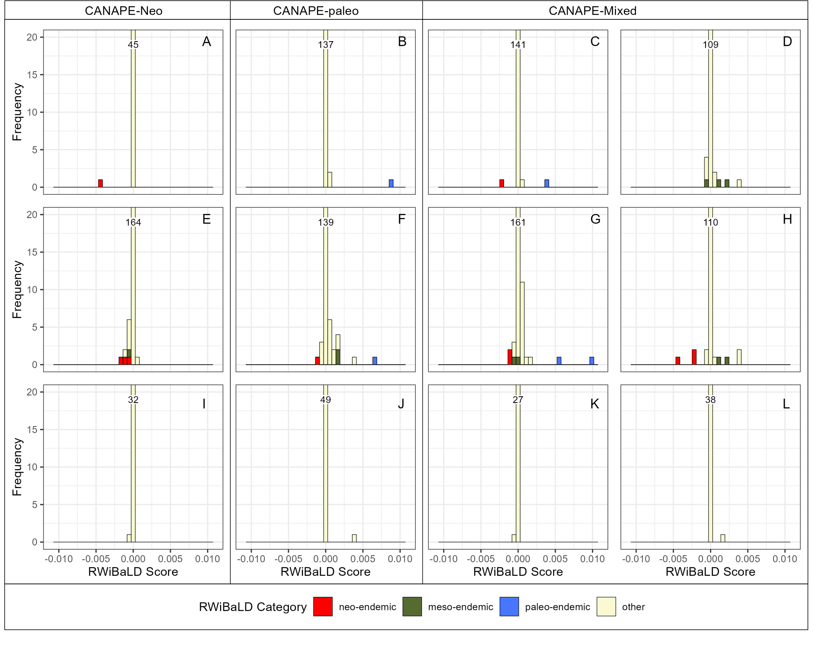

## Load results data & generate data files for biome maps

Now we take the RWiBaLD results and split the taxa in the original
specimen data from the [Categorical Analysis of Neo And Paleo-Endemisim
(CANAPE)](https://www.nature.com/articles/ncomms5473) paper according to
these RWiBaLD categories so we can overlay them on the biome map
published by [Crisp et al.](http://dx.doi.org/10.1098/rstb.2004.1528) in
2004.

<details class="code-fold">
<summary>Show the code</summary>

``` r
original_paper_specimen_data_file <- "doi_10_5061_dryad_dv4qk__v20150514/Point_distribution_Australian_Phylogenetic_Diversity_Acacia.csv"

original_paper_specimen_data <- read.table(original_paper_specimen_data_file, header=T, sep=",")

#View(original_paper_specimen_data)
#View(rwibald_results_all_with_range)

# Summarize the data in the rwibaled_type column
summary_df <- rwibald_results_all_with_range %>%
  group_by(rwibald_type) %>%
  summarise(count = n())  # Count of each rwibaled_type

# Create a table using gt
summary_table <- summary_df %>%
  gt() %>%
  tab_header(
    title = "Summary of rwibaled_type",
    subtitle = "Count of each type"
  )

# Print the table
summary_table

# Extract the 'NAME' values where 'rwibald_type' is 'meso-endemic'
meso_names <- rwibald_results_all_with_range[rwibald_results_all_with_range$rwibald_type == "meso-endemic", "NAME"]

# Filter the 'original_paper_specimen_data' dataframe
meso_taxa <- original_paper_specimen_data[original_paper_specimen_data$Species %in% meso_names, ]

# Write data to file
write.csv(meso_taxa, "quarto_outputs/Meso_endemics.csv" ,row.names=FALSE)

# Extract the 'NAME' values where 'rwibald_type' is 'neo-endemic'
neo_names <- rwibald_results_all_with_range[rwibald_results_all_with_range$rwibald_type == "neo-endemic", "NAME"]

# Filter the 'original_paper_specimen_data' dataframe
neo_taxa <- original_paper_specimen_data[original_paper_specimen_data$Species %in% neo_names, ]

# Write data to file
write.csv(neo_taxa, "quarto_outputs/Neo_endemics.csv" ,row.names=FALSE)

# Extract the 'NAME' values where 'rwibald_type' is 'paleo-endemic'
paleo_names <- rwibald_results_all_with_range[rwibald_results_all_with_range$rwibald_type == "paleo-endemic", "NAME"]

# Filter the 'original_paper_specimen_data' dataframe
paleo_taxa <- original_paper_specimen_data[original_paper_specimen_data$Species %in% paleo_names, ]

# Write data to file
write.csv(paleo_taxa, "quarto_outputs/Paleo_endemics.csv" ,row.names=FALSE)
```

</details>

<div id="zoazygsuhy" style="padding-left:0px;padding-right:0px;padding-top:10px;padding-bottom:10px;overflow-x:auto;overflow-y:auto;width:auto;height:auto;">
<style>#zoazygsuhy table {
  font-family: system-ui, 'Segoe UI', Roboto, Helvetica, Arial, sans-serif, 'Apple Color Emoji', 'Segoe UI Emoji', 'Segoe UI Symbol', 'Noto Color Emoji';
  -webkit-font-smoothing: antialiased;
  -moz-osx-font-smoothing: grayscale;
}
&#10;#zoazygsuhy thead, #zoazygsuhy tbody, #zoazygsuhy tfoot, #zoazygsuhy tr, #zoazygsuhy td, #zoazygsuhy th {
  border-style: none;
}
&#10;#zoazygsuhy p {
  margin: 0;
  padding: 0;
}
&#10;#zoazygsuhy .gt_table {
  display: table;
  border-collapse: collapse;
  line-height: normal;
  margin-left: auto;
  margin-right: auto;
  color: #333333;
  font-size: 16px;
  font-weight: normal;
  font-style: normal;
  background-color: #FFFFFF;
  width: auto;
  border-top-style: solid;
  border-top-width: 2px;
  border-top-color: #A8A8A8;
  border-right-style: none;
  border-right-width: 2px;
  border-right-color: #D3D3D3;
  border-bottom-style: solid;
  border-bottom-width: 2px;
  border-bottom-color: #A8A8A8;
  border-left-style: none;
  border-left-width: 2px;
  border-left-color: #D3D3D3;
}
&#10;#zoazygsuhy .gt_caption {
  padding-top: 4px;
  padding-bottom: 4px;
}
&#10;#zoazygsuhy .gt_title {
  color: #333333;
  font-size: 125%;
  font-weight: initial;
  padding-top: 4px;
  padding-bottom: 4px;
  padding-left: 5px;
  padding-right: 5px;
  border-bottom-color: #FFFFFF;
  border-bottom-width: 0;
}
&#10;#zoazygsuhy .gt_subtitle {
  color: #333333;
  font-size: 85%;
  font-weight: initial;
  padding-top: 3px;
  padding-bottom: 5px;
  padding-left: 5px;
  padding-right: 5px;
  border-top-color: #FFFFFF;
  border-top-width: 0;
}
&#10;#zoazygsuhy .gt_heading {
  background-color: #FFFFFF;
  text-align: center;
  border-bottom-color: #FFFFFF;
  border-left-style: none;
  border-left-width: 1px;
  border-left-color: #D3D3D3;
  border-right-style: none;
  border-right-width: 1px;
  border-right-color: #D3D3D3;
}
&#10;#zoazygsuhy .gt_bottom_border {
  border-bottom-style: solid;
  border-bottom-width: 2px;
  border-bottom-color: #D3D3D3;
}
&#10;#zoazygsuhy .gt_col_headings {
  border-top-style: solid;
  border-top-width: 2px;
  border-top-color: #D3D3D3;
  border-bottom-style: solid;
  border-bottom-width: 2px;
  border-bottom-color: #D3D3D3;
  border-left-style: none;
  border-left-width: 1px;
  border-left-color: #D3D3D3;
  border-right-style: none;
  border-right-width: 1px;
  border-right-color: #D3D3D3;
}
&#10;#zoazygsuhy .gt_col_heading {
  color: #333333;
  background-color: #FFFFFF;
  font-size: 100%;
  font-weight: normal;
  text-transform: inherit;
  border-left-style: none;
  border-left-width: 1px;
  border-left-color: #D3D3D3;
  border-right-style: none;
  border-right-width: 1px;
  border-right-color: #D3D3D3;
  vertical-align: bottom;
  padding-top: 5px;
  padding-bottom: 6px;
  padding-left: 5px;
  padding-right: 5px;
  overflow-x: hidden;
}
&#10;#zoazygsuhy .gt_column_spanner_outer {
  color: #333333;
  background-color: #FFFFFF;
  font-size: 100%;
  font-weight: normal;
  text-transform: inherit;
  padding-top: 0;
  padding-bottom: 0;
  padding-left: 4px;
  padding-right: 4px;
}
&#10;#zoazygsuhy .gt_column_spanner_outer:first-child {
  padding-left: 0;
}
&#10;#zoazygsuhy .gt_column_spanner_outer:last-child {
  padding-right: 0;
}
&#10;#zoazygsuhy .gt_column_spanner {
  border-bottom-style: solid;
  border-bottom-width: 2px;
  border-bottom-color: #D3D3D3;
  vertical-align: bottom;
  padding-top: 5px;
  padding-bottom: 5px;
  overflow-x: hidden;
  display: inline-block;
  width: 100%;
}
&#10;#zoazygsuhy .gt_spanner_row {
  border-bottom-style: hidden;
}
&#10;#zoazygsuhy .gt_group_heading {
  padding-top: 8px;
  padding-bottom: 8px;
  padding-left: 5px;
  padding-right: 5px;
  color: #333333;
  background-color: #FFFFFF;
  font-size: 100%;
  font-weight: initial;
  text-transform: inherit;
  border-top-style: solid;
  border-top-width: 2px;
  border-top-color: #D3D3D3;
  border-bottom-style: solid;
  border-bottom-width: 2px;
  border-bottom-color: #D3D3D3;
  border-left-style: none;
  border-left-width: 1px;
  border-left-color: #D3D3D3;
  border-right-style: none;
  border-right-width: 1px;
  border-right-color: #D3D3D3;
  vertical-align: middle;
  text-align: left;
}
&#10;#zoazygsuhy .gt_empty_group_heading {
  padding: 0.5px;
  color: #333333;
  background-color: #FFFFFF;
  font-size: 100%;
  font-weight: initial;
  border-top-style: solid;
  border-top-width: 2px;
  border-top-color: #D3D3D3;
  border-bottom-style: solid;
  border-bottom-width: 2px;
  border-bottom-color: #D3D3D3;
  vertical-align: middle;
}
&#10;#zoazygsuhy .gt_from_md > :first-child {
  margin-top: 0;
}
&#10;#zoazygsuhy .gt_from_md > :last-child {
  margin-bottom: 0;
}
&#10;#zoazygsuhy .gt_row {
  padding-top: 8px;
  padding-bottom: 8px;
  padding-left: 5px;
  padding-right: 5px;
  margin: 10px;
  border-top-style: solid;
  border-top-width: 1px;
  border-top-color: #D3D3D3;
  border-left-style: none;
  border-left-width: 1px;
  border-left-color: #D3D3D3;
  border-right-style: none;
  border-right-width: 1px;
  border-right-color: #D3D3D3;
  vertical-align: middle;
  overflow-x: hidden;
}
&#10;#zoazygsuhy .gt_stub {
  color: #333333;
  background-color: #FFFFFF;
  font-size: 100%;
  font-weight: initial;
  text-transform: inherit;
  border-right-style: solid;
  border-right-width: 2px;
  border-right-color: #D3D3D3;
  padding-left: 5px;
  padding-right: 5px;
}
&#10;#zoazygsuhy .gt_stub_row_group {
  color: #333333;
  background-color: #FFFFFF;
  font-size: 100%;
  font-weight: initial;
  text-transform: inherit;
  border-right-style: solid;
  border-right-width: 2px;
  border-right-color: #D3D3D3;
  padding-left: 5px;
  padding-right: 5px;
  vertical-align: top;
}
&#10;#zoazygsuhy .gt_row_group_first td {
  border-top-width: 2px;
}
&#10;#zoazygsuhy .gt_row_group_first th {
  border-top-width: 2px;
}
&#10;#zoazygsuhy .gt_summary_row {
  color: #333333;
  background-color: #FFFFFF;
  text-transform: inherit;
  padding-top: 8px;
  padding-bottom: 8px;
  padding-left: 5px;
  padding-right: 5px;
}
&#10;#zoazygsuhy .gt_first_summary_row {
  border-top-style: solid;
  border-top-color: #D3D3D3;
}
&#10;#zoazygsuhy .gt_first_summary_row.thick {
  border-top-width: 2px;
}
&#10;#zoazygsuhy .gt_last_summary_row {
  padding-top: 8px;
  padding-bottom: 8px;
  padding-left: 5px;
  padding-right: 5px;
  border-bottom-style: solid;
  border-bottom-width: 2px;
  border-bottom-color: #D3D3D3;
}
&#10;#zoazygsuhy .gt_grand_summary_row {
  color: #333333;
  background-color: #FFFFFF;
  text-transform: inherit;
  padding-top: 8px;
  padding-bottom: 8px;
  padding-left: 5px;
  padding-right: 5px;
}
&#10;#zoazygsuhy .gt_first_grand_summary_row {
  padding-top: 8px;
  padding-bottom: 8px;
  padding-left: 5px;
  padding-right: 5px;
  border-top-style: double;
  border-top-width: 6px;
  border-top-color: #D3D3D3;
}
&#10;#zoazygsuhy .gt_last_grand_summary_row_top {
  padding-top: 8px;
  padding-bottom: 8px;
  padding-left: 5px;
  padding-right: 5px;
  border-bottom-style: double;
  border-bottom-width: 6px;
  border-bottom-color: #D3D3D3;
}
&#10;#zoazygsuhy .gt_striped {
  background-color: rgba(128, 128, 128, 0.05);
}
&#10;#zoazygsuhy .gt_table_body {
  border-top-style: solid;
  border-top-width: 2px;
  border-top-color: #D3D3D3;
  border-bottom-style: solid;
  border-bottom-width: 2px;
  border-bottom-color: #D3D3D3;
}
&#10;#zoazygsuhy .gt_footnotes {
  color: #333333;
  background-color: #FFFFFF;
  border-bottom-style: none;
  border-bottom-width: 2px;
  border-bottom-color: #D3D3D3;
  border-left-style: none;
  border-left-width: 2px;
  border-left-color: #D3D3D3;
  border-right-style: none;
  border-right-width: 2px;
  border-right-color: #D3D3D3;
}
&#10;#zoazygsuhy .gt_footnote {
  margin: 0px;
  font-size: 90%;
  padding-top: 4px;
  padding-bottom: 4px;
  padding-left: 5px;
  padding-right: 5px;
}
&#10;#zoazygsuhy .gt_sourcenotes {
  color: #333333;
  background-color: #FFFFFF;
  border-bottom-style: none;
  border-bottom-width: 2px;
  border-bottom-color: #D3D3D3;
  border-left-style: none;
  border-left-width: 2px;
  border-left-color: #D3D3D3;
  border-right-style: none;
  border-right-width: 2px;
  border-right-color: #D3D3D3;
}
&#10;#zoazygsuhy .gt_sourcenote {
  font-size: 90%;
  padding-top: 4px;
  padding-bottom: 4px;
  padding-left: 5px;
  padding-right: 5px;
}
&#10;#zoazygsuhy .gt_left {
  text-align: left;
}
&#10;#zoazygsuhy .gt_center {
  text-align: center;
}
&#10;#zoazygsuhy .gt_right {
  text-align: right;
  font-variant-numeric: tabular-nums;
}
&#10;#zoazygsuhy .gt_font_normal {
  font-weight: normal;
}
&#10;#zoazygsuhy .gt_font_bold {
  font-weight: bold;
}
&#10;#zoazygsuhy .gt_font_italic {
  font-style: italic;
}
&#10;#zoazygsuhy .gt_super {
  font-size: 65%;
}
&#10;#zoazygsuhy .gt_footnote_marks {
  font-size: 75%;
  vertical-align: 0.4em;
  position: initial;
}
&#10;#zoazygsuhy .gt_asterisk {
  font-size: 100%;
  vertical-align: 0;
}
&#10;#zoazygsuhy .gt_indent_1 {
  text-indent: 5px;
}
&#10;#zoazygsuhy .gt_indent_2 {
  text-indent: 10px;
}
&#10;#zoazygsuhy .gt_indent_3 {
  text-indent: 15px;
}
&#10;#zoazygsuhy .gt_indent_4 {
  text-indent: 20px;
}
&#10;#zoazygsuhy .gt_indent_5 {
  text-indent: 25px;
}
&#10;#zoazygsuhy .katex-display {
  display: inline-flex !important;
  margin-bottom: 0.75em !important;
}
&#10;#zoazygsuhy div.Reactable > div.rt-table > div.rt-thead > div.rt-tr.rt-tr-group-header > div.rt-th-group:after {
  height: 0px !important;
}
</style>

| Summary of rwibaled_type |       |
|--------------------------|-------|
| Count of each type       |       |
| rwibald_type             | count |
| meso-endemic             | 59    |
| neo-endemic              | 55    |
| other                    | 880   |
| paleo-endemic            | 21    |

</div>

## Two tailed relative phylogenetic diversity (RPD) & CANAPE functions

This is the function for calculating Categorical Analysis of Neo- and
Paleo-endemism (CANAPE) from ranked P scores of Biodiverse analysis.

<details class="code-fold">
<summary>Show the code</summary>

``` r
#Standard 2 tailed test for RPD
significance_fun <- function(x){
  if (x >= 0.99) {
    return("Very Highly Sig")
  } else if (x >= 0.975){
    return ("Highly Sig")
  } else if (x <= 0.01){
    return ("Very Sig Low")
  } else if (x <= 0.025){
    return ("Sig Low")
  } else {
    return("Not Sig")
  }
}

#two pass test for RPE
# x=P_PE_WE_P, y=P_PHYLO_RPE_NULL2, z=P_PHYLO_RPE2
significance_super_fun <- function(x, y, z){
  if (x > 0.95 || y > 0.95) {
    if (z <= 0.025){
      return ("Neo")
    } else if (z >= 0.975){
      return ("paleo")
    } else if (x >= 0.99 || y >= 0.99){
      return ("Super")
    } else {
      return("Mixed")
    }
  } else {
    return("Not Sig")
  }
}
```

</details>

## Load CANAPE & randomisation results

Here we load the re-created biodiverse results from the original paper,
calculate CANAPE and re-generate the CANAPE map. Note: these results may
differ slightly from the original paper as we re-ran the randomisation
in biodiverse.

<details class="code-fold">
<summary>Show the code</summary>

``` r
data_dir <- "Acacia_biodiverse_exports/"

# The CANAPE results file calculated in Biodiverse directly and exported
biodiverse_canape_results_file <- paste0(data_dir, "Acacia_Rand1_CANAPE_Export.csv")

# The spatial & randomisation results files calculated in Biodiverse and exported
biodiverse_observed_data_file  <- paste0(data_dir, "Acacia_SPATIAL_RESULTS_Export.csv")
biodiverse_rand_results_file <- paste0(data_dir, "Acacia_Rand1_SPATIAL_RESULTS_Export.csv")

biodiverse_canape_results <- read.table(biodiverse_canape_results_file, header=T,sep=",", check.names = FALSE )

biodiverse_observed_spatial_results <- read.table(biodiverse_observed_data_file, header=T,sep=",")
biodiverse_rand_spatial_results <- read.table(biodiverse_rand_results_file, header=T,sep=",")

biodiverse_results_concatenated <- cbind(biodiverse_observed_spatial_results, biodiverse_rand_spatial_results)

#View(biodiverse_results_concatenated)

###############################################
#Create new columns in dataframe and 
#populate them using the functions above
###############################################

targets <- c("PHYLO_RPD2", "PD_P", "PE_WE_P", "PD_P_per_taxon", "PHYLO_RPE2")

for (name in targets) {
  colname <- paste0("P_", name)  #  prepend the P_ since we want the proportions, saves some typing above
  new_colname = paste0(colname, "_SIG")
  trait_index <- match (colname, colnames(biodiverse_results_concatenated))
  # Apply the function to every row of column with index "trait_index"
  #  and generate a column in the dataframe showing significant cells
  if (!is.na(trait_index)) {
    biodiverse_results_concatenated[[new_colname]] <- apply (biodiverse_results_concatenated[trait_index],  MARGIN=c(1), significance_fun)
  } else {
    print (paste("Cannot find index", colname, "in data frame"))
  }
}

biodiverse_results_concatenated$P_PHYLO_RPE2_CANAPE_SIG <- sapply(
  1:nrow(biodiverse_results_concatenated),
  function(x) significance_super_fun(
    biodiverse_results_concatenated$P_PE_WE_P[x],
    biodiverse_results_concatenated$P_PHYLO_RPE_NULL2[x],
    biodiverse_results_concatenated$P_PHYLO_RPE2[x]
  )
)

#View(biodiverse_results_concatenated)
```

</details>

## Generate CANAPE map figure 5A

Here we generate the CANAPE map, indicating cell locations from the
histograms in figure 4A-L. CANAPE identifies geographic concentrations
of high PE, and gives a summary classification of the type of endemism
dominating in a location. The RWiBaLD histograms (figure 4A-L) identify
the specific branches that contribute the most to PE in a given cell,
and what type of endemism they represent.

<details class="code-fold">
<summary>Show the code</summary>

``` r
#loadfonts()

myFont <- choose_font(c("HelvLight", "Arial", "sans"), quiet = TRUE) #load a font if available
   
map_text <- "Categorical Analysis of Neo- And Paleo- Endemism"
sigplot <- "P_PHYLO_RPE2_CANAPE_SIG"
col_scheme <- c("paleo" = "royalblue1","Not Sig" = "snow2", "Neo" = "red", "Super" = "#9D00FF", "Mixed"= "#CB7FFF")
legend_order <-c("Neo","paleo", "Not Sig", "Mixed", "Super")
legend_labels <- c("Neo"="Neo","paleo"="Paleo", "Not Sig"="Not significant", "Mixed"="Mixed", "Super"="Super")

biodiverse_results_concatenated[, sigplot] <- factor(biodiverse_results_concatenated[, sigplot], levels=legend_order)
Axis_0 <- "Axis_0"
Axis_1 <- "Axis_1"   
   
map_shape_file <- paste0("shape_files/coastline_albers.shp")
map_data   <- st_read(map_shape_file)  

cols_to_keep <- c("-1825000:-2975000", "75000:-2525000", "625000:-3475000","-1425000:-3225000","1775000:-3725000", "-1425000:-3475000", "-1225000:-3775000", "-1425000:-3275000", "1225000:-1275000", "-1175000:-3275000", "-1075000:-2825000", "-1075000:-2375000")

# Initialize empty vectors for x and y
x <- c()
y <- c()

# Split each element of cols_to_keep and append to x and y for plotting on the map
for (val in cols_to_keep) {
  parts <- strsplit(val, ":")[[1]]
  x <- c(x, as.numeric(parts[1]))
  y <- c(y, as.numeric(parts[2]))
}

# Print the result
#print(x)
#print(y)

labels <- c("A", "B", "C", "D", "E", "F", "G", "H", "I", "J", "K", "L")

# Create data frame
histograms <- data.frame(x = x, y = y, label = labels)

# Plot the sf object with ggplot2, coloring by the BIOME column
map_plot_CANAPE  <- ggplot() +
  geom_tile(data=biodiverse_results_concatenated, aes_string(x=Axis_0, y=Axis_1, fill=sigplot)) +
  geom_sf(data = map_data, colour = "grey77" , fill="transparent") +
  scale_fill_manual(values = col_scheme,  labels=legend_labels, name="CANAPE", guide = guide_legend(direction = "horizontal", title.position = "bottom", title.hjust=0.5, title.vjust=0.5, label.position="bottom", label.hjust = 0.5, label.vjust = 0.1, lineheight=0.5))+
  geom_text_repel(data=histograms, aes(x = x, y = y, label = labels), fontface = "bold", size = 2.5, nudge_x = c(-200000, 0, 0, -100000, 250000, -300000, 200000, 100000, 200000, 200000, 200000, 200000), nudge_y = c(200000, 250000, 350000, 300000, -100000, 0, -200000, 200000, 200000, 200000, 200000, 200000)) +
   annotate("rect", xmin = -750000, xmax = -250000, ymin = -4500000, ymax = -4550000, fill = "black", colour = "black", alpha = 1, linewidth = 0.1) +
    annotate("rect", xmin = -250000, xmax = 250000, ymin = -4500000, ymax = -4550000, fill = "white", colour = "black", alpha = 1, linewidth = 0.1) +
    annotate("text", label = "0", x = -750000, y = -4650000, size=rel(2),  face = 'plain', family = myFont) +
    annotate("text", label = "500", x = -250000, y = -4650000, size=rel(2),  face = 'plain', family = myFont) +
    annotate("text", label = "1000", x = 250000, y = -4650000, size=rel(2),  face = 'plain', family = myFont) +
    annotate("text", label = "km", x = 500000, y = -4650000, size=rel(2),  face = 'plain', family = myFont) +
   theme(text = element_text(family = myFont),
         strip.background = element_blank(),
         title = element_text(colour = 'black', angle = 0, size=rel(1), face = 'plain', family = myFont),
         axis.line=element_blank(),axis.text.x=element_blank(),
         axis.text.y=element_blank(),axis.ticks=element_blank(),
         axis.title.x=element_blank(), axis.title.y=element_blank(),
         legend.position="none",
         legend.direction='horizontal',
         legend.text = element_text(colour = 'black', angle = 0, size=rel(1), face = 'plain', family = myFont),
         panel.grid = element_blank(),
         panel.background=element_blank(),#element_rect(colour = "black", fill="white", size = 1),
         panel.border = element_blank(),
         plot.background=element_blank(),#element_rect(colour = "black", fill="white", size = 1),
         plot.margin=unit(c(0,0,0,0),"line"))

print(map_plot_CANAPE)
```

</details>

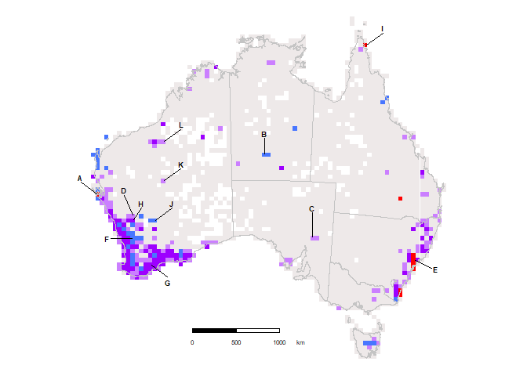

<details class="code-fold">
<summary>Show the code</summary>

``` r
ggsave('quarto_outputs/figures/Figure5_A.png', map_plot_CANAPE, width = 1024, height = 1024, units = "px", bg = "white")
```

</details>

    Reading layer `coastline_albers' from data source 
      `C:\E\gitRepos\rwibald\shape_files\coastline_albers.shp' using driver `ESRI Shapefile'
    Simple feature collection with 44 features and 4 fields
    Geometry type: POLYGON
    Dimension:     XY
    Bounding box:  xmin: -1887741 ymin: -4840771 xmax: 2121462 ymax: -1029671
    Projected CRS: GDA94 / Australian Albers

## Generate biome map with neo-endemics figure 5B

Here we show the specimen data for all of the neo-endemic taxa
categorised by RWiBaLD overlaid on the biome map published by [Crisp et
al.](http://dx.doi.org/10.1098/rstb.2004.1528) in 2004.

<details class="code-fold">
<summary>Show the code</summary>

``` r
#loadfonts()

#myFont <- choose_font(c("HelvLight", "Arial", "sans"), quiet = TRUE) #load a font if available

col_scheme <- c("aseasonal wet" = "cornflowerblue",
                "eremean" = "lightyellow1",
                "monsoonal tropics" = "powderblue",
                "southeastern temperate" = "moccasin",
                "southwestern temperate"= "#fbb4ae")
legend_order <-c("aseasonal wet", 
                 "eremean", 
                 "monsoonal tropics",
                 "southeastern temperate", 
                 "southwestern temperate")
legend_labels <- c("aseasonal wet" = "aseasonal wet",
                   "eremean" = "eremean",
                   "monsoonal tropics" = "monsoonal tropics",
                   "southeastern temperate"="southeastern temperate",
                   "southwestern temperate"="southwestern temperate")

map_shape_file1 <- paste0("shape_files/coastline_albers.shp")
map_data   <- st_read(map_shape_file1)   
#geom_sf(data = map_data, colour = "grey77" , fill="transparent") +

map_shape_file <- paste0("shape_files/biomes_crisp_3577/biomes_crisp_3577.shp")
# Read the shapefile as an sf object
biomes_sf <- st_read(map_shape_file)

csv_file <- paste0("quarto_outputs/Neo_endemics.csv") 
# Read the CSV file into a data frame
csv_data <- read.csv(csv_file)
# Convert data frame to sf object
csv_sf <- st_as_sf(csv_data, coords = c("x_metres_EPSG_3577_Albers_Equal_Area", "y_metres_EPSG_3577_Albers_Equal_Area"), crs = st_crs(biomes_sf))


# Plot the sf object with ggplot2, coloring by the BIOME column
map_plot_Neo  <- ggplot() +
  geom_sf(data = biomes_sf, aes(fill = BIOME), colour = "grey77") +
  geom_sf(data = map_data, colour = "grey77" , fill="transparent") +
  geom_sf(data = csv_sf, fill= "red", color = "red4", shape = 21) +
 scale_fill_manual(values = col_scheme,  labels=legend_labels, name="Biomes", guide = guide_legend(direction = "horizontal", title.position = "bottom", title.hjust=0.5, title.vjust=0.5, label.position="bottom", label.hjust = 0.5, label.vjust = 0.1, lineheight=0.5))+
   theme(text = element_text(family = myFont),
         strip.background = element_blank(),
         title = element_text(colour = 'black', angle = 0, size=rel(1), face = 'plain', family = myFont),
         axis.line=element_blank(),axis.text.x=element_blank(),
         axis.text.y=element_blank(),axis.ticks=element_blank(),
         axis.title.x=element_blank(), axis.title.y=element_blank(),
         legend.position="none",
         legend.direction='horizontal',
         legend.text = element_text(colour = 'black', angle = 0, size=rel(1), face = 'plain', family = myFont),
         legend.key = element_rect(color = "black", size = 0),
         panel.grid = element_blank(),
         panel.background=element_blank(),#element_rect(colour = "black", fill="white", size = 1),
         panel.border = element_blank(),
         plot.background=element_blank(),#element_rect(colour = "black", fill="white", size = 1),
         plot.margin=unit(c(0,0,0,0),"line"))


print(map_plot_Neo)
```

</details>

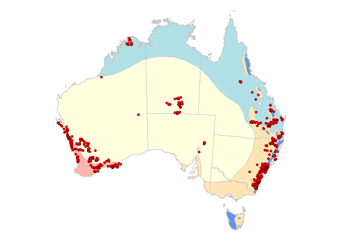

<details class="code-fold">
<summary>Show the code</summary>

``` r
ggsave("quarto_outputs/figures/Figure5_B.png", map_plot_Neo, width = 3000, height = 2600, units = "px")
```

</details>

    Reading layer `coastline_albers' from data source 
      `C:\E\gitRepos\rwibald\shape_files\coastline_albers.shp' using driver `ESRI Shapefile'
    Simple feature collection with 44 features and 4 fields
    Geometry type: POLYGON
    Dimension:     XY
    Bounding box:  xmin: -1887741 ymin: -4840771 xmax: 2121462 ymax: -1029671
    Projected CRS: GDA94 / Australian Albers
    Reading layer `biomes_crisp_3577' from data source 
      `C:\E\gitRepos\rwibald\shape_files\biomes_crisp_3577\biomes_crisp_3577.shp' 
      using driver `ESRI Shapefile'
    Simple feature collection with 5 features and 3 fields
    Geometry type: MULTIPOLYGON
    Dimension:     XY
    Bounding box:  xmin: -1887414 ymin: -4840588 xmax: 2121442 ymax: -1087816
    Projected CRS: GDA94 / Australian Albers

## Generate biome map with meso-endemics figure 5C

Here we show the specimen data for all of the meso-endemic taxa
categorised by RWiBaLD overlaid on the biome map published by [Crisp et
al.](http://dx.doi.org/10.1098/rstb.2004.1528) in 2004.

<details class="code-fold">
<summary>Show the code</summary>

``` r
#loadfonts()

#myFont <- choose_font(c("HelvLight", "Arial", "sans"), quiet = TRUE) #load a font if available

map_text <- "Categorical Analysis of Neo- And Paleo- Endemism"

col_scheme <- c("aseasonal wet" = "cornflowerblue",
                "eremean" = "lightyellow1",
                "monsoonal tropics" = "powderblue",
                "southeastern temperate" = "moccasin",
                "southwestern temperate"= "#fbb4ae")
legend_order <-c("aseasonal wet", 
                 "eremean", 
                 "monsoonal tropics",
                 "southeastern temperate", 
                 "southwestern temperate")
legend_labels <- c("aseasonal wet" = "aseasonal wet",
                   "eremean" = "eremean",
                   "monsoonal tropics" = "monsoonal tropics",
                   "southeastern temperate"="southeastern temperate",
                   "southwestern temperate"="southwestern temperate")

map_shape_file1 <- paste0("shape_files/coastline_albers.shp")
map_data   <- st_read(map_shape_file1)   
#geom_sf(data = map_data, colour = "grey77" , fill="transparent") +

map_shape_file <- paste0("shape_files/biomes_crisp_3577/biomes_crisp_3577.shp")
# Read the shapefile as an sf object
biomes_sf <- st_read(map_shape_file)

csv_file <- paste0("quarto_outputs/Meso_endemics.csv") 
# Read the CSV file into a data frame
csv_data <- read.csv(csv_file)
# Convert data frame to sf object
csv_sf <- st_as_sf(csv_data, coords = c("x_metres_EPSG_3577_Albers_Equal_Area", "y_metres_EPSG_3577_Albers_Equal_Area"), crs = st_crs(biomes_sf))


# Plot the sf object with ggplot2, coloring by the BIOME column
map_plot_Meso  <- ggplot() +
  geom_sf(data = biomes_sf, aes(fill = BIOME), color = "grey77") +
  geom_sf(data = map_data, colour = "grey77" , fill="transparent") +
  geom_sf(data = csv_sf, fill= "forestgreen", color = "darkgreen", shape = 21) +
  scale_fill_manual(values = col_scheme,  labels=legend_labels, name="Biomes", guide = guide_legend(direction = "horizontal", title.position = "bottom", title.hjust=0.5, title.vjust=0.5, label.position="bottom", label.hjust = 0.5, label.vjust = 0.1, lineheight=0.5))+
   theme(text = element_text(family = myFont),
         strip.background = element_blank(),
         title = element_text(colour = 'black', angle = 0, size=rel(1), face = 'plain', family = myFont),
         axis.line=element_blank(),axis.text.x=element_blank(),
         axis.text.y=element_blank(),axis.ticks=element_blank(),
         axis.title.x=element_blank(), axis.title.y=element_blank(),
         legend.position="none",
         legend.direction='horizontal',
         legend.text = element_text(colour = 'black', angle = 0, size=rel(1), face = 'plain', family = myFont),
         legend.key = element_rect(color = "black", size = 0),
         panel.grid = element_blank(),
         panel.background=element_blank(),#element_rect(colour = "black", fill="white", size = 1),
         panel.border = element_blank(),
         plot.background=element_blank(),#element_rect(colour = "black", fill="white", size = 1),
         plot.margin=unit(c(0,0,0,0),"line"))

print(map_plot_Meso)
```

</details>


<details class="code-fold">
<summary>Show the code</summary>

``` r
ggsave("quarto_outputs/figures/Figure5_C.png", map_plot_Meso, width = 3000, height = 2600, units = "px")
```

</details>

    Reading layer `coastline_albers' from data source 
      `C:\E\gitRepos\rwibald\shape_files\coastline_albers.shp' using driver `ESRI Shapefile'
    Simple feature collection with 44 features and 4 fields
    Geometry type: POLYGON
    Dimension:     XY
    Bounding box:  xmin: -1887741 ymin: -4840771 xmax: 2121462 ymax: -1029671
    Projected CRS: GDA94 / Australian Albers
    Reading layer `biomes_crisp_3577' from data source 
      `C:\E\gitRepos\rwibald\shape_files\biomes_crisp_3577\biomes_crisp_3577.shp' 
      using driver `ESRI Shapefile'
    Simple feature collection with 5 features and 3 fields
    Geometry type: MULTIPOLYGON
    Dimension:     XY
    Bounding box:  xmin: -1887414 ymin: -4840588 xmax: 2121442 ymax: -1087816
    Projected CRS: GDA94 / Australian Albers

## Generate biome map with paleo-endemics figure 5D

Here we show the specimen data for all of the paleo-endemic taxa
categorised by RWiBaLD overlaid on the biome map published by [Crisp et
al.](http://dx.doi.org/10.1098/rstb.2004.1528) in 2004.

<details class="code-fold">
<summary>Show the code</summary>

``` r
#loadfonts()

#myFont <- choose_font(c("HelvLight", "Arial", "sans"), quiet = TRUE) #load a font if available

map_text <- "Categorical Analysis of Neo- And Paleo- Endemism"

col_scheme <- c("aseasonal wet" = "cornflowerblue",
                "eremean" = "lightyellow1",
                "monsoonal tropics" = "powderblue",
                "southeastern temperate" = "moccasin",
                "southwestern temperate"= "#fbb4ae")
legend_order <-c("aseasonal wet", 
                 "eremean", 
                 "monsoonal tropics",
                 "southeastern temperate", 
                 "southwestern temperate")
legend_labels <- c("aseasonal wet" = "aseasonal wet",
                   "eremean" = "eremean",
                   "monsoonal tropics" = "monsoonal tropics",
                   "southeastern temperate"="southeastern temperate",
                   "southwestern temperate"="southwestern temperate")

map_shape_file1 <- paste0("shape_files/coastline_albers.shp")
map_data  <- st_read(map_shape_file1)   
#geom_sf(data = map_data, colour = "grey77" , fill="transparent") +

map_shape_file <- paste0("shape_files/biomes_crisp_3577/biomes_crisp_3577.shp")

# Read the shapefile as an sf object
biomes_sf <- st_read(map_shape_file)

csv_file <- paste0("quarto_outputs/Paleo_endemics.csv") 

# Read the CSV file into a data frame
csv_data <- read.csv(csv_file)

# Convert data frame to sf object
csv_sf <- st_as_sf(csv_data, coords = c("x_metres_EPSG_3577_Albers_Equal_Area", "y_metres_EPSG_3577_Albers_Equal_Area"), crs = st_crs(biomes_sf))

# Plot the sf object with ggplot2, coloring by the BIOME column
map_plot_Paleo  <- ggplot() +
  geom_sf(data = biomes_sf, aes(fill = BIOME), color = "grey77") +
  geom_sf(data = map_data, colour = "grey77" , fill="transparent") +
  geom_sf(data = csv_sf, fill= "royalblue3", color = "darkblue", shape = 21) +
  scale_fill_manual(values = col_scheme,  labels=legend_labels, name="Biomes", guide = guide_legend(direction = "horizontal", title.position = "bottom", title.hjust=0.5, title.vjust=0.5, label.position="bottom", label.hjust = 0.5, label.vjust = 0.1, lineheight=0.5))+
    theme(text = element_text(family = myFont),
         strip.background = element_blank(),
         title = element_text(colour = 'black', angle = 0, size=rel(1), face = 'plain', family = myFont),
         axis.line=element_blank(),axis.text.x=element_blank(),
         axis.text.y=element_blank(),axis.ticks=element_blank(),
         axis.title.x=element_blank(), axis.title.y=element_blank(),
         legend.position="none",
         legend.direction='horizontal',
         legend.text = element_text(colour = 'black', angle = 0, size=rel(0.5), face = 'plain', family = myFont),
         legend.key = element_rect(color = "black", size = 0),
         panel.grid = element_blank(),
         panel.background=element_blank(),#element_rect(colour = "black", fill="white", size = 1),
         panel.border = element_blank(),
         plot.background=element_blank(),#element_rect(colour = "black", fill="white", size = 1),
         plot.margin=unit(c(0,0,0,0),"line"))
  

print(map_plot_Paleo)
```

</details>

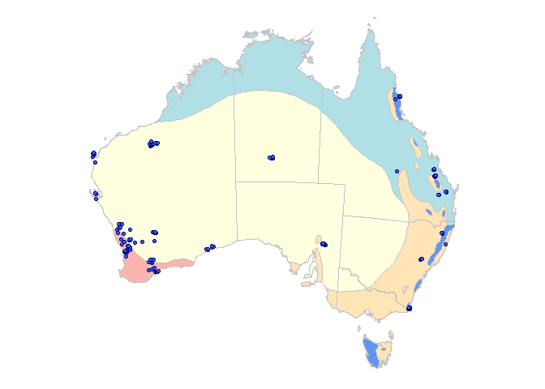

<details class="code-fold">
<summary>Show the code</summary>

``` r
ggsave("quarto_outputs/figures/Figure5_D.png", map_plot_Paleo, width = 3000, height = 2600, units = "px")
```

</details>

    Reading layer `coastline_albers' from data source 
      `C:\E\gitRepos\rwibald\shape_files\coastline_albers.shp' using driver `ESRI Shapefile'
    Simple feature collection with 44 features and 4 fields
    Geometry type: POLYGON
    Dimension:     XY
    Bounding box:  xmin: -1887741 ymin: -4840771 xmax: 2121462 ymax: -1029671
    Projected CRS: GDA94 / Australian Albers
    Reading layer `biomes_crisp_3577' from data source 
      `C:\E\gitRepos\rwibald\shape_files\biomes_crisp_3577\biomes_crisp_3577.shp' 
      using driver `ESRI Shapefile'
    Simple feature collection with 5 features and 3 fields
    Geometry type: MULTIPOLYGON
    Dimension:     XY
    Bounding box:  xmin: -1887414 ymin: -4840588 xmax: 2121442 ymax: -1087816
    Projected CRS: GDA94 / Australian Albers

## Generate 4 up map figure 5ABCD

Here we compile the maps into one figure 5A-D

<details class="code-fold">
<summary>Show the code</summary>

``` r
patchwork_map <- map_plot_CANAPE +
              map_plot_Neo + 
              map_plot_Meso + 
              map_plot_Paleo

patchwork_map <- patchwork_map +
              plot_annotation(subtitle = '',
                              caption = '',
                              tag_levels = 'A') +
              plot_layout(ncol = 2, guides = 'collect') &
              theme(legend.position = "bottom", 
                    legend.title=element_text(size=rel(0.6)),
                    legend.text=element_text(size=rel(0.5)),
                    legend.title.position = "bottom",
                    legend.label.position= "bottom",
                    legend.key = element_rect(color = "black", size = 0.5),
                    legend.key.height = unit(0.5, "cm"),
                    legend.key.width = unit(0.5, "cm"),
                    plot.tag.position = c(0.9, 0.9),
                    plot.tag = element_text(size = 12, hjust = 0, vjust = 0))
             
#print(patchwork_map)

ggsave('quarto_outputs/figures/Figure5_ABCD.png', patchwork_map, width = 3000, height = 2600, units = "px")
```

</details>

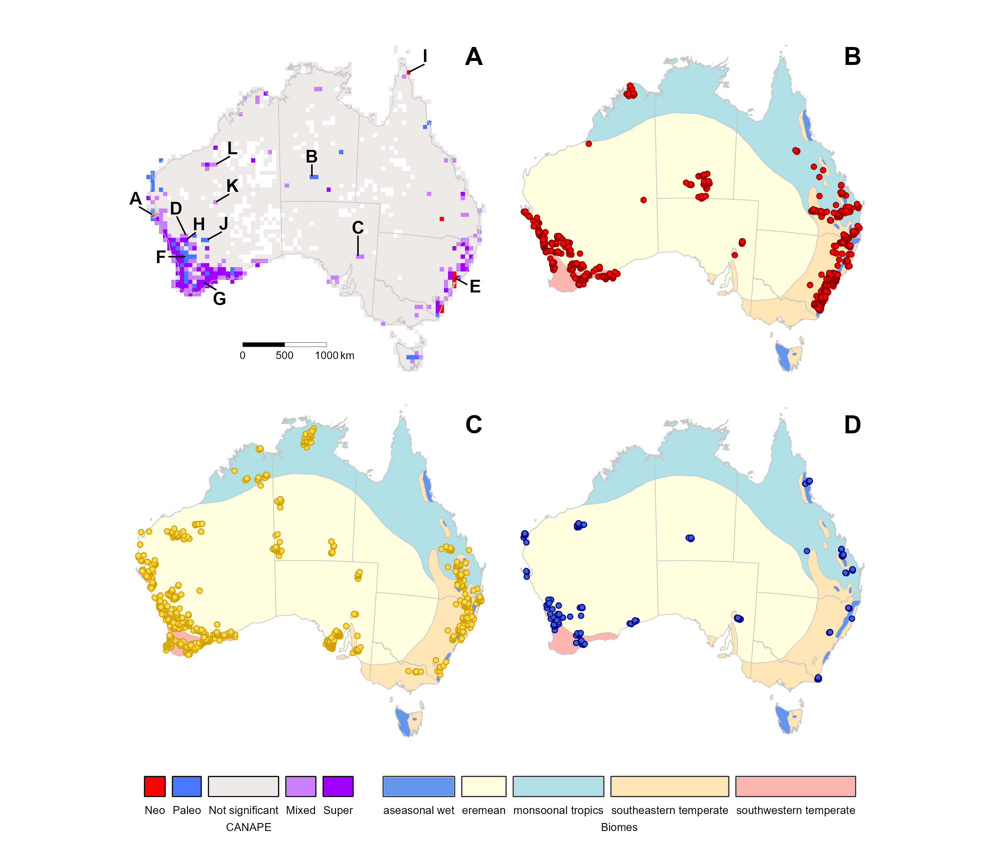

## Table of RWiBaLD results supplementary table 1

RWiBaLD results for each branch on the phylogeny of Australian Acacia.

<details class="code-fold">
<summary>Show the code</summary>

``` r
RWiBaLD_results_csv  <- paste0("quarto_outputs/Acacia_RWiBaLD_results_all_with_range.csv")

rwibald_results_all_with_range <- read.table(RWiBaLD_results_csv, header=T,sep=",")

#View(rwibald_results_all_with_range)

#colnames(rwibald_results_all_with_range)

gt_table <- rwibald_results_all_with_range %>%
            select("NAME", "branch_length_comparison_tree", "branch_length_observed_tree",
                   "rwibald_score", "rwibald_type", "range_cell_count")

# print table using gt
rwibald_results_all_with_range_table <- gt(gt_table) %>%
  tab_options(
    table.width = pct(100),
    table.layout = "auto",
    table.align = "left",
    table.margin.left = px(5),
    table.margin.right = px(5),
    table.font.size = px(8),
    column_labels.font.size = px(10),
    heading.align = "center",
    heading.title.font.size = px(12),
    quarto.use_bootstrap = TRUE
  ) %>%
  opt_row_striping() %>%
  tab_header(
    title = md("RWiBaLD Results")
  ) %>%
  tab_style(
    style = cell_text(align = "center"),
    locations = cells_body()
  )

rwibald_results_all_with_range_table
```

</details>

<div id="pugptyatzo" style="padding-left:0px;padding-right:0px;padding-top:10px;padding-bottom:10px;overflow-x:auto;overflow-y:auto;width:auto;height:auto;">
<style>#pugptyatzo table {
  font-family: system-ui, 'Segoe UI', Roboto, Helvetica, Arial, sans-serif, 'Apple Color Emoji', 'Segoe UI Emoji', 'Segoe UI Symbol', 'Noto Color Emoji';
  -webkit-font-smoothing: antialiased;
  -moz-osx-font-smoothing: grayscale;
}
&#10;#pugptyatzo thead, #pugptyatzo tbody, #pugptyatzo tfoot, #pugptyatzo tr, #pugptyatzo td, #pugptyatzo th {
  border-style: none;
}
&#10;#pugptyatzo p {
  margin: 0;
  padding: 0;
}
&#10;#pugptyatzo .gt_table {
  display: table;
  border-collapse: collapse;
  line-height: normal;
  margin-left: 5px;
  margin-right: 5px;
  color: #333333;
  font-size: 8px;
  font-weight: normal;
  font-style: normal;
  background-color: #FFFFFF;
  width: 100%;
  border-top-style: solid;
  border-top-width: 2px;
  border-top-color: #A8A8A8;
  border-right-style: none;
  border-right-width: 2px;
  border-right-color: #D3D3D3;
  border-bottom-style: solid;
  border-bottom-width: 2px;
  border-bottom-color: #A8A8A8;
  border-left-style: none;
  border-left-width: 2px;
  border-left-color: #D3D3D3;
}
&#10;#pugptyatzo .gt_caption {
  padding-top: 4px;
  padding-bottom: 4px;
}
&#10;#pugptyatzo .gt_title {
  color: #333333;
  font-size: 12px;
  font-weight: initial;
  padding-top: 4px;
  padding-bottom: 4px;
  padding-left: 5px;
  padding-right: 5px;
  border-bottom-color: #FFFFFF;
  border-bottom-width: 0;
}
&#10;#pugptyatzo .gt_subtitle {
  color: #333333;
  font-size: 85%;
  font-weight: initial;
  padding-top: 3px;
  padding-bottom: 5px;
  padding-left: 5px;
  padding-right: 5px;
  border-top-color: #FFFFFF;
  border-top-width: 0;
}
&#10;#pugptyatzo .gt_heading {
  background-color: #FFFFFF;
  text-align: center;
  border-bottom-color: #FFFFFF;
  border-left-style: none;
  border-left-width: 1px;
  border-left-color: #D3D3D3;
  border-right-style: none;
  border-right-width: 1px;
  border-right-color: #D3D3D3;
}
&#10;#pugptyatzo .gt_bottom_border {
  border-bottom-style: solid;
  border-bottom-width: 2px;
  border-bottom-color: #D3D3D3;
}
&#10;#pugptyatzo .gt_col_headings {
  border-top-style: solid;
  border-top-width: 2px;
  border-top-color: #D3D3D3;
  border-bottom-style: solid;
  border-bottom-width: 2px;
  border-bottom-color: #D3D3D3;
  border-left-style: none;
  border-left-width: 1px;
  border-left-color: #D3D3D3;
  border-right-style: none;
  border-right-width: 1px;
  border-right-color: #D3D3D3;
}
&#10;#pugptyatzo .gt_col_heading {
  color: #333333;
  background-color: #FFFFFF;
  font-size: 10px;
  font-weight: normal;
  text-transform: inherit;
  border-left-style: none;
  border-left-width: 1px;
  border-left-color: #D3D3D3;
  border-right-style: none;
  border-right-width: 1px;
  border-right-color: #D3D3D3;
  vertical-align: bottom;
  padding-top: 5px;
  padding-bottom: 6px;
  padding-left: 5px;
  padding-right: 5px;
  overflow-x: hidden;
}
&#10;#pugptyatzo .gt_column_spanner_outer {
  color: #333333;
  background-color: #FFFFFF;
  font-size: 10px;
  font-weight: normal;
  text-transform: inherit;
  padding-top: 0;
  padding-bottom: 0;
  padding-left: 4px;
  padding-right: 4px;
}
&#10;#pugptyatzo .gt_column_spanner_outer:first-child {
  padding-left: 0;
}
&#10;#pugptyatzo .gt_column_spanner_outer:last-child {
  padding-right: 0;
}
&#10;#pugptyatzo .gt_column_spanner {
  border-bottom-style: solid;
  border-bottom-width: 2px;
  border-bottom-color: #D3D3D3;
  vertical-align: bottom;
  padding-top: 5px;
  padding-bottom: 5px;
  overflow-x: hidden;
  display: inline-block;
  width: 100%;
}
&#10;#pugptyatzo .gt_spanner_row {
  border-bottom-style: hidden;
}
&#10;#pugptyatzo .gt_group_heading {
  padding-top: 8px;
  padding-bottom: 8px;
  padding-left: 5px;
  padding-right: 5px;
  color: #333333;
  background-color: #FFFFFF;
  font-size: 100%;
  font-weight: initial;
  text-transform: inherit;
  border-top-style: solid;
  border-top-width: 2px;
  border-top-color: #D3D3D3;
  border-bottom-style: solid;
  border-bottom-width: 2px;
  border-bottom-color: #D3D3D3;
  border-left-style: none;
  border-left-width: 1px;
  border-left-color: #D3D3D3;
  border-right-style: none;
  border-right-width: 1px;
  border-right-color: #D3D3D3;
  vertical-align: middle;
  text-align: left;
}
&#10;#pugptyatzo .gt_empty_group_heading {
  padding: 0.5px;
  color: #333333;
  background-color: #FFFFFF;
  font-size: 100%;
  font-weight: initial;
  border-top-style: solid;
  border-top-width: 2px;
  border-top-color: #D3D3D3;
  border-bottom-style: solid;
  border-bottom-width: 2px;
  border-bottom-color: #D3D3D3;
  vertical-align: middle;
}
&#10;#pugptyatzo .gt_from_md > :first-child {
  margin-top: 0;
}
&#10;#pugptyatzo .gt_from_md > :last-child {
  margin-bottom: 0;
}
&#10;#pugptyatzo .gt_row {
  padding-top: 8px;
  padding-bottom: 8px;
  padding-left: 5px;
  padding-right: 5px;
  margin: 10px;
  border-top-style: solid;
  border-top-width: 1px;
  border-top-color: #D3D3D3;
  border-left-style: none;
  border-left-width: 1px;
  border-left-color: #D3D3D3;
  border-right-style: none;
  border-right-width: 1px;
  border-right-color: #D3D3D3;
  vertical-align: middle;
  overflow-x: hidden;
}
&#10;#pugptyatzo .gt_stub {
  color: #333333;
  background-color: #FFFFFF;
  font-size: 100%;
  font-weight: initial;
  text-transform: inherit;
  border-right-style: solid;
  border-right-width: 2px;
  border-right-color: #D3D3D3;
  padding-left: 5px;
  padding-right: 5px;
}
&#10;#pugptyatzo .gt_stub_row_group {
  color: #333333;
  background-color: #FFFFFF;
  font-size: 100%;
  font-weight: initial;
  text-transform: inherit;
  border-right-style: solid;
  border-right-width: 2px;
  border-right-color: #D3D3D3;
  padding-left: 5px;
  padding-right: 5px;
  vertical-align: top;
}
&#10;#pugptyatzo .gt_row_group_first td {
  border-top-width: 2px;
}
&#10;#pugptyatzo .gt_row_group_first th {
  border-top-width: 2px;
}
&#10;#pugptyatzo .gt_summary_row {
  color: #333333;
  background-color: #FFFFFF;
  text-transform: inherit;
  padding-top: 8px;
  padding-bottom: 8px;
  padding-left: 5px;
  padding-right: 5px;
}
&#10;#pugptyatzo .gt_first_summary_row {
  border-top-style: solid;
  border-top-color: #D3D3D3;
}
&#10;#pugptyatzo .gt_first_summary_row.thick {
  border-top-width: 2px;
}
&#10;#pugptyatzo .gt_last_summary_row {
  padding-top: 8px;
  padding-bottom: 8px;
  padding-left: 5px;
  padding-right: 5px;
  border-bottom-style: solid;
  border-bottom-width: 2px;
  border-bottom-color: #D3D3D3;
}
&#10;#pugptyatzo .gt_grand_summary_row {
  color: #333333;
  background-color: #FFFFFF;
  text-transform: inherit;
  padding-top: 8px;
  padding-bottom: 8px;
  padding-left: 5px;
  padding-right: 5px;
}
&#10;#pugptyatzo .gt_first_grand_summary_row {
  padding-top: 8px;
  padding-bottom: 8px;
  padding-left: 5px;
  padding-right: 5px;
  border-top-style: double;
  border-top-width: 6px;
  border-top-color: #D3D3D3;
}
&#10;#pugptyatzo .gt_last_grand_summary_row_top {
  padding-top: 8px;
  padding-bottom: 8px;
  padding-left: 5px;
  padding-right: 5px;
  border-bottom-style: double;
  border-bottom-width: 6px;
  border-bottom-color: #D3D3D3;
}
&#10;#pugptyatzo .gt_striped {
  background-color: rgba(128, 128, 128, 0.05);
}
&#10;#pugptyatzo .gt_table_body {
  border-top-style: solid;
  border-top-width: 2px;
  border-top-color: #D3D3D3;
  border-bottom-style: solid;
  border-bottom-width: 2px;
  border-bottom-color: #D3D3D3;
}
&#10;#pugptyatzo .gt_footnotes {
  color: #333333;
  background-color: #FFFFFF;
  border-bottom-style: none;
  border-bottom-width: 2px;
  border-bottom-color: #D3D3D3;
  border-left-style: none;
  border-left-width: 2px;
  border-left-color: #D3D3D3;
  border-right-style: none;
  border-right-width: 2px;
  border-right-color: #D3D3D3;
}
&#10;#pugptyatzo .gt_footnote {
  margin: 0px;
  font-size: 90%;
  padding-top: 4px;
  padding-bottom: 4px;
  padding-left: 5px;
  padding-right: 5px;
}
&#10;#pugptyatzo .gt_sourcenotes {
  color: #333333;
  background-color: #FFFFFF;
  border-bottom-style: none;
  border-bottom-width: 2px;
  border-bottom-color: #D3D3D3;
  border-left-style: none;
  border-left-width: 2px;
  border-left-color: #D3D3D3;
  border-right-style: none;
  border-right-width: 2px;
  border-right-color: #D3D3D3;
}
&#10;#pugptyatzo .gt_sourcenote {
  font-size: 90%;
  padding-top: 4px;
  padding-bottom: 4px;
  padding-left: 5px;
  padding-right: 5px;
}
&#10;#pugptyatzo .gt_left {
  text-align: left;
}
&#10;#pugptyatzo .gt_center {
  text-align: center;
}
&#10;#pugptyatzo .gt_right {
  text-align: right;
  font-variant-numeric: tabular-nums;
}
&#10;#pugptyatzo .gt_font_normal {
  font-weight: normal;
}
&#10;#pugptyatzo .gt_font_bold {
  font-weight: bold;
}
&#10;#pugptyatzo .gt_font_italic {
  font-style: italic;
}
&#10;#pugptyatzo .gt_super {
  font-size: 65%;
}
&#10;#pugptyatzo .gt_footnote_marks {
  font-size: 75%;
  vertical-align: 0.4em;
  position: initial;
}
&#10;#pugptyatzo .gt_asterisk {
  font-size: 100%;
  vertical-align: 0;
}
&#10;#pugptyatzo .gt_indent_1 {
  text-indent: 5px;
}
&#10;#pugptyatzo .gt_indent_2 {
  text-indent: 10px;
}
&#10;#pugptyatzo .gt_indent_3 {
  text-indent: 15px;
}
&#10;#pugptyatzo .gt_indent_4 {
  text-indent: 20px;
}
&#10;#pugptyatzo .gt_indent_5 {
  text-indent: 25px;
}
&#10;#pugptyatzo .katex-display {
  display: inline-flex !important;
  margin-bottom: 0.75em !important;
}
&#10;#pugptyatzo div.Reactable > div.rt-table > div.rt-thead > div.rt-tr.rt-tr-group-header > div.rt-th-group:after {
  height: 0px !important;
}
</style>

| RWiBaLD Results |  |  |  |  |  |
|:--:|:--:|:--:|:--:|:--:|:--:|
| NAME | branch_length_comparison_tree | branch_length_observed_tree | rwibald_score | rwibald_type | range_cell_count |
| 1\_\_\_ | 8.777963e-05 | 2.234812e-04 | 1.357015e-04 | other | 103 |
| 10\_\_\_ | 8.951784e-05 | 3.583689e-05 | -5.368095e-05 | other | 101 |
| 100\_\_\_ | 4.109683e-05 | 7.239508e-06 | -3.385732e-05 | other | 220 |
| 101\_\_\_ | 2.366833e-05 | 3.361011e-05 | 9.941780e-06 | other | 382 |
| 102\_\_\_ | 2.318283e-05 | 1.884262e-05 | -4.340207e-06 | other | 390 |
| 103\_\_\_ | 2.137424e-05 | 4.697007e-05 | 2.559583e-05 | other | 423 |
| 104\_\_\_ | 2.318283e-04 | 9.137027e-04 | 6.818744e-04 | other | 39 |
| 105\_\_\_ | 6.027535e-04 | 1.624921e-03 | 1.022168e-03 | other | 15 |
| 106\_\_\_ | 1.532424e-04 | 1.057493e-04 | -4.749313e-05 | other | 59 |
| 107\_\_\_ | 9.935497e-05 | 3.545809e-04 | 2.552259e-04 | other | 91 |
| 108\_\_\_ | 9.827502e-05 | 3.429999e-05 | -6.397503e-05 | other | 92 |
| 109\_\_\_ | 8.449815e-05 | 1.130098e-04 | 2.851166e-05 | other | 107 |
| 11\_\_\_ | 8.777963e-05 | 2.896118e-05 | -5.881846e-05 | other | 103 |
| 110\_\_\_ | 1.891486e-05 | 9.029480e-06 | -9.885378e-06 | other | 478 |
| 111\_\_\_ | 7.534419e-04 | 1.343083e-03 | 5.896411e-04 | other | 12 |
| 112\_\_\_ | 1.614518e-04 | 4.342113e-05 | -1.180307e-04 | other | 56 |
| 113\_\_\_ | 1.051314e-04 | 1.208033e-04 | 1.567189e-05 | other | 86 |
| 114\_\_\_ | 8.777963e-05 | 6.943275e-09 | -8.777269e-05 | other | 103 |
| 115\_\_\_ | 7.862002e-05 | 9.885975e-06 | -6.873404e-05 | other | 115 |
| 116\_\_\_ | 7.175637e-05 | 1.346953e-05 | -5.828684e-05 | other | 126 |
| 117\_\_\_ | 7.008761e-05 | 4.083340e-05 | -2.925421e-05 | other | 129 |
| 118\_\_\_ | 7.008761e-05 | 5.616836e-05 | -1.391925e-05 | other | 129 |
| 119\_\_\_ | 6.954848e-05 | 1.778353e-05 | -5.176495e-05 | other | 130 |
| 12\_\_\_ | 1.335495e-05 | 1.097784e-05 | -2.377112e-06 | other | 677 |
| 120\_\_\_ | 1.597403e-05 | 7.837726e-06 | -8.136307e-06 | other | 566 |
| 121\_\_\_ | 1.504376e-05 | 1.467145e-05 | -3.723155e-07 | other | 601 |
| 122\_\_\_ | 9.881205e-06 | 4.100078e-06 | -5.781126e-06 | other | 915 |
| 123\_\_\_ | 9.859654e-06 | 1.414163e-06 | -8.445490e-06 | other | 917 |
| 124\_\_\_ | 3.117690e-04 | 3.328489e-04 | 2.107982e-05 | other | 29 |
| 125\_\_\_ | 2.511473e-04 | 3.887985e-04 | 1.376512e-04 | other | 36 |
| 126\_\_\_ | 2.054841e-04 | 4.573766e-05 | -1.597465e-04 | other | 44 |
| 127\_\_\_ | 2.825407e-04 | 6.909660e-05 | -2.134441e-04 | other | 32 |
| 128\_\_\_ | 2.825407e-04 | 2.411957e-04 | -4.134496e-05 | other | 32 |
| 129\_\_\_ | 5.022946e-04 | 2.914361e-04 | -2.108585e-04 | other | 18 |
| 13\_\_\_ | 1.310334e-05 | 5.646846e-06 | -7.456490e-06 | other | 690 |
| 130\_\_\_ | 1.130163e-04 | 3.901460e-05 | -7.400168e-05 | other | 80 |
| 131\_\_\_ | 1.004589e-04 | 4.157142e-05 | -5.888750e-05 | other | 90 |
| 132\_\_\_ | 7.862002e-05 | 1.278658e-04 | 4.924578e-05 | other | 115 |
| 133\_\_\_ | 7.662121e-05 | 3.954025e-05 | -3.708095e-05 | other | 118 |
| 134\_\_\_ | 3.863804e-05 | 1.794236e-06 | -3.684381e-05 | other | 234 |
| 135\_\_\_ | 4.346780e-05 | 4.264787e-05 | -8.199310e-07 | other | 208 |
| 136\_\_\_ | 6.551668e-05 | 4.443585e-05 | -2.108084e-05 | other | 138 |
| 137\_\_\_ | 2.807858e-05 | 5.238707e-05 | 2.430849e-05 | other | 322 |
| 138\_\_\_ | 2.539692e-05 | 7.418464e-05 | 4.878772e-05 | other | 356 |
| 139\_\_\_ | 4.758580e-04 | 6.521900e-05 | -4.106390e-04 | other | 19 |
| 14\_\_\_ | 1.145919e-05 | 4.368943e-06 | -7.090249e-06 | other | 789 |
| 140\_\_\_ | 3.767209e-04 | 2.539890e-04 | -1.227320e-04 | other | 24 |
| 141\_\_\_ | 3.477424e-04 | 5.308590e-04 | 1.831166e-04 | other | 26 |
| 142\_\_\_ | 2.916549e-04 | 4.352484e-04 | 1.435935e-04 | other | 31 |
| 143\_\_\_ | 2.054841e-04 | 2.656276e-05 | -1.789214e-04 | other | 44 |
| 144\_\_\_ | 1.506884e-04 | 1.191929e-08 | -1.506765e-04 | other | 60 |
| 145\_\_\_ | 1.238535e-04 | 5.947281e-05 | -6.438065e-05 | other | 73 |
| 146\_\_\_ | 1.221798e-04 | 3.874051e-05 | -8.343925e-05 | other | 74 |
| 147\_\_\_ | 8.145317e-05 | 9.120355e-05 | 9.750379e-06 | other | 111 |
| 148\_\_\_ | 1.936039e-05 | 8.736721e-06 | -1.062367e-05 | other | 467 |
| 149\_\_\_ | 1.361642e-05 | 7.233721e-06 | -6.382699e-06 | other | 664 |
| 15\_\_\_ | 1.090628e-05 | 2.498268e-05 | 1.407641e-05 | other | 829 |
| 150\_\_\_ | 1.302781e-05 | 3.732148e-06 | -9.295665e-06 | other | 694 |
| 151\_\_\_ | 3.931001e-04 | 1.185664e-04 | -2.745337e-04 | other | 23 |
| 152\_\_\_ | 2.318283e-04 | 6.839497e-05 | -1.634333e-04 | other | 39 |
| 153\_\_\_ | 1.586193e-04 | 1.557460e-04 | -2.873300e-06 | other | 57 |
| 154\_\_\_ | 7.008761e-05 | 6.309607e-06 | -6.377801e-05 | other | 129 |
| 155\_\_\_ | 6.551668e-05 | 1.174379e-05 | -5.377289e-05 | other | 138 |
| 156\_\_\_ | 6.504534e-05 | 4.422731e-05 | -2.081803e-05 | other | 139 |
| 157\_\_\_ | 3.631045e-05 | 1.614817e-05 | -2.016228e-05 | other | 249 |
| 158\_\_\_ | 5.758791e-05 | 5.237361e-05 | -5.214300e-06 | other | 157 |
| 159\_\_\_ | 4.589494e-05 | 1.856155e-05 | -2.733338e-05 | other | 197 |
| 16\_\_\_ | 6.901757e-05 | 9.388402e-05 | 2.486645e-05 | other | 131 |
| 160\_\_\_ | 4.000576e-05 | 2.116269e-05 | -1.884307e-05 | other | 226 |
| 161\_\_\_ | 2.620667e-05 | 2.072920e-09 | -2.620460e-05 | other | 345 |
| 162\_\_\_ | 1.369894e-04 | 5.770269e-05 | -7.928674e-05 | other | 66 |
| 163\_\_\_ | 1.027421e-04 | 1.694995e-05 | -8.579212e-05 | other | 88 |
| 164\_\_\_ | 8.001152e-05 | 3.946034e-05 | -4.055118e-05 | other | 113 |
| 165\_\_\_ | 5.318413e-05 | 4.206808e-09 | -5.317992e-05 | other | 170 |
| 166\_\_\_ | 4.224908e-05 | 3.435192e-06 | -3.881388e-05 | other | 214 |
| 167\_\_\_ | 9.132629e-05 | 2.496945e-05 | -6.635684e-05 | other | 99 |
| 168\_\_\_ | 2.825407e-04 | 4.848574e-05 | -2.340550e-04 | other | 32 |
| 169\_\_\_ | 1.674315e-04 | 2.781283e-05 | -1.396187e-04 | other | 54 |
| 17\_\_\_ | 6.192673e-05 | 8.906534e-05 | 2.713862e-05 | other | 146 |
| 170\_\_\_ | 1.205507e-04 | 3.798806e-05 | -8.256264e-05 | other | 75 |
| 171\_\_\_ | 1.205507e-04 | 5.692448e-05 | -6.362621e-05 | other | 75 |
| 172\_\_\_ | 1.205507e-04 | 1.042297e-04 | -1.632098e-05 | other | 75 |
| 173\_\_\_ | 1.174195e-04 | 4.595375e-05 | -7.146576e-05 | other | 77 |
| 174\_\_\_ | 1.063683e-04 | 1.635680e-06 | -1.047326e-04 | other | 85 |
| 175\_\_\_ | 8.777963e-05 | 6.665401e-06 | -8.111423e-05 | other | 103 |
| 176\_\_\_ | 5.079383e-05 | 4.017738e-09 | -5.078982e-05 | other | 178 |
| 177\_\_\_ | 4.967749e-05 | 1.645418e-05 | -3.322331e-05 | other | 182 |
| 178\_\_\_ | 3.631045e-05 | 2.872118e-09 | -3.630758e-05 | other | 249 |
| 179\_\_\_ | 2.816605e-05 | 1.232424e-05 | -1.584181e-05 | other | 321 |
| 18\_\_\_ | 2.379290e-04 | 2.770606e-05 | -2.102229e-04 | other | 38 |
| 180\_\_\_ | 2.226922e-05 | 2.067711e-06 | -2.020151e-05 | other | 406 |
| 181\_\_\_ | 1.583415e-05 | 9.804553e-06 | -6.029602e-06 | other | 571 |
| 182\_\_\_ | 1.382462e-05 | 2.249130e-06 | -1.157549e-05 | other | 654 |
| 183\_\_\_ | 5.795707e-05 | 6.485613e-05 | 6.899068e-06 | other | 156 |
| 184\_\_\_ | 5.413953e-05 | 3.121126e-05 | -2.292827e-05 | other | 167 |
| 185\_\_\_ | 8.371576e-05 | 6.061842e-05 | -2.309734e-05 | other | 108 |
| 186\_\_\_ | 8.072591e-05 | 6.385333e-09 | -8.071953e-05 | other | 112 |
| 187\_\_\_ | 7.930967e-05 | 2.326218e-05 | -5.604749e-05 | other | 114 |
| 188\_\_\_ | 7.862002e-05 | 3.879562e-05 | -3.982440e-05 | other | 115 |
| 189\_\_\_ | 6.027535e-04 | 6.557666e-04 | 5.301308e-05 | other | 15 |
| 19\_\_\_ | 9.827502e-05 | 6.119933e-05 | -3.707570e-05 | other | 92 |
| 190\_\_\_ | 2.659207e-04 | 1.346622e-04 | -1.312585e-04 | other | 34 |
| 191\_\_\_ | 2.443595e-04 | 1.932858e-08 | -2.443402e-04 | other | 37 |
| 192\_\_\_ | 7.727609e-05 | 2.609021e-05 | -5.118588e-05 | other | 117 |
| 193\_\_\_ | 6.747241e-05 | 4.129034e-05 | -2.618207e-05 | other | 134 |
| 194\_\_\_ | 5.318413e-04 | 7.492230e-05 | -4.569190e-04 | other | 17 |
| 195\_\_\_ | 1.923681e-04 | 1.878672e-04 | -4.500934e-06 | other | 47 |
| 196\_\_\_ | 6.901757e-05 | 4.168372e-05 | -2.733386e-05 | other | 131 |
| 197\_\_\_ | 6.551668e-05 | 6.230231e-06 | -5.928645e-05 | other | 138 |
| 198\_\_\_ | 6.551668e-05 | 2.481117e-05 | -4.070552e-05 | other | 138 |
| 199\_\_\_ | 6.192673e-05 | 3.577419e-05 | -2.615254e-05 | other | 146 |
| 2\_\_\_ | 8.529530e-05 | 1.408452e-04 | 5.554991e-05 | other | 106 |
| 20\_\_\_ | 4.367779e-05 | 4.996096e-05 | 6.283174e-06 | other | 207 |
| 200\_\_\_ | 5.686354e-05 | 4.728088e-05 | -9.582659e-06 | other | 159 |
| 201\_\_\_ | 3.847363e-05 | 1.174597e-05 | -2.672766e-05 | other | 235 |
| 202\_\_\_ | 3.631045e-05 | 4.837139e-06 | -3.147331e-05 | other | 249 |
| 203\_\_\_ | 3.490850e-05 | 3.357560e-06 | -3.155094e-05 | other | 259 |
| 204\_\_\_ | 4.520651e-04 | 8.089279e-05 | -3.711723e-04 | other | 20 |
| 205\_\_\_ | 2.009178e-04 | 4.073891e-05 | -1.601789e-04 | other | 45 |
| 206\_\_\_ | 1.586193e-04 | 2.724207e-05 | -1.313773e-04 | other | 57 |
| 207\_\_\_ | 4.684613e-05 | 3.858457e-06 | -4.298767e-05 | other | 193 |
| 208\_\_\_ | 4.636565e-05 | 1.780143e-06 | -4.458551e-05 | other | 195 |
| 209\_\_\_ | 4.018357e-05 | 3.683896e-06 | -3.649967e-05 | other | 225 |
| 21\_\_\_ | 4.367779e-05 | 5.050867e-05 | 6.830880e-06 | other | 207 |
| 210\_\_\_ | 3.490850e-05 | 3.157915e-06 | -3.175059e-05 | other | 259 |
| 211\_\_\_ | 4.758580e-04 | 3.478897e-04 | -1.279683e-04 | other | 19 |
| 212\_\_\_ | 1.004589e-03 | 1.252213e-04 | -8.793679e-04 | neo-endemic | 9 |
| 213\_\_\_ | 3.767209e-04 | 2.979822e-08 | -3.766911e-04 | other | 24 |
| 214\_\_\_ | 2.916549e-04 | 1.445634e-04 | -1.470915e-04 | other | 31 |
| 215\_\_\_ | 2.825407e-04 | 2.282277e-05 | -2.597179e-04 | other | 32 |
| 216\_\_\_ | 2.205196e-04 | 1.832734e-05 | -2.021922e-04 | other | 41 |
| 217\_\_\_ | 1.772804e-04 | 1.402269e-08 | -1.772664e-04 | other | 51 |
| 218\_\_\_ | 1.643873e-04 | 1.300286e-08 | -1.643743e-04 | other | 55 |
| 219\_\_\_ | 1.558845e-04 | 1.233030e-08 | -1.558722e-04 | other | 58 |
| 22\_\_\_ | 3.183557e-05 | 2.970162e-05 | -2.133952e-06 | other | 284 |
| 220\_\_\_ | 1.255736e-04 | 9.932740e-09 | -1.255637e-04 | other | 72 |
| 221\_\_\_ | 3.437758e-05 | 9.878504e-06 | -2.449907e-05 | other | 263 |
| 222\_\_\_ | 6.901757e-05 | 5.459216e-09 | -6.901212e-05 | other | 131 |
| 223\_\_\_ | 6.412271e-05 | 1.364680e-05 | -5.047591e-05 | other | 141 |
| 224\_\_\_ | 2.102628e-04 | 1.663157e-08 | -2.102462e-04 | other | 43 |
| 225\_\_\_ | 3.477424e-04 | 5.693195e-05 | -2.908104e-04 | other | 26 |
| 226\_\_\_ | 2.511473e-04 | 4.780370e-05 | -2.033436e-04 | other | 36 |
| 227\_\_\_ | 2.511473e-04 | 1.986548e-08 | -2.511274e-04 | other | 36 |
| 228\_\_\_ | 2.443595e-04 | 1.932858e-08 | -2.443402e-04 | other | 37 |
| 229\_\_\_ | 2.443595e-04 | 5.971620e-05 | -1.846433e-04 | other | 37 |
| 23\_\_\_ | 3.064848e-05 | 1.226722e-04 | 9.202372e-05 | other | 295 |
| 230\_\_\_ | 5.349883e-05 | 4.231700e-09 | -5.349460e-05 | other | 169 |
| 231\_\_\_ | 5.051007e-05 | 1.239962e-05 | -3.811045e-05 | other | 179 |
| 232\_\_\_ | 4.834921e-05 | 3.824371e-09 | -4.834539e-05 | other | 187 |
| 233\_\_\_ | 1.063683e-04 | 8.413615e-09 | -1.063598e-04 | other | 85 |
| 234\_\_\_ | 1.369894e-04 | 3.542795e-05 | -1.015615e-04 | other | 66 |
| 235\_\_\_ | 1.329603e-04 | 4.690909e-05 | -8.605124e-05 | other | 68 |
| 236\_\_\_ | 1.883605e-04 | 1.489911e-08 | -1.883456e-04 | other | 48 |
| 237\_\_\_ | 2.916549e-04 | 7.235236e-05 | -2.193026e-04 | other | 31 |
| 238\_\_\_ | 4.109683e-04 | 4.873219e-05 | -3.622361e-04 | other | 22 |
| 239\_\_\_ | 1.808260e-04 | 1.638970e-05 | -1.644363e-04 | other | 50 |
| 24\_\_\_ | 2.147578e-05 | 9.431207e-06 | -1.204457e-05 | other | 421 |
| 240\_\_\_ | 9.935497e-05 | 8.749122e-06 | -9.060585e-05 | other | 91 |
| 241\_\_\_ | 9.721830e-05 | 7.689864e-09 | -9.721061e-05 | other | 93 |
| 242\_\_\_ | 5.650814e-04 | 1.624080e-04 | -4.026734e-04 | other | 16 |
| 243\_\_\_ | 4.809203e-05 | 1.864923e-05 | -2.944280e-05 | other | 188 |
| 244\_\_\_ | 4.367779e-05 | 7.142586e-06 | -3.653520e-05 | other | 207 |
| 245\_\_\_ | 8.610764e-05 | 6.811022e-09 | -8.610083e-05 | other | 105 |
| 246\_\_\_ | 8.001152e-05 | 6.669451e-06 | -7.334207e-05 | other | 113 |
| 247\_\_\_ | 5.226186e-05 | 4.377641e-06 | -4.788422e-05 | other | 173 |
| 248\_\_\_ | 2.790525e-05 | 2.207276e-09 | -2.790305e-05 | other | 324 |
| 249\_\_\_ | 2.739789e-05 | 2.475063e-06 | -2.492282e-05 | other | 330 |
| 25\_\_\_ | 1.891486e-05 | 4.604526e-06 | -1.431033e-05 | other | 478 |
| 250\_\_\_ | 2.628286e-05 | 2.078946e-09 | -2.628078e-05 | other | 344 |
| 251\_\_\_ | 2.490717e-05 | 2.349888e-06 | -2.255728e-05 | other | 363 |
| 252\_\_\_ | 2.477069e-05 | 1.959335e-09 | -2.476873e-05 | other | 365 |
| 253\_\_\_ | 2.404602e-05 | 2.432616e-06 | -2.161340e-05 | other | 376 |
| 254\_\_\_ | 2.199830e-05 | 4.456066e-06 | -1.754224e-05 | other | 411 |
| 255\_\_\_ | 2.189177e-05 | 2.214796e-06 | -1.967698e-05 | other | 413 |
| 256\_\_\_ | 2.142489e-05 | 1.694686e-09 | -2.142319e-05 | other | 422 |
| 257\_\_\_ | 1.982742e-05 | 6.024675e-06 | -1.380274e-05 | other | 456 |
| 258\_\_\_ | 1.948557e-05 | 1.541287e-09 | -1.948402e-05 | other | 464 |
| 259\_\_\_ | 1.833936e-05 | 3.784195e-06 | -1.455516e-05 | other | 493 |
| 26\_\_\_ | 1.848937e-05 | 4.457219e-06 | -1.403215e-05 | other | 489 |
| 260\_\_\_ | 1.783294e-05 | 1.391071e-06 | -1.644187e-05 | other | 507 |
| 261\_\_\_ | 1.779784e-05 | 5.150657e-06 | -1.264718e-05 | other | 508 |
| 262\_\_\_ | 1.620305e-05 | 2.735927e-06 | -1.346712e-05 | other | 558 |
| 263\_\_\_ | 1.569671e-05 | 2.878626e-06 | -1.281808e-05 | other | 576 |
| 264\_\_\_ | 9.398443e-06 | 8.694522e-06 | -7.039213e-07 | other | 962 |
| 265\_\_\_ | 8.907687e-06 | 9.213716e-07 | -7.986315e-06 | other | 1015 |
| 266\_\_\_ | 8.898920e-06 | 2.122882e-05 | 1.232990e-05 | other | 1016 |
| 267\_\_\_ | 1.089314e-04 | 1.554625e-04 | 4.653110e-05 | other | 83 |
| 268\_\_\_ | 1.808260e-03 | 1.430315e-07 | -1.808117e-03 | neo-endemic | 5 |
| 269\_\_\_ | 4.109683e-04 | 2.854363e-05 | -3.824247e-04 | other | 22 |
| 27\_\_\_ | 1.231785e-05 | 1.413074e-05 | 1.812889e-06 | other | 734 |
| 270\_\_\_ | 4.612909e-05 | 7.841023e-06 | -3.828807e-05 | other | 196 |
| 271\_\_\_ | 4.018357e-05 | 4.209988e-06 | -3.597358e-05 | other | 225 |
| 272\_\_\_ | 4.000576e-05 | 3.164413e-09 | -4.000260e-05 | other | 226 |
| 273\_\_\_ | 3.913984e-05 | 1.314225e-05 | -2.599759e-05 | other | 231 |
| 274\_\_\_ | 3.880387e-05 | 4.930536e-06 | -3.387334e-05 | other | 233 |
| 275\_\_\_ | 3.847363e-05 | 1.730259e-05 | -2.117104e-05 | other | 235 |
| 276\_\_\_ | 3.736075e-05 | 6.705231e-06 | -3.065552e-05 | other | 242 |
| 277\_\_\_ | 2.897853e-05 | 7.521549e-06 | -2.145698e-05 | other | 312 |
| 278\_\_\_ | 2.102628e-04 | 1.287104e-04 | -8.155248e-05 | other | 43 |
| 279\_\_\_ | 8.371576e-05 | 6.621827e-09 | -8.370914e-05 | other | 108 |
| 28\_\_\_ | 1.110725e-05 | 2.269639e-05 | 1.158914e-05 | other | 814 |
| 280\_\_\_ | 1.506884e-03 | 6.490422e-04 | -8.578415e-04 | neo-endemic | 6 |
| 281\_\_\_ | 6.458073e-04 | 2.256771e-03 | 1.610963e-03 | other | 14 |
| 282\_\_\_ | 5.349883e-05 | 1.031773e-05 | -4.318110e-05 | other | 169 |
| 283\_\_\_ | 3.705452e-05 | 6.575738e-06 | -3.047878e-05 | other | 244 |
| 284\_\_\_ | 5.256571e-05 | 5.367677e-05 | 1.111060e-06 | other | 172 |
| 285\_\_\_ | 1.412703e-04 | 8.163462e-06 | -1.331069e-04 | other | 64 |
| 286\_\_\_ | 4.388982e-05 | 2.595055e-05 | -1.793927e-05 | other | 206 |
| 287\_\_\_ | 1.339452e-05 | 1.474387e-05 | 1.349347e-06 | other | 675 |
| 288\_\_\_ | 5.022946e-04 | 2.487536e-04 | -2.535410e-04 | other | 18 |
| 289\_\_\_ | 4.264765e-05 | 2.549108e-05 | -1.715657e-05 | other | 212 |
| 29\_\_\_ | 6.551668e-05 | 6.175468e-05 | -3.762008e-06 | other | 138 |
| 290\_\_\_ | 1.197523e-05 | 3.172861e-06 | -8.802374e-06 | other | 755 |
| 291\_\_\_ | 1.160629e-05 | 7.321023e-06 | -4.285270e-06 | other | 779 |
| 292\_\_\_ | 7.410904e-05 | 5.032021e-05 | -2.378883e-05 | other | 122 |
| 293\_\_\_ | 1.390970e-04 | 1.205114e-05 | -1.270458e-04 | other | 65 |
| 294\_\_\_ | 6.067988e-05 | 4.193568e-05 | -1.874420e-05 | other | 149 |
| 295\_\_\_ | 5.948225e-05 | 4.704982e-09 | -5.947755e-05 | other | 152 |
| 296\_\_\_ | 5.615716e-05 | 4.441971e-09 | -5.615272e-05 | other | 161 |
| 297\_\_\_ | 5.446568e-05 | 2.553282e-05 | -2.893286e-05 | other | 166 |
| 298\_\_\_ | 4.453843e-05 | 4.152567e-05 | -3.012765e-06 | other | 203 |
| 299\_\_\_ | 2.605563e-05 | 1.171474e-05 | -1.434089e-05 | other | 347 |
| 3\_\_\_ | 8.449815e-05 | 2.284378e-05 | -6.165437e-05 | other | 107 |
| 30\_\_\_ | 7.175637e-05 | 2.194683e-04 | 1.477120e-04 | other | 126 |
| 300\_\_\_ | 5.137104e-05 | 6.357156e-05 | 1.220052e-05 | other | 176 |
| 301\_\_\_ | 3.264008e-05 | 2.424527e-05 | -8.394812e-06 | other | 277 |
| 302\_\_\_ | 1.205507e-04 | 9.535431e-09 | -1.205412e-04 | other | 75 |
| 303\_\_\_ | 5.758791e-05 | 1.258129e-05 | -4.500663e-05 | other | 157 |
| 304\_\_\_ | 4.660465e-05 | 2.054523e-05 | -2.605942e-05 | other | 194 |
| 305\_\_\_ | 4.913751e-05 | 1.646566e-05 | -3.267185e-05 | other | 184 |
| 306\_\_\_ | 3.117690e-04 | 3.921233e-05 | -2.725567e-04 | other | 29 |
| 307\_\_\_ | 3.229037e-04 | 1.402147e-04 | -1.826889e-04 | other | 28 |
| 308\_\_\_ | 1.705906e-04 | 9.908724e-05 | -7.150337e-05 | other | 53 |
| 309\_\_\_ | 1.116210e-04 | 1.032886e-05 | -1.012922e-04 | other | 81 |
| 31\_\_\_ | 3.616521e-05 | 6.754410e-05 | 3.137889e-05 | other | 250 |
| 310\_\_\_ | 7.350652e-05 | 3.040135e-05 | -4.310517e-05 | other | 123 |
| 311\_\_\_ | 3.559568e-05 | 5.896858e-06 | -2.969882e-05 | other | 254 |
| 312\_\_\_ | 3.054494e-05 | 2.224148e-05 | -8.303462e-06 | other | 296 |
| 313\_\_\_ | 2.907171e-05 | 7.115461e-06 | -2.195625e-05 | other | 311 |
| 314\_\_\_ | 2.288937e-05 | 3.143992e-05 | 8.550544e-06 | other | 395 |
| 315\_\_\_ | 1.558845e-05 | 1.982681e-06 | -1.360577e-05 | other | 580 |
| 316\_\_\_ | 1.448927e-05 | 6.333613e-06 | -8.155654e-06 | other | 624 |
| 317\_\_\_ | 1.134417e-05 | 7.667768e-06 | -3.676400e-06 | other | 797 |
| 318\_\_\_ | 1.120360e-05 | 8.344771e-06 | -2.858826e-06 | other | 807 |
| 319\_\_\_ | 1.113461e-05 | 7.691499e-07 | -1.036546e-05 | other | 812 |
| 32\_\_\_ | 2.659207e-04 | 3.391338e-04 | 7.321315e-05 | other | 34 |
| 320\_\_\_ | 9.320930e-06 | 1.738357e-06 | -7.582573e-06 | other | 970 |
| 321\_\_\_ | 4.758580e-04 | 4.871288e-04 | 1.127079e-05 | other | 19 |
| 322\_\_\_ | 4.109683e-04 | 2.386360e-04 | -1.723323e-04 | other | 22 |
| 323\_\_\_ | 2.443595e-04 | 3.106113e-05 | -2.132984e-04 | other | 37 |
| 324\_\_\_ | 1.291615e-04 | 1.215317e-04 | -7.629775e-06 | other | 70 |
| 325\_\_\_ | 2.731511e-05 | 1.991416e-05 | -7.400957e-06 | other | 331 |
| 326\_\_\_ | 2.723284e-05 | 3.042749e-05 | 3.194652e-06 | other | 332 |
| 327\_\_\_ | 2.605563e-05 | 7.121782e-06 | -1.893384e-05 | other | 347 |
| 328\_\_\_ | 2.561275e-05 | 9.605731e-06 | -1.600702e-05 | other | 353 |
| 329\_\_\_ | 8.449815e-05 | 2.003453e-05 | -6.446362e-05 | other | 107 |
| 33\_\_\_ | 8.371576e-05 | 1.184969e-04 | 3.478110e-05 | other | 108 |
| 330\_\_\_ | 8.219366e-05 | 4.823878e-05 | -3.395488e-05 | other | 110 |
| 331\_\_\_ | 7.794226e-05 | 7.278825e-06 | -7.066344e-05 | other | 116 |
| 332\_\_\_ | 6.322589e-05 | 5.296122e-06 | -5.792977e-05 | other | 143 |
| 333\_\_\_ | 1.808260e-04 | 2.032569e-05 | -1.605004e-04 | other | 50 |
| 334\_\_\_ | 4.589494e-05 | 3.630240e-09 | -4.589131e-05 | other | 197 |
| 335\_\_\_ | 3.013767e-04 | 4.297014e-05 | -2.584066e-04 | other | 30 |
| 336\_\_\_ | 2.825407e-04 | 2.263536e-05 | -2.599053e-04 | other | 32 |
| 337\_\_\_ | 5.581051e-05 | 1.341677e-05 | -4.239374e-05 | other | 162 |
| 338\_\_\_ | 5.137104e-05 | 4.136785e-06 | -4.723425e-05 | other | 176 |
| 339\_\_\_ | 3.299745e-05 | 8.427732e-06 | -2.456972e-05 | other | 274 |
| 34\_\_\_ | 6.412271e-05 | 8.952333e-05 | 2.540062e-05 | other | 141 |
| 340\_\_\_ | 2.667051e-05 | 1.318683e-05 | -1.348368e-05 | other | 339 |
| 341\_\_\_ | 2.477069e-05 | 6.546084e-06 | -1.822461e-05 | other | 365 |
| 342\_\_\_ | 1.868038e-05 | 3.678263e-06 | -1.500211e-05 | other | 484 |
| 343\_\_\_ | 1.801056e-05 | 3.051310e-06 | -1.495925e-05 | other | 502 |
| 344\_\_\_ | 1.786819e-05 | 8.811448e-06 | -9.056739e-06 | other | 506 |
| 345\_\_\_ | 7.233042e-06 | 3.328682e-06 | -3.904360e-06 | other | 1250 |
| 346\_\_\_ | 7.102358e-06 | 5.151363e-06 | -1.950995e-06 | other | 1273 |
| 347\_\_\_ | 7.096784e-06 | 1.117101e-06 | -5.979683e-06 | other | 1274 |
| 348\_\_\_ | 6.023519e-06 | 9.637247e-07 | -5.059794e-06 | other | 1501 |
| 349\_\_\_ | 5.851976e-06 | 2.989433e-06 | -2.862542e-06 | other | 1545 |
| 35\_\_\_ | 2.456876e-05 | 4.002870e-05 | 1.545994e-05 | other | 368 |
| 350\_\_\_ | 5.755126e-06 | 1.657232e-06 | -4.097893e-06 | other | 1571 |
| 351\_\_\_ | 5.693515e-06 | 2.432663e-06 | -3.260852e-06 | other | 1588 |
| 352\_\_\_ | 1.369894e-04 | 3.417201e-04 | 2.047307e-04 | other | 66 |
| 353\_\_\_ | 4.758580e-05 | 1.997795e-04 | 1.521937e-04 | other | 190 |
| 354\_\_\_ | 3.477424e-04 | 8.157094e-05 | -2.661715e-04 | other | 26 |
| 355\_\_\_ | 2.583229e-04 | 2.894556e-04 | 3.113269e-05 | other | 35 |
| 356\_\_\_ | 4.018357e-05 | 1.878571e-05 | -2.139786e-05 | other | 225 |
| 357\_\_\_ | 3.477424e-05 | 8.403271e-06 | -2.637097e-05 | other | 260 |
| 358\_\_\_ | 2.964361e-05 | 1.034821e-04 | 7.383850e-05 | other | 305 |
| 359\_\_\_ | 1.144469e-04 | 9.052624e-09 | -1.144378e-04 | other | 79 |
| 36\_\_\_ | 1.808260e-03 | 8.962423e-04 | -9.120182e-04 | neo-endemic | 5 |
| 360\_\_\_ | 3.023847e-05 | 2.099901e-05 | -9.239463e-06 | other | 299 |
| 361\_\_\_ | 2.456876e-05 | 8.875664e-06 | -1.569309e-05 | other | 368 |
| 362\_\_\_ | 2.443595e-05 | 1.245297e-05 | -1.198298e-05 | other | 370 |
| 363\_\_\_ | 2.312354e-05 | 2.369180e-05 | 5.682603e-07 | other | 391 |
| 364\_\_\_ | 2.277406e-05 | 7.003495e-06 | -1.577057e-05 | other | 397 |
| 365\_\_\_ | 1.435127e-04 | 7.938922e-05 | -6.412351e-05 | other | 63 |
| 366\_\_\_ | 1.189645e-04 | 2.148619e-05 | -9.747832e-05 | other | 76 |
| 367\_\_\_ | 2.054841e-04 | 1.625358e-08 | -2.054679e-04 | other | 44 |
| 368\_\_\_ | 7.534419e-05 | 4.042876e-05 | -3.491543e-05 | other | 120 |
| 369\_\_\_ | 6.797972e-05 | 6.320342e-06 | -6.165937e-05 | other | 133 |
| 37\_\_\_ | 1.130163e-03 | 1.957058e-03 | 8.268952e-04 | meso-endemic | 8 |
| 370\_\_\_ | 4.520651e-04 | 3.575787e-08 | -4.520294e-04 | other | 20 |
| 371\_\_\_ | 9.041302e-04 | 2.486922e-04 | -6.554380e-04 | other | 10 |
| 372\_\_\_ | 1.965500e-04 | 4.626448e-05 | -1.502856e-04 | other | 46 |
| 373\_\_\_ | 1.369894e-04 | 5.996121e-05 | -7.702822e-05 | other | 66 |
| 374\_\_\_ | 1.004589e-04 | 6.885180e-06 | -9.357373e-05 | other | 90 |
| 375\_\_\_ | 1.102598e-04 | 1.954259e-05 | -9.071720e-05 | other | 82 |
| 376\_\_\_ | 1.089314e-04 | 3.756057e-05 | -7.137078e-05 | other | 83 |
| 377\_\_\_ | 9.418023e-05 | 2.944702e-05 | -6.473321e-05 | other | 96 |
| 378\_\_\_ | 5.870976e-05 | 7.586922e-05 | 1.715946e-05 | other | 154 |
| 379\_\_\_ | 3.675326e-05 | 2.170961e-05 | -1.504365e-05 | other | 246 |
| 38\_\_\_ | 1.956992e-05 | 1.085814e-05 | -8.711777e-06 | other | 462 |
| 380\_\_\_ | 3.161295e-05 | 1.208417e-05 | -1.952877e-05 | other | 286 |
| 381\_\_\_ | 3.054494e-05 | 8.321486e-06 | -2.222345e-05 | other | 296 |
| 382\_\_\_ | 2.925988e-05 | 1.085457e-05 | -1.840531e-05 | other | 309 |
| 383\_\_\_ | 2.226922e-05 | 8.843135e-06 | -1.342608e-05 | other | 406 |
| 384\_\_\_ | 1.801056e-05 | 1.732309e-06 | -1.627825e-05 | other | 502 |
| 385\_\_\_ | 7.534419e-05 | 4.831432e-05 | -2.702987e-05 | other | 120 |
| 386\_\_\_ | 5.166458e-05 | 3.578376e-05 | -1.588083e-05 | other | 175 |
| 387\_\_\_ | 3.183557e-05 | 7.953268e-06 | -2.388230e-05 | other | 284 |
| 388\_\_\_ | 2.674942e-05 | 4.289230e-05 | 1.614289e-05 | other | 338 |
| 389\_\_\_ | 5.650814e-04 | 2.012442e-04 | -3.638372e-04 | other | 16 |
| 39\_\_\_ | 7.794226e-05 | 1.943760e-05 | -5.850466e-05 | other | 116 |
| 390\_\_\_ | 4.305382e-05 | 5.845142e-05 | 1.539760e-05 | other | 210 |
| 391\_\_\_ | 4.244743e-05 | 2.840161e-05 | -1.404582e-05 | other | 213 |
| 392\_\_\_ | 4.224908e-05 | 4.088467e-06 | -3.816061e-05 | other | 214 |
| 393\_\_\_ | 4.072659e-05 | 4.482355e-06 | -3.624423e-05 | other | 222 |
| 394\_\_\_ | 2.723284e-05 | 3.486406e-06 | -2.374643e-05 | other | 332 |
| 395\_\_\_ | 2.031753e-05 | 2.016143e-06 | -1.830139e-05 | other | 445 |
| 396\_\_\_ | 1.504376e-05 | 1.994775e-06 | -1.304899e-05 | other | 601 |
| 397\_\_\_ | 1.221798e-05 | 3.855233e-06 | -8.362743e-06 | other | 740 |
| 398\_\_\_ | 9.447547e-06 | 2.013047e-06 | -7.434500e-06 | other | 957 |
| 399\_\_\_ | 8.744006e-06 | 4.227835e-06 | -4.516171e-06 | other | 1034 |
| 4\_\_\_ | 8.145317e-05 | 7.823254e-05 | -3.220634e-06 | other | 111 |
| 40\_\_\_ | 1.159141e-04 | 9.524741e-05 | -2.066672e-05 | other | 78 |
| 400\_\_\_ | 8.529530e-06 | 9.422414e-07 | -7.587289e-06 | other | 1060 |
| 401\_\_\_ | 1.291615e-03 | 1.535655e-04 | -1.138049e-03 | neo-endemic | 7 |
| 402\_\_\_ | 6.027535e-04 | 6.599641e-04 | 5.721066e-05 | other | 15 |
| 403\_\_\_ | 1.130163e-04 | 2.535538e-05 | -8.766090e-05 | other | 80 |
| 404\_\_\_ | 2.659207e-04 | 1.328233e-04 | -1.330974e-04 | other | 34 |
| 405\_\_\_ | 1.015877e-04 | 1.894606e-05 | -8.264160e-05 | other | 89 |
| 406\_\_\_ | 1.860350e-05 | 1.625219e-06 | -1.697828e-05 | other | 486 |
| 407\_\_\_ | 1.797476e-05 | 1.502893e-05 | -2.945824e-06 | other | 503 |
| 408\_\_\_ | 1.086695e-05 | 4.145344e-06 | -6.721606e-06 | other | 832 |
| 409\_\_\_ | 4.264765e-05 | 1.735445e-05 | -2.529321e-05 | other | 212 |
| 41\_\_\_ | 1.323763e-05 | 1.047082e-09 | -1.323658e-05 | other | 683 |
| 410\_\_\_ | 3.490850e-05 | 3.545571e-06 | -3.136293e-05 | other | 259 |
| 411\_\_\_ | 3.172387e-05 | 3.150578e-06 | -2.857329e-05 | other | 285 |
| 412\_\_\_ | 3.054494e-05 | 5.381137e-06 | -2.516380e-05 | other | 296 |
| 413\_\_\_ | 1.030935e-05 | 5.404304e-06 | -4.905049e-06 | other | 877 |
| 414\_\_\_ | 9.700968e-06 | 5.151312e-06 | -4.549656e-06 | other | 932 |
| 415\_\_\_ | 9.359526e-06 | 3.100889e-06 | -6.258637e-06 | other | 966 |
| 416\_\_\_ | 8.219366e-06 | 9.510136e-07 | -7.268352e-06 | other | 1100 |
| 417\_\_\_ | 4.758580e-05 | 1.809485e-05 | -2.949095e-05 | other | 190 |
| 418\_\_\_ | 4.498160e-05 | 7.975766e-06 | -3.700584e-05 | other | 201 |
| 419\_\_\_ | 4.305382e-05 | 4.236547e-05 | -6.883487e-07 | other | 210 |
| 42\_\_\_ | 1.808260e-04 | 1.509412e-05 | -1.657319e-04 | other | 50 |
| 420\_\_\_ | 3.139341e-05 | 4.115266e-06 | -2.727814e-05 | other | 288 |
| 421\_\_\_ | 2.360653e-05 | 1.374304e-05 | -9.863493e-06 | other | 383 |
| 422\_\_\_ | 5.833098e-05 | 6.995193e-06 | -5.133579e-05 | other | 155 |
| 423\_\_\_ | 3.948167e-05 | 9.585672e-06 | -2.989600e-05 | other | 229 |
| 424\_\_\_ | 1.699493e-05 | 3.944849e-06 | -1.305008e-05 | other | 532 |
| 425\_\_\_ | 1.403929e-05 | 4.802965e-06 | -9.236324e-06 | other | 644 |
| 426\_\_\_ | 1.004589e-03 | 1.669130e-03 | 6.645407e-04 | meso-endemic | 9 |
| 427\_\_\_ | 6.954848e-04 | 1.737355e-05 | -6.781112e-04 | other | 13 |
| 428\_\_\_ | 7.410904e-05 | 1.886828e-04 | 1.145737e-04 | other | 122 |
| 429\_\_\_ | 3.117690e-04 | 2.182921e-04 | -9.347694e-05 | other | 29 |
| 43\_\_\_ | 1.280638e-05 | 1.054689e-06 | -1.175169e-05 | other | 706 |
| 430\_\_\_ | 1.586193e-04 | 1.105759e-04 | -4.804341e-05 | other | 57 |
| 431\_\_\_ | 5.318413e-04 | 1.050486e-04 | -4.267927e-04 | other | 17 |
| 432\_\_\_ | 1.102598e-04 | 3.772722e-05 | -7.253257e-05 | other | 82 |
| 433\_\_\_ | 6.849471e-05 | 3.473418e-05 | -3.376054e-05 | other | 132 |
| 434\_\_\_ | 4.072659e-05 | 4.604166e-06 | -3.612242e-05 | other | 222 |
| 435\_\_\_ | 2.059522e-05 | 1.004895e-05 | -1.054628e-05 | other | 439 |
| 436\_\_\_ | 8.978453e-06 | 4.442727e-06 | -4.535726e-06 | other | 1007 |
| 437\_\_\_ | 8.545654e-06 | 9.886114e-07 | -7.557043e-06 | other | 1058 |
| 438\_\_\_ | 5.587949e-06 | 4.420008e-10 | -5.587507e-06 | other | 1618 |
| 439\_\_\_ | 5.587949e-06 | 4.381861e-07 | -5.149763e-06 | other | 1618 |
| 44\_\_\_ | 1.072515e-05 | 3.076302e-06 | -7.648849e-06 | other | 843 |
| 440\_\_\_ | 5.512989e-06 | 3.195335e-06 | -2.317654e-06 | other | 1640 |
| 441\_\_\_ | 6.551668e-05 | 6.641427e-05 | 8.975846e-07 | other | 138 |
| 442\_\_\_ | 7.008761e-05 | 5.543855e-09 | -7.008207e-05 | other | 129 |
| 443\_\_\_ | 9.320930e-05 | 7.372756e-09 | -9.320193e-05 | other | 97 |
| 444\_\_\_ | 8.777963e-05 | 3.802415e-05 | -4.975549e-05 | other | 103 |
| 445\_\_\_ | 4.410391e-05 | 1.069986e-05 | -3.340405e-05 | other | 205 |
| 446\_\_\_ | 3.675326e-05 | 4.103422e-05 | 4.280956e-06 | other | 246 |
| 447\_\_\_ | 2.756495e-05 | 8.186036e-06 | -1.937891e-05 | other | 328 |
| 448\_\_\_ | 5.196151e-05 | 4.063185e-05 | -1.132966e-05 | other | 174 |
| 449\_\_\_ | 4.072659e-05 | 8.142923e-06 | -3.258366e-05 | other | 222 |
| 45\_\_\_ | 1.015877e-05 | 4.644428e-06 | -5.514339e-06 | other | 890 |
| 450\_\_\_ | 2.916549e-05 | 8.171119e-06 | -2.099437e-05 | other | 310 |
| 451\_\_\_ | 2.674942e-05 | 6.829576e-06 | -1.991984e-05 | other | 338 |
| 452\_\_\_ | 9.618407e-05 | 3.831646e-05 | -5.786760e-05 | other | 94 |
| 453\_\_\_ | 6.235381e-05 | 1.962881e-05 | -4.272500e-05 | other | 145 |
| 454\_\_\_ | 5.909348e-05 | 1.595873e-05 | -4.313475e-05 | other | 153 |
| 455\_\_\_ | 2.102628e-04 | 2.624281e-04 | 5.216525e-05 | other | 43 |
| 456\_\_\_ | 6.648016e-05 | 1.862801e-05 | -4.785215e-05 | other | 136 |
| 457\_\_\_ | 3.531759e-05 | 6.913559e-06 | -2.840403e-05 | other | 256 |
| 458\_\_\_ | 2.964361e-05 | 1.474459e-06 | -2.816915e-05 | other | 305 |
| 459\_\_\_ | 2.879396e-05 | 4.898673e-06 | -2.389528e-05 | other | 314 |
| 46\_\_\_ | 9.859654e-06 | 8.616349e-07 | -8.998019e-06 | other | 917 |
| 460\_\_\_ | 1.725439e-05 | 6.624631e-06 | -1.062976e-05 | other | 524 |
| 461\_\_\_ | 1.225109e-05 | 2.715107e-06 | -9.535980e-06 | other | 738 |
| 462\_\_\_ | 3.602112e-05 | 2.849232e-09 | -3.601828e-05 | other | 251 |
| 463\_\_\_ | 2.398223e-05 | 1.110051e-05 | -1.288172e-05 | other | 377 |
| 464\_\_\_ | 2.348390e-05 | 1.811581e-05 | -5.368096e-06 | other | 385 |
| 465\_\_\_ | 2.330233e-05 | 1.843189e-09 | -2.330048e-05 | other | 388 |
| 466\_\_\_ | 2.064224e-05 | 1.996282e-06 | -1.864596e-05 | other | 438 |
| 467\_\_\_ | 4.367779e-05 | 3.392275e-05 | -9.755037e-06 | other | 207 |
| 468\_\_\_ | 3.798867e-05 | 2.833669e-06 | -3.515500e-05 | other | 238 |
| 469\_\_\_ | 2.483874e-05 | 1.720410e-05 | -7.634641e-06 | other | 364 |
| 47\_\_\_ | 7.591354e-06 | 1.079876e-05 | 3.207411e-06 | other | 1191 |
| 470\_\_\_ | 2.511473e-04 | 1.074039e-04 | -1.437433e-04 | other | 36 |
| 471\_\_\_ | 6.648016e-05 | 1.763197e-05 | -4.884819e-05 | other | 136 |
| 472\_\_\_ | 1.051314e-04 | 5.013550e-05 | -5.499592e-05 | other | 86 |
| 473\_\_\_ | 5.196151e-05 | 7.730290e-06 | -4.423122e-05 | other | 174 |
| 474\_\_\_ | 9.320930e-05 | 3.531953e-05 | -5.788977e-05 | other | 97 |
| 475\_\_\_ | 4.709012e-05 | 4.027978e-06 | -4.306214e-05 | other | 192 |
| 476\_\_\_ | 3.782972e-05 | 3.329100e-06 | -3.450062e-05 | other | 239 |
| 477\_\_\_ | 2.477069e-05 | 2.140332e-06 | -2.263036e-05 | other | 365 |
| 478\_\_\_ | 2.142489e-05 | 5.868434e-06 | -1.555645e-05 | other | 422 |
| 479\_\_\_ | 2.117401e-05 | 1.674841e-09 | -2.117234e-05 | other | 427 |
| 48\_\_\_ | 7.591354e-06 | 2.628153e-05 | 1.869017e-05 | other | 1191 |
| 480\_\_\_ | 2.000288e-05 | 1.869942e-06 | -1.813294e-05 | other | 452 |
| 481\_\_\_ | 1.165116e-05 | 1.020156e-06 | -1.063101e-05 | other | 776 |
| 482\_\_\_ | 9.711388e-06 | 2.056928e-06 | -7.654460e-06 | other | 931 |
| 483\_\_\_ | 9.507153e-06 | 3.151960e-06 | -6.355193e-06 | other | 951 |
| 484\_\_\_ | 9.014259e-06 | 4.188186e-06 | -4.826074e-06 | other | 1003 |
| 485\_\_\_ | 8.987378e-06 | 2.567102e-06 | -6.420276e-06 | other | 1006 |
| 486\_\_\_ | 7.681650e-06 | 3.433618e-06 | -4.248032e-06 | other | 1177 |
| 487\_\_\_ | 7.572280e-06 | 2.453788e-06 | -5.118492e-06 | other | 1194 |
| 488\_\_\_ | 4.002347e-06 | 9.110017e-07 | -3.091346e-06 | other | 2259 |
| 489\_\_\_ | 3.995273e-06 | 2.514326e-06 | -1.480946e-06 | other | 2263 |
| 49\_\_\_ | 7.584985e-06 | 2.600874e-06 | -4.984111e-06 | other | 1192 |
| 490\_\_\_ | 3.782972e-06 | 3.917105e-07 | -3.391261e-06 | other | 2390 |
| 491\_\_\_ | 3.778229e-06 | 1.239022e-06 | -2.539207e-06 | other | 2393 |
| 492\_\_\_ | 3.778229e-06 | 3.588184e-07 | -3.419411e-06 | other | 2393 |
| 493\_\_\_ | 3.771924e-06 | 4.304886e-07 | -3.341436e-06 | other | 2397 |
| 494\_\_\_ | 3.771924e-06 | 8.199410e-07 | -2.951983e-06 | other | 2397 |
| 495\_\_\_ | 3.708491e-06 | 1.066736e-06 | -2.641756e-06 | other | 2438 |
| 496\_\_\_ | 3.679814e-06 | 1.226428e-06 | -2.453386e-06 | other | 2457 |
| 497\_\_\_ | 3.661929e-06 | 6.966459e-07 | -2.965283e-06 | other | 2469 |
| 498\_\_\_ | 3.130645e-06 | 3.712458e-06 | 5.818128e-07 | other | 2888 |
| 499\_\_\_ | 3.110183e-06 | 1.279921e-06 | -1.830262e-06 | other | 2907 |
| 5\_\_\_ | 2.511473e-04 | 3.377366e-04 | 8.658934e-05 | other | 36 |
| 50\_\_\_ | 6.987096e-06 | 4.411483e-06 | -2.575613e-06 | other | 1294 |
| 500\_\_\_ | 3.088931e-06 | 7.886079e-07 | -2.300324e-06 | other | 2927 |
| 501\_\_\_ | 3.058627e-06 | 2.419341e-10 | -3.058385e-06 | other | 2956 |
| 502\_\_\_ | 3.057593e-06 | 4.329675e-06 | 1.272082e-06 | other | 2957 |
| 503\_\_\_ | 3.043185e-06 | 2.074385e-06 | -9.688000e-07 | other | 2971 |
| 504\_\_\_ | 3.012763e-06 | 1.435897e-06 | -1.576866e-06 | other | 3001 |
| 505\_\_\_ | 2.998774e-06 | 1.811016e-06 | -1.187758e-06 | other | 3015 |
| 506\_\_\_ | 2.997779e-06 | 6.074031e-07 | -2.390376e-06 | other | 3016 |
| 507\_\_\_ | 0.000000e+00 | 0.000000e+00 | 0.000000e+00 | other | NA |
| 51\_\_\_ | 2.583229e-04 | 4.403145e-04 | 1.819916e-04 | other | 35 |
| 52\_\_\_ | 2.054841e-04 | 5.069268e-04 | 3.014426e-04 | other | 44 |
| 53\_\_\_ | 7.534419e-05 | 3.601855e-05 | -3.932564e-05 | other | 120 |
| 54\_\_\_ | 1.310334e-04 | 2.537250e-05 | -1.056609e-04 | other | 69 |
| 55\_\_\_ | 6.648016e-05 | 1.839042e-05 | -4.808974e-05 | other | 136 |
| 56\_\_\_ | 3.948167e-05 | 1.413389e-05 | -2.534778e-05 | other | 229 |
| 57\_\_\_ | 3.948167e-05 | 5.386139e-05 | 1.437972e-05 | other | 229 |
| 58\_\_\_ | 3.913984e-05 | 5.783681e-05 | 1.869697e-05 | other | 231 |
| 59\_\_\_ | 3.287746e-05 | 2.911583e-05 | -3.761631e-06 | other | 275 |
| 6\_\_\_ | 5.795707e-05 | 1.104020e-04 | 5.244493e-05 | other | 156 |
| 60\_\_\_ | 1.883605e-04 | 2.228697e-04 | 3.450926e-05 | other | 48 |
| 61\_\_\_ | 1.586193e-04 | 9.409158e-04 | 7.822965e-04 | other | 57 |
| 62\_\_\_ | 3.931001e-04 | 2.258312e-04 | -1.672689e-04 | other | 23 |
| 63\_\_\_ | 3.013767e-04 | 4.172849e-05 | -2.596482e-04 | other | 30 |
| 64\_\_\_ | 2.825407e-04 | 1.212211e-04 | -1.613196e-04 | other | 32 |
| 65\_\_\_ | 1.845164e-04 | 8.647190e-05 | -9.804447e-05 | other | 49 |
| 66\_\_\_ | 1.772804e-04 | 4.721267e-04 | 2.948462e-04 | other | 51 |
| 67\_\_\_ | 1.532424e-04 | 2.035616e-04 | 5.031916e-05 | other | 59 |
| 68\_\_\_ | 1.506884e-03 | 4.977381e-04 | -1.009146e-03 | neo-endemic | 6 |
| 69\_\_\_ | 2.318283e-04 | 1.788137e-04 | -5.301458e-05 | other | 39 |
| 7\_\_\_ | 5.196151e-05 | 4.778721e-05 | -4.174294e-06 | other | 174 |
| 70\_\_\_ | 1.051314e-04 | 4.720912e-05 | -5.792230e-05 | other | 86 |
| 71\_\_\_ | 1.051314e-04 | 4.660956e-04 | 3.609642e-04 | other | 86 |
| 72\_\_\_ | 5.022946e-04 | 1.462622e-03 | 9.603271e-04 | other | 18 |
| 73\_\_\_ | 3.348630e-04 | 5.881803e-04 | 2.533172e-04 | other | 27 |
| 74\_\_\_ | 6.458073e-04 | 5.108267e-08 | -6.457562e-04 | other | 14 |
| 75\_\_\_ | 3.948167e-05 | 1.461606e-04 | 1.066789e-04 | other | 229 |
| 76\_\_\_ | 3.751578e-05 | 8.002141e-05 | 4.250564e-05 | other | 241 |
| 77\_\_\_ | 3.690327e-05 | 9.526445e-06 | -2.737683e-05 | other | 245 |
| 78\_\_\_ | 3.675326e-05 | 3.485838e-05 | -1.894879e-06 | other | 246 |
| 79\_\_\_ | 3.573637e-05 | 2.826709e-09 | -3.573355e-05 | other | 253 |
| 8\_\_\_ | 4.566314e-05 | 1.687415e-05 | -2.878899e-05 | other | 198 |
| 80\_\_\_ | 3.299745e-05 | 3.187543e-05 | -1.122019e-06 | other | 274 |
| 81\_\_\_ | 3.275834e-05 | 2.286138e-05 | -9.896959e-06 | other | 276 |
| 82\_\_\_ | 3.217545e-05 | 2.611769e-05 | -6.057764e-06 | other | 281 |
| 83\_\_\_ | 3.183557e-05 | 1.021483e-05 | -2.162074e-05 | other | 284 |
| 84\_\_\_ | 1.709131e-05 | 7.851706e-06 | -9.239602e-06 | other | 529 |
| 85\_\_\_ | 5.693515e-06 | 7.575179e-06 | 1.881664e-06 | other | 1588 |
| 86\_\_\_ | 8.219366e-04 | 9.147983e-04 | 9.286170e-05 | other | 11 |
| 87\_\_\_ | 2.216005e-05 | 1.436167e-05 | -7.798385e-06 | other | 408 |
| 88\_\_\_ | 2.142489e-05 | 2.754671e-05 | 6.121826e-06 | other | 422 |
| 89\_\_\_ | 2.107530e-05 | 4.557120e-05 | 2.449591e-05 | other | 429 |
| 9\_\_\_ | 4.305382e-04 | 4.710688e-04 | 4.053056e-05 | other | 21 |
| 90\_\_\_ | 6.367114e-05 | 1.603466e-05 | -4.763649e-05 | other | 142 |
| 91\_\_\_ | 6.367114e-05 | 3.151921e-04 | 2.515210e-04 | other | 142 |
| 92\_\_\_ | 5.795707e-05 | 1.907411e-04 | 1.327841e-04 | other | 156 |
| 93\_\_\_ | 8.072591e-05 | 8.565735e-06 | -7.216018e-05 | other | 112 |
| 94\_\_\_ | 7.350652e-05 | 8.790881e-05 | 1.440229e-05 | other | 123 |
| 95\_\_\_ | 3.240610e-05 | 5.726527e-05 | 2.485917e-05 | other | 279 |
| 96\_\_\_ | 2.324242e-05 | 2.470511e-05 | 1.462687e-06 | other | 389 |
| 97\_\_\_ | 1.186523e-05 | 1.136541e-05 | -4.998158e-07 | other | 762 |
| 98\_\_\_ | 8.219366e-04 | 4.798358e-03 | 3.976421e-03 | other | 11 |
| 99\_\_\_ | 4.388982e-05 | 3.253124e-06 | -4.063669e-05 | other | 206 |
| abbreviata | 1.506884e-03 | 1.436124e-03 | -7.075948e-05 | meso-endemic | 6 |
| acanthaster | 9.041302e-04 | 2.500786e-03 | 1.596655e-03 | other | 10 |
| acanthoclada | 9.132629e-05 | 1.844050e-04 | 9.307874e-05 | other | 99 |
| acinacea | 7.233042e-05 | 7.218576e-05 | -1.446581e-07 | other | 125 |
| aciphylla | 7.534419e-04 | 3.224805e-04 | -4.309613e-04 | other | 12 |
| acoma | 6.458073e-04 | 3.464592e-04 | -2.993482e-04 | other | 14 |
| acradenia | 5.137104e-05 | 5.621538e-05 | 4.844342e-06 | other | 176 |
| acrionastes | 1.808260e-03 | 7.818173e-04 | -1.026443e-03 | neo-endemic | 5 |
| acuaria | 2.825407e-04 | 2.234867e-08 | -2.825183e-04 | other | 32 |
| aculeatissima | 2.659207e-04 | 7.569400e-04 | 4.910193e-04 | other | 34 |
| acuminata | 6.551668e-05 | 1.885246e-05 | -4.666422e-05 | other | 138 |
| acutata | 3.616521e-04 | 4.275355e-04 | 6.588346e-05 | other | 25 |
| adinophylla | 9.041302e-03 | 1.786382e-02 | 8.822520e-03 | paleo-endemic | 1 |
| adnata | 1.506884e-03 | 4.796539e-04 | -1.027230e-03 | neo-endemic | 6 |
| adoxa | 7.862002e-05 | 1.820600e-05 | -6.041402e-05 | other | 115 |
| adsurgens | 5.833098e-05 | 1.054178e-05 | -4.778920e-05 | other | 155 |
| adunca | 5.650814e-04 | 7.893862e-04 | 2.243048e-04 | other | 16 |
| aemula | 5.022946e-04 | 3.673275e-04 | -1.349671e-04 | other | 18 |
| aestivalis | 3.767209e-04 | 2.933933e-04 | -8.332766e-05 | other | 24 |
| alata | 1.808260e-04 | 4.009575e-04 | 2.201315e-04 | other | 50 |
| alcockii | 1.291615e-03 | 1.606220e-03 | 3.146051e-04 | meso-endemic | 7 |
| alexandri | 2.260326e-03 | 9.152274e-03 | 6.891948e-03 | paleo-endemic | 4 |
| alpina | 5.318413e-04 | 5.692479e-04 | 3.740658e-05 | other | 17 |
| amblygona | 1.039230e-04 | 2.060459e-04 | 1.021229e-04 | other | 87 |
| amblyophylla | 4.520651e-03 | 1.408732e-02 | 9.566664e-03 | paleo-endemic | 2 |
| ammobia | 8.219366e-04 | 7.910600e-04 | -3.087660e-05 | other | 11 |
| ampliceps | 1.116210e-04 | 5.256877e-05 | -5.905225e-05 | other | 81 |
| amyctica | 3.013767e-03 | 1.040566e-03 | -1.973201e-03 | neo-endemic | 3 |
| anasilla | 1.506884e-03 | 3.428075e-03 | 1.921192e-03 | meso-endemic | 6 |
| anastema | 1.506884e-03 | 2.293590e-03 | 7.867058e-04 | meso-endemic | 6 |
| anaticeps | 6.954848e-04 | 2.142965e-03 | 1.447480e-03 | other | 13 |
| anceps | 2.511473e-04 | 2.015837e-04 | -4.956357e-05 | other | 36 |
| ancistrocarpa | 4.346780e-05 | 7.697054e-05 | 3.350274e-05 | other | 208 |
| ancistrophylla | 1.238535e-04 | 2.571802e-05 | -9.813544e-05 | other | 73 |
| andrewsii | 2.205196e-04 | 4.744428e-04 | 2.539233e-04 | other | 41 |
| aneura | 1.094589e-05 | 4.233587e-06 | -6.712300e-06 | other | 826 |
| anfractuosa | 5.650814e-04 | 5.545739e-04 | -1.050747e-05 | other | 16 |
| angusta | 5.650814e-04 | 1.156121e-03 | 5.910400e-04 | other | 16 |
| anthochaera | 4.758580e-04 | 1.535120e-04 | -3.223460e-04 | other | 19 |
| aphanoclada | 2.260326e-03 | 6.950566e-03 | 4.690240e-03 | paleo-endemic | 4 |
| aphylla | 3.013767e-03 | 1.205790e-02 | 9.044135e-03 | paleo-endemic | 3 |
| applanata | 2.825407e-04 | 2.195575e-03 | 1.913034e-03 | other | 32 |
| aprepta | 2.825407e-04 | 2.234867e-08 | -2.825183e-04 | other | 32 |
| aprica | 9.041302e-03 | 2.293302e-03 | -6.748001e-03 | neo-endemic | 1 |
| araneosa | 3.013767e-03 | 9.974512e-04 | -2.016316e-03 | neo-endemic | 3 |
| arcuatilis | 1.506884e-03 | 1.846046e-04 | -1.322279e-03 | neo-endemic | 6 |
| areolata | 1.291615e-03 | 1.021653e-07 | -1.291512e-03 | neo-endemic | 7 |
| argutifolia | 3.013767e-03 | 5.086852e-03 | 2.073085e-03 | meso-endemic | 3 |
| argyraea | 1.705906e-04 | 3.020693e-04 | 1.314787e-04 | other | 53 |
| argyrodendron | 3.767209e-04 | 5.441393e-05 | -3.223070e-04 | other | 24 |
| argyrophylla | 2.825407e-04 | 2.648535e-05 | -2.560553e-04 | other | 32 |
| arida | 2.583229e-04 | 7.907022e-05 | -1.792527e-04 | other | 35 |
| armitii | 6.027535e-04 | 9.113025e-05 | -5.116232e-04 | other | 15 |
| arrecta | 6.458073e-04 | 3.388787e-04 | -3.069286e-04 | other | 14 |
| ashbyae | 9.041302e-04 | 3.632112e-03 | 2.727981e-03 | other | 10 |
| aspera | 3.013767e-04 | 8.807847e-05 | -2.132983e-04 | other | 30 |
| asperulacea | 1.965500e-04 | 1.088829e-04 | -8.766714e-05 | other | 46 |
| assimilis | 1.051314e-04 | 3.533684e-05 | -6.979458e-05 | other | 86 |
| ataxiphylla | 1.004589e-03 | 3.729739e-03 | 2.725149e-03 | meso-endemic | 9 |
| atkinsiana | 4.758580e-04 | 6.310771e-04 | 1.552191e-04 | other | 19 |
| atrox | 9.041302e-03 | 5.763760e-03 | -3.277542e-03 | neo-endemic | 1 |
| attenuata | 8.219366e-04 | 8.138164e-04 | -8.120184e-06 | other | 11 |
| aulacocarpa | 1.051314e-04 | 5.081359e-05 | -5.431783e-05 | other | 86 |
| aulacophylla | 5.022946e-04 | 2.950568e-04 | -2.072377e-04 | other | 18 |
| auratiflora | 3.013767e-03 | 1.277168e-02 | 9.757913e-03 | paleo-endemic | 3 |
| aureocrinita | 1.004589e-03 | 3.679445e-04 | -6.366446e-04 | neo-endemic | 9 |
| auricoma | 1.506884e-03 | 2.956324e-03 | 1.449440e-03 | meso-endemic | 6 |
| auriculiformis | 8.371576e-05 | 2.505897e-04 | 1.668740e-04 | other | 108 |
| auronitens | 7.534419e-04 | 1.084753e-03 | 3.313107e-04 | other | 12 |
| ausfeldii | 6.027535e-04 | 4.767715e-08 | -6.027058e-04 | other | 15 |
| axillaris | 8.219366e-04 | 2.547651e-03 | 1.725715e-03 | other | 11 |
| ayersiana | 7.597733e-05 | 5.308986e-05 | -2.288747e-05 | other | 119 |
| baeuerlenii | 6.027535e-04 | 6.645766e-04 | 6.182310e-05 | other | 15 |
| baileyana | 7.534419e-04 | 1.348035e-04 | -6.186383e-04 | other | 12 |
| bakeri | 6.027535e-04 | 2.710215e-03 | 2.107461e-03 | other | 15 |
| balsamea | 4.758580e-04 | 1.138892e-04 | -3.619688e-04 | other | 19 |
| bancroftiorum | 1.144469e-04 | 9.052624e-09 | -1.144378e-04 | other | 79 |
| barattensis | 3.013767e-03 | 7.124868e-03 | 4.111101e-03 | paleo-endemic | 3 |
| barringtonensis | 1.291615e-03 | 1.517307e-03 | 2.256928e-04 | meso-endemic | 7 |
| bartleana | 4.520651e-03 | 3.575787e-07 | -4.520294e-03 | neo-endemic | 2 |
| basedowii | 3.229037e-04 | 6.167092e-04 | 2.938056e-04 | other | 28 |
| baueri | 3.616521e-04 | 9.258915e-04 | 5.642394e-04 | other | 25 |
| baxteri | 1.004589e-03 | 3.822126e-03 | 2.817537e-03 | meso-endemic | 9 |
| beadleana | 4.520651e-03 | 1.375688e-02 | 9.236227e-03 | paleo-endemic | 2 |
| beauverdiana | 3.477424e-04 | 4.052933e-05 | -3.072131e-04 | other | 26 |
| beckleri | 1.674315e-04 | 1.375453e-04 | -2.988619e-05 | other | 54 |
| benthamii | 1.130163e-03 | 3.384190e-04 | -7.917438e-04 | neo-endemic | 8 |
| betchei | 7.534419e-04 | 2.232045e-04 | -5.302373e-04 | other | 12 |
| bidentata | 1.674315e-04 | 4.496156e-04 | 2.821841e-04 | other | 54 |
| bifaria | 1.506884e-03 | 7.277486e-04 | -7.791351e-04 | neo-endemic | 6 |
| biflora | 6.954848e-04 | 1.195532e-03 | 5.000474e-04 | other | 13 |
| binata | 7.534419e-04 | 4.722852e-04 | -2.811566e-04 | other | 12 |
| binervata | 2.318283e-04 | 2.074490e-05 | -2.110834e-04 | other | 39 |
| binervia | 3.348630e-04 | 2.209943e-04 | -1.138688e-04 | other | 27 |
| bivenosa | 4.589494e-05 | 7.553815e-05 | 2.964321e-05 | other | 197 |
| blakei | 1.027421e-04 | 6.605827e-04 | 5.578406e-04 | other | 88 |
| blakelyi | 3.013767e-04 | 4.671436e-04 | 1.657668e-04 | other | 30 |
| blayana | 3.013767e-03 | 5.415040e-04 | -2.472263e-03 | neo-endemic | 3 |
| boormanii | 4.520651e-04 | 5.757662e-04 | 1.237011e-04 | other | 20 |
| brachybotrya | 7.063517e-05 | 1.471852e-05 | -5.591666e-05 | other | 128 |
| brachyclada | 3.616521e-04 | 1.175988e-03 | 8.143363e-04 | other | 25 |
| brachyphylla | 5.022946e-04 | 8.905851e-04 | 3.882905e-04 | other | 18 |
| brachypoda | 1.808260e-03 | 2.244015e-03 | 4.357546e-04 | meso-endemic | 5 |
| brachystachya | 3.798867e-05 | 2.516907e-05 | -1.281959e-05 | other | 238 |
| bracteolata | 1.291615e-03 | 1.436652e-03 | 1.450379e-04 | meso-endemic | 7 |
| brassii | 5.318413e-04 | 1.158921e-03 | 6.270801e-04 | other | 17 |
| brockii | 1.004589e-03 | 2.920476e-03 | 1.915887e-03 | meso-endemic | 9 |
| bromilowiana | 1.004589e-03 | 1.770965e-03 | 7.663762e-04 | meso-endemic | 9 |
| browniana | 2.318283e-04 | 4.626265e-04 | 2.307982e-04 | other | 39 |
| bulgaensis | 2.260326e-03 | 6.533363e-04 | -1.606989e-03 | neo-endemic | 4 |
| burkittii | 4.346780e-05 | 2.406079e-05 | -1.940701e-05 | other | 208 |
| buxifolia | 7.233042e-05 | 1.773820e-04 | 1.050516e-04 | other | 125 |
| caesiella | 4.520651e-04 | 1.115294e-03 | 6.632290e-04 | other | 20 |
| calamifolia | 9.132629e-05 | 5.216657e-05 | -3.915971e-05 | other | 99 |
| calantha | 1.130163e-03 | 1.174237e-03 | 4.407440e-05 | meso-endemic | 8 |
| calcicola | 8.693560e-05 | 8.214313e-06 | -7.872129e-05 | other | 104 |
| camptoclada | 2.825407e-04 | 4.585115e-04 | 1.759708e-04 | other | 32 |
| campylophylla | 1.291615e-03 | 2.723046e-03 | 1.431431e-03 | meso-endemic | 7 |
| cana | 3.616521e-04 | 1.285143e-04 | -2.331378e-04 | other | 25 |
| cangaiensis | 4.520651e-03 | 4.788326e-04 | -4.041819e-03 | neo-endemic | 2 |
| cardiophylla | 5.650814e-04 | 2.138152e-04 | -3.512662e-04 | other | 16 |
| carneorum | 3.229037e-04 | 7.078652e-04 | 3.849615e-04 | other | 28 |
| carnosula | 2.260326e-03 | 5.380049e-03 | 3.119724e-03 | paleo-endemic | 4 |
| caroleae | 1.189645e-04 | 4.981365e-05 | -6.915085e-05 | other | 76 |
| catenulata | 1.532424e-04 | 8.273224e-05 | -7.051017e-05 | other | 59 |
| cavealis | 1.506884e-03 | 3.656891e-03 | 2.150007e-03 | meso-endemic | 6 |
| cedroides | 1.808260e-03 | 4.662524e-03 | 2.854264e-03 | meso-endemic | 5 |
| celastrifolia | 4.305382e-04 | 8.602593e-04 | 4.297211e-04 | other | 21 |
| celsa | 6.027535e-04 | 4.034102e-04 | -1.993433e-04 | other | 15 |
| chartacea | 5.318413e-04 | 5.367480e-04 | 4.906701e-06 | other | 17 |
| cheelii | 2.659207e-04 | 1.809641e-04 | -8.495653e-05 | other | 34 |
| chinchillensis | 1.004589e-03 | 1.711744e-03 | 7.071549e-04 | meso-endemic | 9 |
| chisholmii | 1.349448e-04 | 1.067399e-08 | -1.349341e-04 | other | 67 |
| chrysotricha | 4.520651e-03 | 5.207260e-03 | 6.866087e-04 | meso-endemic | 2 |
| citrinoviridis | 1.772804e-04 | 2.045159e-05 | -1.568289e-04 | other | 51 |
| clelandii | 2.205196e-04 | 1.818532e-04 | -3.866640e-05 | other | 41 |
| clunies | 4.520651e-03 | 1.818097e-03 | -2.702554e-03 | neo-endemic | 2 |
| clydonophora | 1.506884e-03 | 3.188094e-03 | 1.681211e-03 | meso-endemic | 6 |
| cochlearis | 1.705906e-04 | 2.671033e-04 | 9.651273e-05 | other | 53 |
| cognata | 5.650814e-04 | 1.802979e-04 | -3.847834e-04 | other | 16 |
| colei | 4.684613e-05 | 3.705478e-09 | -4.684242e-05 | other | 193 |
| colletioides | 5.833098e-05 | 1.279603e-04 | 6.962930e-05 | other | 155 |
| complanata | 1.130163e-04 | 2.001405e-04 | 8.712423e-05 | other | 80 |
| concurrens | 1.883605e-04 | 2.784710e-05 | -1.605134e-04 | other | 48 |
| conferta | 8.951784e-05 | 6.448137e-05 | -2.503648e-05 | other | 101 |
| congesta | 6.027535e-04 | 2.049068e-03 | 1.446315e-03 | other | 15 |
| consobrina | 6.954848e-04 | 1.281995e-03 | 5.865106e-04 | other | 13 |
| conspersa | 3.013767e-04 | 4.142095e-04 | 1.128328e-04 | other | 30 |
| constablei | 9.041302e-03 | 3.623151e-02 | 2.719021e-02 | paleo-endemic | 1 |
| continua | 1.329603e-04 | 1.970188e-04 | 6.405845e-05 | other | 68 |
| coolgardiensis | 1.015877e-04 | 1.628077e-04 | 6.122007e-05 | other | 89 |
| coriacea | 4.709012e-05 | 3.724778e-09 | -4.708639e-05 | other | 192 |
| costata | 8.219366e-04 | 2.172506e-03 | 1.350569e-03 | other | 11 |
| courtii | 9.041302e-03 | 6.064724e-03 | -2.976578e-03 | neo-endemic | 1 |
| covenyi | 1.506884e-03 | 3.143006e-03 | 1.636122e-03 | meso-endemic | 6 |
| cowleana | 6.150546e-05 | 1.050247e-04 | 4.351924e-05 | other | 147 |
| craspedocarpa | 2.009178e-04 | 7.912177e-05 | -1.217961e-04 | other | 45 |
| crassa | 9.418023e-05 | 2.596380e-05 | -6.821644e-05 | other | 96 |
| crassicarpa | 1.482181e-04 | 1.172389e-08 | -1.482063e-04 | other | 61 |
| crassiuscula | 6.027535e-04 | 6.187676e-04 | 1.601409e-05 | other | 15 |
| cremiflora | 6.458073e-04 | 5.288980e-04 | -1.169093e-04 | other | 14 |
| cultriformis | 2.318283e-04 | 3.304559e-04 | 9.862759e-05 | other | 39 |
| cupularis | 8.001152e-05 | 3.408263e-05 | -4.592890e-05 | other | 113 |
| curranii | 6.954848e-04 | 1.242627e-03 | 5.471421e-04 | other | 13 |
| curvata | 1.130163e-03 | 2.382844e-03 | 1.252681e-03 | meso-endemic | 8 |
| cuspidifolia | 3.117690e-04 | 2.172394e-03 | 1.860625e-03 | other | 29 |
| cuthbertsonii | 5.446568e-05 | 1.962704e-04 | 1.418048e-04 | other | 166 |
| cyclops | 1.369894e-04 | 6.521050e-04 | 5.151156e-04 | other | 66 |
| cyperophylla | 9.827502e-05 | 7.358728e-05 | -2.468775e-05 | other | 92 |
| dangarensis | 4.520651e-03 | 7.451232e-03 | 2.930580e-03 | paleo-endemic | 2 |
| dawsonii | 3.013767e-04 | 8.916427e-04 | 5.902659e-04 | other | 30 |
| dealbata | 5.758791e-05 | 1.093708e-05 | -4.665083e-05 | other | 157 |
| deanei | 4.834921e-05 | 8.730399e-06 | -3.961881e-05 | other | 187 |
| debilis | 6.027535e-04 | 5.539579e-04 | -4.879562e-05 | other | 15 |
| declinata | 2.260326e-03 | 1.914810e-03 | -3.455160e-04 | meso-endemic | 4 |
| decora | 3.645686e-05 | 5.971545e-05 | 2.325858e-05 | other | 248 |
| decurrens | 4.520651e-04 | 3.575787e-08 | -4.520294e-04 | other | 20 |
| delibrata | 4.520651e-04 | 3.778769e-04 | -7.418819e-05 | other | 20 |
| delphina | 7.534419e-04 | 4.314350e-03 | 3.560908e-03 | other | 12 |
| dempsteri | 5.022946e-04 | 1.809224e-03 | 1.306929e-03 | other | 18 |
| denticulosa | 1.130163e-03 | 2.010220e-04 | -9.291408e-04 | neo-endemic | 8 |
| desmondii | 1.291615e-03 | 3.279173e-04 | -9.636973e-04 | neo-endemic | 7 |
| diallaga | 4.520651e-03 | 3.270479e-04 | -4.193603e-03 | neo-endemic | 2 |
| dictyoneura | 4.520651e-03 | 3.307158e-03 | -1.213493e-03 | neo-endemic | 2 |
| dictyophleba | 4.783758e-05 | 6.060738e-05 | 1.276980e-05 | other | 189 |
| didyma | 4.520651e-03 | 3.575787e-07 | -4.520294e-03 | neo-endemic | 2 |
| difficilis | 7.597733e-05 | 2.232075e-05 | -5.365658e-05 | other | 119 |
| dimidiata | 1.159141e-04 | 2.612836e-04 | 1.453694e-04 | other | 78 |
| diphylla | 2.260326e-03 | 2.374963e-03 | 1.146377e-04 | meso-endemic | 4 |
| disparrima | 1.063683e-04 | 7.301173e-05 | -3.335653e-05 | other | 85 |
| distans | 6.027535e-04 | 5.797399e-04 | -2.301357e-05 | other | 15 |
| dodonaeifolia | 4.520651e-04 | 6.012640e-04 | 1.491989e-04 | other | 20 |
| dolichophylla | 2.260326e-03 | 1.087952e-02 | 8.619193e-03 | paleo-endemic | 4 |
| doratoxylon | 8.219366e-05 | 1.726829e-04 | 9.048922e-05 | other | 110 |
| dorothea | 9.041302e-04 | 9.912609e-04 | 8.713065e-05 | other | 10 |
| drepanocarpa | 9.618407e-05 | 2.137020e-05 | -7.481386e-05 | other | 94 |
| drepanophylla | 1.130163e-03 | 3.155062e-03 | 2.024899e-03 | meso-endemic | 8 |
| drummondii | 2.443595e-04 | 2.884462e-04 | 4.408670e-05 | other | 37 |
| dunnii | 2.659207e-04 | 3.924237e-04 | 1.265030e-04 | other | 34 |
| elachantha | 5.870976e-05 | 4.643879e-09 | -5.870511e-05 | other | 154 |
| elata | 6.027535e-04 | 1.707331e-03 | 1.104577e-03 | other | 15 |
| elongata | 2.443595e-04 | 1.557358e-04 | -8.862377e-05 | other | 37 |
| empelioclada | 1.808260e-03 | 2.101121e-03 | 2.928602e-04 | meso-endemic | 5 |
| enervia | 1.965500e-04 | 1.332475e-04 | -6.330260e-05 | other | 46 |
| enterocarpa | 5.650814e-04 | 3.796834e-04 | -1.853980e-04 | other | 16 |
| epacantha | 3.013767e-03 | 5.409387e-03 | 2.395620e-03 | meso-endemic | 3 |
| eriopoda | 1.586193e-04 | 7.484815e-04 | 5.898622e-04 | other | 57 |
| errabunda | 1.506884e-03 | 1.690419e-03 | 1.835348e-04 | meso-endemic | 6 |
| estrophiolata | 8.529530e-05 | 1.650084e-04 | 7.971307e-05 | other | 106 |
| euthycarpa | 1.144469e-04 | 9.517772e-05 | -1.926914e-05 | other | 79 |
| excelsa | 4.783758e-05 | 1.838210e-05 | -2.945548e-05 | other | 189 |
| excentrica | 9.041302e-04 | 7.147236e-04 | -1.894066e-04 | other | 10 |
| exilis | 1.506884e-03 | 2.421227e-03 | 9.143433e-04 | meso-endemic | 6 |
| extensa | 3.348630e-04 | 1.416159e-03 | 1.081296e-03 | other | 27 |
| fagonioides | 1.808260e-03 | 3.241301e-03 | 1.433041e-03 | meso-endemic | 5 |
| falcata | 1.015877e-04 | 8.035475e-09 | -1.015796e-04 | other | 89 |
| falciformis | 7.662121e-05 | 4.818377e-05 | -2.843744e-05 | other | 118 |
| faucium | 1.808260e-03 | 7.259642e-04 | -1.082296e-03 | neo-endemic | 5 |
| fecunda | 2.260326e-03 | 2.142886e-03 | -1.174394e-04 | meso-endemic | 4 |
| filicifolia | 2.205196e-04 | 8.371121e-05 | -1.368084e-04 | other | 41 |
| fimbriata | 1.027421e-04 | 1.739064e-05 | -8.535143e-05 | other | 88 |
| flexifolia | 1.923681e-04 | 1.761718e-04 | -1.619629e-05 | other | 47 |
| floribunda | 1.076346e-04 | 1.947956e-04 | 8.716102e-05 | other | 84 |
| fragilis | 2.102628e-04 | 1.452862e-04 | -6.497662e-05 | other | 43 |
| fulva | 1.808260e-03 | 1.324531e-03 | -4.837296e-04 | meso-endemic | 5 |
| gardneri | 9.041302e-04 | 3.984442e-04 | -5.056860e-04 | other | 10 |
| gelasina | 2.260326e-03 | 2.557917e-03 | 2.975918e-04 | meso-endemic | 4 |
| genistifolia | 7.794226e-05 | 1.178698e-04 | 3.992756e-05 | other | 116 |
| georginae | 8.951784e-05 | 1.434821e-04 | 5.396423e-05 | other | 101 |
| gilbertii | 6.954848e-04 | 5.578852e-04 | -1.375996e-04 | other | 13 |
| gillii | 2.260326e-03 | 2.516661e-03 | 2.563354e-04 | meso-endemic | 4 |
| gittinsii | 9.041302e-04 | 1.741342e-03 | 8.372116e-04 | other | 10 |
| gladiiformis | 2.825407e-04 | 5.708986e-04 | 2.883579e-04 | other | 32 |
| glaucissima | 1.808260e-03 | 2.314075e-03 | 5.058149e-04 | meso-endemic | 5 |
| glaucocarpa | 2.054841e-04 | 5.059367e-05 | -1.548905e-04 | other | 44 |
| glaucoptera | 3.013767e-04 | 1.167353e-04 | -1.846415e-04 | other | 30 |
| gnidium | 5.318413e-04 | 3.441696e-04 | -1.876717e-04 | other | 17 |
| gonocarpa | 1.532424e-04 | 8.435170e-04 | 6.902746e-04 | other | 59 |
| gonoclada | 6.747241e-05 | 7.179551e-05 | 4.323101e-06 | other | 134 |
| gonophylla | 3.931001e-04 | 1.091335e-03 | 6.982349e-04 | other | 23 |
| gracillima | 6.954848e-04 | 1.270560e-03 | 5.750757e-04 | other | 13 |
| grandifolia | 1.808260e-03 | 7.015666e-04 | -1.106694e-03 | neo-endemic | 5 |
| grasbyi | 1.458275e-04 | 4.361439e-05 | -1.022131e-04 | other | 62 |
| gregorii | 6.954848e-04 | 3.589778e-03 | 2.894294e-03 | other | 13 |
| guinetii | 4.520651e-03 | 9.092776e-04 | -3.611374e-03 | neo-endemic | 2 |
| hakeoides | 4.367779e-05 | 4.211422e-05 | -1.563566e-06 | other | 207 |
| halliana | 1.458275e-04 | 2.542503e-04 | 1.084229e-04 | other | 62 |
| hamersleyensis | 4.520651e-04 | 6.616731e-04 | 2.096080e-04 | other | 20 |
| hammondii | 6.504534e-05 | 2.785352e-05 | -3.719182e-05 | other | 139 |
| harpophylla | 5.581051e-05 | 1.330010e-05 | -4.251040e-05 | other | 162 |
| harveyi | 6.027535e-04 | 2.449039e-04 | -3.578496e-04 | other | 15 |
| hastulata | 6.458073e-04 | 5.108267e-08 | -6.457562e-04 | other | 14 |
| havilandiorum | 1.390970e-04 | 1.968137e-04 | 5.771677e-05 | other | 65 |
| hemiteles | 1.174195e-04 | 4.068415e-05 | -7.673536e-05 | other | 77 |
| hemsleyi | 1.027421e-04 | 5.079073e-04 | 4.051652e-04 | other | 88 |
| heterochroa | 1.130163e-03 | 2.699382e-03 | 1.569219e-03 | meso-endemic | 8 |
| heteroclita | 3.931001e-04 | 1.466908e-04 | -2.464093e-04 | other | 23 |
| hexaneura | 1.506884e-03 | 1.080625e-03 | -4.262588e-04 | meso-endemic | 6 |
| hilliana | 5.226186e-05 | 2.153507e-05 | -3.072679e-05 | other | 173 |
| holosericea | 2.613093e-05 | 2.066929e-09 | -2.612886e-05 | other | 346 |
| hopperiana | 1.004589e-03 | 7.946192e-08 | -1.004510e-03 | neo-endemic | 9 |
| howittii | 6.458073e-04 | 1.393318e-04 | -5.064755e-04 | other | 14 |
| huegelii | 4.109683e-04 | 1.370513e-03 | 9.595443e-04 | other | 22 |
| hylonoma | 4.520651e-03 | 5.013222e-02 | 4.561157e-02 | paleo-endemic | 2 |
| hypermeces | 9.041302e-03 | 1.074410e-02 | 1.702800e-03 | meso-endemic | 1 |
| hystrix | 7.534419e-04 | 2.479453e-03 | 1.726011e-03 | other | 12 |
| imbricata | 1.808260e-03 | 1.385359e-03 | -4.229019e-04 | meso-endemic | 5 |
| implexa | 4.636565e-05 | 1.265693e-04 | 8.020368e-05 | other | 195 |
| inaequilatera | 1.051314e-04 | 1.812082e-04 | 7.607677e-05 | other | 86 |
| inceana | 3.229037e-04 | 4.895622e-04 | 1.666585e-04 | other | 28 |
| incrassata | 1.004589e-03 | 5.700825e-03 | 4.696236e-03 | paleo-endemic | 9 |
| ingramii | 1.808260e-03 | 1.707909e-03 | -1.003520e-04 | meso-endemic | 5 |
| irrorata | 1.130163e-04 | 1.884847e-05 | -9.416781e-05 | other | 80 |
| iteaphylla | 2.659207e-04 | 5.605052e-04 | 2.945845e-04 | other | 34 |
| ixiophylla | 1.435127e-04 | 9.767902e-05 | -4.583372e-05 | other | 63 |
| ixodes | 2.583229e-04 | 6.562958e-04 | 3.979728e-04 | other | 35 |
| jacksonioides | 7.534419e-04 | 4.555974e-03 | 3.802532e-03 | other | 12 |
| jamesiana | 3.767209e-04 | 6.491544e-04 | 2.724335e-04 | other | 24 |
| jennerae | 1.089314e-04 | 1.572901e-04 | 4.835874e-05 | other | 83 |
| jensenii | 4.758580e-04 | 1.711435e-03 | 1.235577e-03 | other | 19 |
| jibberdingensis | 3.616521e-04 | 8.985223e-05 | -2.717999e-04 | other | 25 |
| jonesii | 1.506884e-03 | 2.427876e-04 | -1.264096e-03 | neo-endemic | 6 |
| jucunda | 2.739789e-04 | 8.145215e-05 | -1.925267e-04 | other | 33 |
| julifera | 6.412271e-05 | 8.789517e-05 | 2.377246e-05 | other | 141 |
| karina | 3.013767e-03 | 7.506891e-04 | -2.263078e-03 | neo-endemic | 3 |
| kempeana | 3.531759e-05 | 9.497744e-06 | -2.581984e-05 | other | 256 |
| kybeanensis | 7.534419e-04 | 5.959644e-08 | -7.533823e-04 | other | 12 |
| lamprocarpa | 8.693560e-05 | 2.295724e-05 | -6.397836e-05 | other | 104 |
| lasiocalyx | 1.159141e-04 | 2.462542e-04 | 1.303401e-04 | other | 78 |
| latescens | 1.738712e-04 | 3.170681e-04 | 1.431969e-04 | other | 52 |
| latipes | 1.643873e-04 | 1.300286e-08 | -1.643743e-04 | other | 55 |
| latisepala | 1.130163e-03 | 3.808536e-03 | 2.678374e-03 | meso-endemic | 8 |
| latzii | 1.291615e-03 | 3.228034e-04 | -9.688112e-04 | neo-endemic | 7 |
| leiocalyx | 5.413953e-05 | 2.768352e-05 | -2.645602e-05 | other | 167 |
| leioderma | 9.041302e-04 | 1.165093e-03 | 2.609632e-04 | other | 10 |
| leptocarpa | 5.686354e-05 | 9.001330e-05 | 3.314976e-05 | other | 159 |
| leptoneura | 2.260326e-03 | 1.281589e-02 | 1.055557e-02 | paleo-endemic | 4 |
| leucoclada | 1.643873e-04 | 1.453395e-04 | -1.904778e-05 | other | 55 |
| leucolobia | 4.109683e-04 | 4.408154e-04 | 2.984710e-05 | other | 22 |
| ligulata | 1.323763e-05 | 9.300050e-06 | -3.937582e-06 | other | 683 |
| linearifolia | 4.109683e-04 | 2.357883e-04 | -1.751800e-04 | other | 22 |
| lineata | 9.132629e-05 | 1.283840e-05 | -7.848788e-05 | other | 99 |
| lineolata | 2.152691e-04 | 3.269648e-04 | 1.116957e-04 | other | 42 |
| linifolia | 6.458073e-04 | 3.512223e-04 | -2.945850e-04 | other | 14 |
| loderi | 2.152691e-04 | 1.507607e-04 | -6.450838e-05 | other | 42 |
| longifolia | 5.581051e-05 | 2.908240e-05 | -2.672810e-05 | other | 162 |
| longispicata | 1.089314e-04 | 5.300418e-04 | 4.211105e-04 | other | 83 |
| longispinea | 1.674315e-04 | 6.547099e-04 | 4.872784e-04 | other | 54 |
| longissima | 2.659207e-04 | 2.123246e-04 | -5.359605e-05 | other | 34 |
| loroloba | 7.534419e-04 | 5.959644e-08 | -7.533823e-04 | other | 12 |
| lycopodiifolia | 1.051314e-04 | 1.541408e-04 | 4.900937e-05 | other | 86 |
| lysiphloia | 4.453843e-05 | 1.610651e-05 | -2.843192e-05 | other | 203 |
| mabellae | 6.954848e-04 | 3.001854e-04 | -3.952994e-04 | other | 13 |
| macdonnellensis | 1.643873e-04 | 4.268892e-04 | 2.625019e-04 | other | 55 |
| mackeyana | 3.348630e-04 | 1.928347e-04 | -1.420283e-04 | other | 27 |
| macnuttiana | 3.013767e-03 | 1.542803e-03 | -1.470965e-03 | neo-endemic | 3 |
| maconochieana | 7.534419e-04 | 1.152927e-03 | 3.994852e-04 | other | 12 |
| macradenia | 2.009178e-04 | 3.950635e-04 | 1.941457e-04 | other | 45 |
| maitlandii | 4.612909e-05 | 1.546431e-04 | 1.085140e-04 | other | 196 |
| mangium | 4.305382e-04 | 3.405511e-08 | -4.305041e-04 | other | 21 |
| maranoensis | 1.808260e-03 | 2.106996e-04 | -1.597561e-03 | neo-endemic | 5 |
| marramamba | 3.477424e-04 | 7.539219e-04 | 4.061795e-04 | other | 26 |
| masliniana | 4.109683e-04 | 5.798577e-04 | 1.688894e-04 | other | 22 |
| mearnsii | 8.610764e-05 | 8.187043e-06 | -7.792060e-05 | other | 105 |
| meisneri | 8.219366e-04 | 7.637584e-05 | -7.455607e-04 | other | 11 |
| melanoxylon | 3.675326e-05 | 3.684181e-05 | 8.855239e-08 | other | 246 |
| melleodora | 3.477424e-05 | 4.303471e-05 | 8.260466e-06 | other | 260 |
| melvillei | 7.727609e-05 | 6.112456e-09 | -7.726998e-05 | other | 117 |
| menzelii | 1.291615e-03 | 2.194496e-03 | 9.028818e-04 | meso-endemic | 7 |
| microbotrya | 1.205507e-04 | 9.535431e-09 | -1.205412e-04 | other | 75 |
| microsperma | 3.477424e-04 | 2.750605e-08 | -3.477149e-04 | other | 26 |
| midgleyi | 5.650814e-04 | 3.779706e-04 | -1.871108e-04 | other | 16 |
| minyura | 9.320930e-05 | 7.372756e-09 | -9.320193e-05 | other | 97 |
| mitchellii | 3.117690e-04 | 5.187479e-04 | 2.069788e-04 | other | 29 |
| mollifolia | 5.022946e-04 | 2.514377e-04 | -2.508569e-04 | other | 18 |
| montana | 9.132629e-05 | 9.294433e-05 | 1.618047e-06 | other | 99 |
| monticola | 4.147386e-05 | 1.021761e-04 | 6.070219e-05 | other | 218 |
| mountfordiae | 9.041302e-04 | 1.821124e-03 | 9.169935e-04 | other | 10 |
| mucronata | 1.015877e-04 | 5.603221e-05 | -4.555546e-05 | other | 89 |
| muelleriana | 3.616521e-04 | 2.709322e-04 | -9.071989e-05 | other | 25 |
| multisiliqua | 6.954848e-05 | 2.406957e-05 | -4.547891e-05 | other | 130 |
| multispicata | 1.174195e-04 | 4.138899e-05 | -7.603052e-05 | other | 77 |
| murrayana | 2.546846e-05 | 1.724498e-05 | -8.223474e-06 | other | 355 |
| myrtifolia | 4.224908e-05 | 1.265250e-04 | 8.427592e-05 | other | 214 |
| nanodealbata | 6.458073e-04 | 2.465476e-04 | -3.992597e-04 | other | 14 |
| nematophylla | 5.022946e-04 | 5.499166e-04 | 4.762204e-05 | other | 18 |
| neriifolia | 8.951784e-05 | 6.424201e-05 | -2.527583e-05 | other | 101 |
| neurocarpa | 1.189645e-04 | 9.409965e-09 | -1.189551e-04 | other | 76 |
| neurophylla | 1.329603e-04 | 2.234059e-04 | 9.044556e-05 | other | 68 |
| nigricans | 1.291615e-03 | 5.549989e-04 | -7.366157e-04 | neo-endemic | 7 |
| notabilis | 1.390970e-04 | 6.622633e-05 | -7.287063e-05 | other | 65 |
| nuperrima | 1.310334e-04 | 3.760527e-04 | 2.450193e-04 | other | 69 |
| nyssophylla | 5.833098e-05 | 3.367499e-05 | -2.465600e-05 | other | 155 |
| obliquinervia | 1.586193e-04 | 1.016175e-04 | -5.700188e-05 | other | 57 |
| obtecta | 8.219366e-04 | 4.835386e-03 | 4.013450e-03 | other | 11 |
| obtusata | 5.022946e-04 | 7.312644e-04 | 2.289698e-04 | other | 18 |
| obtusifolia | 2.205196e-04 | 3.417648e-04 | 1.212452e-04 | other | 41 |
| oldfieldii | 9.041302e-04 | 2.881355e-04 | -6.159947e-04 | other | 10 |
| olgana | 4.305382e-04 | 3.790987e-04 | -5.143951e-05 | other | 21 |
| olsenii | 4.520651e-03 | 3.575787e-07 | -4.520294e-03 | neo-endemic | 2 |
| omalophylla | 8.001152e-05 | 6.328826e-09 | -8.000520e-05 | other | 113 |
| oncinocarpa | 1.329603e-04 | 3.338679e-04 | 2.009076e-04 | other | 68 |
| oncinophylla | 8.219366e-04 | 7.309440e-05 | -7.488422e-04 | other | 11 |
| orites | 2.260326e-03 | 2.625937e-03 | 3.656117e-04 | meso-endemic | 4 |
| orthocarpa | 8.951784e-05 | 1.358819e-04 | 4.636407e-05 | other | 101 |
| oshanesii | 3.616521e-04 | 1.789506e-04 | -1.827015e-04 | other | 25 |
| oswaldii | 1.458275e-05 | 9.687391e-06 | -4.895354e-06 | other | 620 |
| oxyclada | 1.506884e-03 | 8.782038e-04 | -6.286799e-04 | neo-endemic | 6 |
| pachyacra | 1.390970e-04 | 5.051913e-05 | -8.857783e-05 | other | 65 |
| pachycarpa | 4.758580e-04 | 4.834945e-04 | 7.636480e-06 | other | 19 |
| papyrocarpa | 8.072591e-05 | 1.342818e-04 | 5.355590e-05 | other | 112 |
| paradoxa | 4.783758e-05 | 7.922931e-05 | 3.139173e-05 | other | 189 |
| paraneura | 7.350652e-05 | 5.814287e-09 | -7.350071e-05 | other | 123 |
| parramattensis | 2.916549e-04 | 4.829998e-05 | -2.433549e-04 | other | 31 |
| parvipinnula | 5.650814e-04 | 4.284248e-04 | -1.366566e-04 | other | 16 |
| patagiata | 4.305382e-04 | 5.534962e-04 | 1.229580e-04 | other | 21 |
| pedina | 3.013767e-03 | 2.383858e-07 | -3.013529e-03 | neo-endemic | 3 |
| pedleyi | 2.260326e-03 | 7.846074e-04 | -1.475718e-03 | neo-endemic | 4 |
| pellita | 2.009178e-04 | 7.261772e-05 | -1.283001e-04 | other | 45 |
| pendula | 6.278682e-05 | 6.050484e-05 | -2.281981e-06 | other | 144 |
| penninervis | 5.758791e-05 | 8.286367e-06 | -4.930155e-05 | other | 157 |
| pentadenia | 7.534419e-04 | 1.364025e-03 | 6.105834e-04 | other | 12 |
| perangusta | 1.808260e-03 | 2.316820e-04 | -1.576578e-03 | neo-endemic | 5 |
| perryi | 3.348630e-04 | 2.962376e-04 | -3.862548e-05 | other | 27 |
| petraea | 2.511473e-04 | 1.252748e-04 | -1.258725e-04 | other | 36 |
| peuce | 5.022946e-04 | 2.197851e-03 | 1.695556e-03 | other | 18 |
| phlebopetala | 1.130163e-03 | 2.418246e-03 | 1.288083e-03 | meso-endemic | 8 |
| phlebophylla | 3.013767e-03 | 4.054453e-03 | 1.040686e-03 | meso-endemic | 3 |
| pickardii | 1.291615e-03 | 2.351349e-03 | 1.059734e-03 | meso-endemic | 7 |
| platycarpa | 4.834921e-05 | 2.732997e-05 | -2.101924e-05 | other | 187 |
| plectocarpa | 6.235381e-05 | 8.240310e-06 | -5.411350e-05 | other | 145 |
| podalyriifolia | 1.923681e-04 | 9.966441e-05 | -9.270372e-05 | other | 47 |
| polybotrya | 2.511473e-04 | 5.839846e-05 | -1.927488e-04 | other | 36 |
| porcata | 4.520651e-03 | 1.314903e-02 | 8.628374e-03 | paleo-endemic | 2 |
| praelongata | 6.458073e-04 | 1.262040e-03 | 6.162324e-04 | other | 14 |
| prainii | 1.015877e-04 | 3.567385e-05 | -6.591382e-05 | other | 89 |
| pravifolia | 1.329603e-04 | 1.334828e-04 | 5.224732e-07 | other | 68 |
| pravissima | 2.443595e-04 | 2.324177e-04 | -1.194185e-05 | other | 37 |
| producta | 3.229037e-04 | 5.648936e-04 | 2.419900e-04 | other | 28 |
| proiantha | 1.506884e-03 | 1.090421e-03 | -4.164631e-04 | meso-endemic | 6 |
| prominens | 9.041302e-04 | 7.151573e-08 | -9.040587e-04 | other | 10 |
| pruinocarpa | 7.794226e-05 | 3.362288e-04 | 2.582865e-04 | other | 116 |
| pruinosa | 3.931001e-04 | 3.719814e-05 | -3.559020e-04 | other | 23 |
| pterocaulon | 4.520651e-03 | 9.952641e-03 | 5.431989e-03 | paleo-endemic | 2 |
| ptychophylla | 3.616521e-04 | 2.377486e-04 | -1.239035e-04 | other | 25 |
| pubicosta | 1.808260e-03 | 7.195957e-03 | 5.387696e-03 | paleo-endemic | 5 |
| pubifolia | 1.506884e-03 | 1.191929e-07 | -1.506765e-03 | neo-endemic | 6 |
| pulchella | 1.089314e-04 | 7.289968e-04 | 6.200654e-04 | other | 83 |
| pustula | 2.825407e-04 | 4.289275e-05 | -2.396479e-04 | other | 32 |
| pycnantha | 5.795707e-05 | 1.078601e-05 | -4.717106e-05 | other | 156 |
| pycnostachya | 1.506884e-03 | 2.223805e-03 | 7.169213e-04 | meso-endemic | 6 |
| pygmaea | 4.520651e-03 | 2.380212e-02 | 1.928147e-02 | paleo-endemic | 2 |
| pyrifolia | 8.001152e-05 | 6.323233e-05 | -1.677920e-05 | other | 113 |
| ramulosa | 1.991476e-05 | 1.290480e-05 | -7.009963e-06 | other | 454 |
| redolens | 6.458073e-04 | 1.287947e-03 | 6.421395e-04 | other | 14 |
| repanda | 4.520651e-03 | 7.566212e-04 | -3.764030e-03 | neo-endemic | 2 |
| retinervis | 6.027535e-04 | 4.767715e-08 | -6.027058e-04 | other | 15 |
| retinodes | 2.054841e-04 | 2.181258e-04 | 1.264167e-05 | other | 44 |
| retivenea | 6.849471e-05 | 4.696718e-05 | -2.152754e-05 | other | 132 |
| rhamphophylla | 3.013767e-03 | 4.176572e-03 | 1.162805e-03 | meso-endemic | 3 |
| rhetinocarpa | 6.954848e-04 | 2.244641e-04 | -4.710207e-04 | other | 13 |
| rhigiophylla | 5.650814e-04 | 1.189834e-04 | -4.460980e-04 | other | 16 |
| rhodophloia | 8.449815e-05 | 3.112146e-05 | -5.337669e-05 | other | 107 |
| rigens | 4.305382e-05 | 5.642081e-05 | 1.336699e-05 | other | 210 |
| rivalis | 5.022946e-04 | 3.403488e-04 | -1.619458e-04 | other | 18 |
| rostellifera | 1.808260e-04 | 4.492540e-05 | -1.359006e-04 | other | 50 |
| rubida | 9.827502e-05 | 1.802669e-04 | 8.199186e-05 | other | 92 |
| ryaniana | 1.808260e-03 | 1.853731e-03 | 4.547095e-05 | meso-endemic | 5 |
| sabulosa | 4.305382e-04 | 3.405511e-08 | -4.305041e-04 | other | 21 |
| saliciformis | 1.004589e-03 | 1.850418e-04 | -8.195474e-04 | neo-endemic | 9 |
| salicina | 2.366833e-05 | 2.181107e-05 | -1.857257e-06 | other | 382 |
| saligna | 7.662121e-05 | 1.360768e-04 | 5.945559e-05 | other | 118 |
| saxatilis | 1.130163e-03 | 2.626446e-03 | 1.496284e-03 | meso-endemic | 8 |
| schinoides | 1.130163e-03 | 9.455330e-05 | -1.035609e-03 | neo-endemic | 8 |
| scirpifolia | 4.758580e-04 | 3.763986e-08 | -4.758204e-04 | other | 19 |
| sclerophylla | 8.219366e-05 | 1.332951e-04 | 5.110144e-05 | other | 110 |
| semicircinalis | 2.260326e-03 | 8.585448e-03 | 6.325123e-03 | paleo-endemic | 4 |
| semilunata | 5.022946e-04 | 1.195621e-03 | 6.933261e-04 | other | 18 |
| semitrullata | 1.130163e-03 | 3.372326e-03 | 2.242163e-03 | meso-endemic | 8 |
| sericoflora | 5.650814e-04 | 6.895197e-04 | 1.244383e-04 | other | 16 |
| sericophylla | 4.636565e-05 | 3.891030e-05 | -7.455349e-06 | other | 195 |
| sessilispica | 3.348630e-04 | 3.605585e-04 | 2.569547e-05 | other | 27 |
| shuttleworthii | 6.954848e-04 | 1.689644e-03 | 9.941589e-04 | other | 13 |
| sibilans | 4.305382e-04 | 7.772306e-05 | -3.528151e-04 | other | 21 |
| sibina | 2.379290e-04 | 2.373277e-04 | -6.012703e-07 | other | 38 |
| siculiformis | 1.586193e-04 | 3.059698e-03 | 2.901079e-03 | other | 57 |
| silvestris | 5.650814e-04 | 1.294422e-04 | -4.356392e-04 | other | 16 |
| simsii | 7.862002e-05 | 4.165739e-05 | -3.696263e-05 | other | 115 |
| simulans | 2.260326e-03 | 7.527814e-03 | 5.267489e-03 | paleo-endemic | 4 |
| sparsiflora | 1.390970e-04 | 3.417164e-04 | 2.026194e-04 | other | 65 |
| spathulifolia | 3.767209e-04 | 1.379207e-03 | 1.002486e-03 | other | 24 |
| spectabilis | 1.076346e-04 | 3.073131e-04 | 1.996785e-04 | other | 84 |
| spinescens | 1.089314e-04 | 7.008022e-04 | 5.918708e-04 | other | 83 |
| spirorbis | 5.318413e-04 | 2.272885e-04 | -3.045528e-04 | other | 17 |
| spongolitica | 1.291615e-03 | 4.427067e-04 | -8.489079e-04 | neo-endemic | 7 |
| stanleyi | 3.013767e-03 | 2.383858e-07 | -3.013529e-03 | neo-endemic | 3 |
| stenophylla | 3.206136e-05 | 2.239887e-04 | 1.919274e-04 | other | 282 |
| stigmatophylla | 2.205196e-04 | 5.408354e-04 | 3.203159e-04 | other | 41 |
| stipuligera | 6.599491e-05 | 8.888522e-05 | 2.289031e-05 | other | 137 |
| storyi | 1.808260e-03 | 1.532003e-03 | -2.762579e-04 | meso-endemic | 5 |
| stowardii | 6.797972e-05 | 8.512254e-06 | -5.946746e-05 | other | 133 |
| striatifolia | 6.954848e-04 | 2.124921e-04 | -4.829927e-04 | other | 13 |
| strongylophylla | 2.102628e-04 | 3.991736e-04 | 1.889108e-04 | other | 43 |
| suaveolens | 7.410904e-05 | 1.461522e-04 | 7.204318e-05 | other | 122 |
| subrigida | 1.291615e-03 | 3.111243e-03 | 1.819628e-03 | meso-endemic | 7 |
| subsessilis | 1.004589e-03 | 5.491490e-04 | -4.554402e-04 | meso-endemic | 9 |
| subtessarogona | 6.027535e-04 | 2.441324e-04 | -3.586211e-04 | other | 15 |
| subulata | 3.616521e-04 | 2.444876e-04 | -1.171645e-04 | other | 25 |
| sulcaticaulis | 9.041302e-03 | 6.926541e-03 | -2.114761e-03 | neo-endemic | 1 |
| synchronicia | 1.004589e-04 | 2.667700e-04 | 1.663111e-04 | other | 90 |
| tarculensis | 3.931001e-04 | 3.109380e-08 | -3.930690e-04 | other | 23 |
| telmica | 3.013767e-03 | 4.678942e-03 | 1.665175e-03 | meso-endemic | 3 |
| tenuinervis | 1.130163e-03 | 4.150358e-04 | -7.151270e-04 | neo-endemic | 8 |
| tenuispica | 8.219366e-04 | 1.834678e-03 | 1.012742e-03 | other | 11 |
| tenuissima | 4.166499e-05 | 7.344688e-05 | 3.178189e-05 | other | 217 |
| tephrina | 1.310334e-04 | 8.915926e-05 | -4.187410e-05 | other | 69 |
| terminalis | 1.015877e-04 | 4.265061e-04 | 3.249185e-04 | other | 89 |
| tessellata | 1.291615e-03 | 6.442597e-04 | -6.473549e-04 | neo-endemic | 7 |
| tetragonophylla | 1.931902e-05 | 3.665425e-05 | 1.733523e-05 | other | 468 |
| thomsonii | 2.739789e-04 | 2.331303e-05 | -2.506658e-04 | other | 33 |
| tindaleae | 6.458073e-04 | 2.755623e-04 | -3.702450e-04 | other | 14 |
| torulosa | 4.520651e-05 | 3.964312e-05 | -5.563396e-06 | other | 200 |
| trachycarpa | 2.260326e-04 | 1.787893e-08 | -2.260147e-04 | other | 40 |
| trachyphloia | 1.291615e-03 | 5.363242e-04 | -7.552905e-04 | neo-endemic | 7 |
| translucens | 1.238535e-04 | 7.344421e-05 | -5.040925e-05 | other | 73 |
| triptera | 1.329603e-04 | 1.211247e-04 | -1.183564e-05 | other | 68 |
| triquetra | 3.477424e-04 | 1.480797e-04 | -1.996627e-04 | other | 26 |
| tropica | 1.965500e-04 | 4.125094e-04 | 2.159593e-04 | other | 46 |
| tumida | 4.432011e-05 | 6.356455e-05 | 1.924444e-05 | other | 204 |
| tysonii | 3.477424e-04 | 2.221210e-04 | -1.256214e-04 | other | 26 |
| umbellata | 8.072591e-05 | 1.546654e-04 | 7.393949e-05 | other | 112 |
| umbraculiformis | 3.477424e-04 | 2.750605e-08 | -3.477149e-04 | other | 26 |
| uncinata | 9.041302e-04 | 1.062119e-03 | 1.579891e-04 | other | 10 |
| undoolyana | 2.260326e-03 | 3.808520e-04 | -1.879474e-03 | neo-endemic | 4 |
| validinervia | 1.586193e-04 | 5.343143e-04 | 3.756950e-04 | other | 57 |
| venulosa | 3.013767e-04 | 1.216959e-04 | -1.796809e-04 | other | 30 |
| verniciflua | 6.367114e-05 | 1.507505e-05 | -4.859609e-05 | other | 142 |
| verricula | 2.009178e-04 | 2.818688e-04 | 8.095097e-05 | other | 45 |
| vestita | 5.022946e-04 | 3.078380e-04 | -1.944566e-04 | other | 18 |
| victoriae | 1.511923e-05 | 4.273991e-05 | 2.762068e-05 | other | 598 |
| viscidula | 2.102628e-04 | 1.248679e-03 | 1.038416e-03 | other | 43 |
| wanyu | 3.013767e-04 | 6.499338e-05 | -2.363834e-04 | other | 30 |
| wattsiana | 8.219366e-04 | 6.501430e-08 | -8.218716e-04 | other | 11 |
| wilhelmiana | 1.076346e-04 | 7.749416e-05 | -3.014039e-05 | other | 84 |
| woodmaniorum | 3.013767e-03 | 5.004156e-03 | 1.990388e-03 | meso-endemic | 3 |
| xanthina | 1.004589e-03 | 4.607729e-04 | -5.438163e-04 | neo-endemic | 9 |
| xiphophylla | 1.923681e-04 | 2.993527e-04 | 1.069845e-04 | other | 47 |
| yirrkallensis | 3.117690e-04 | 5.226377e-04 | 2.108686e-04 | other | 29 |

</div>
